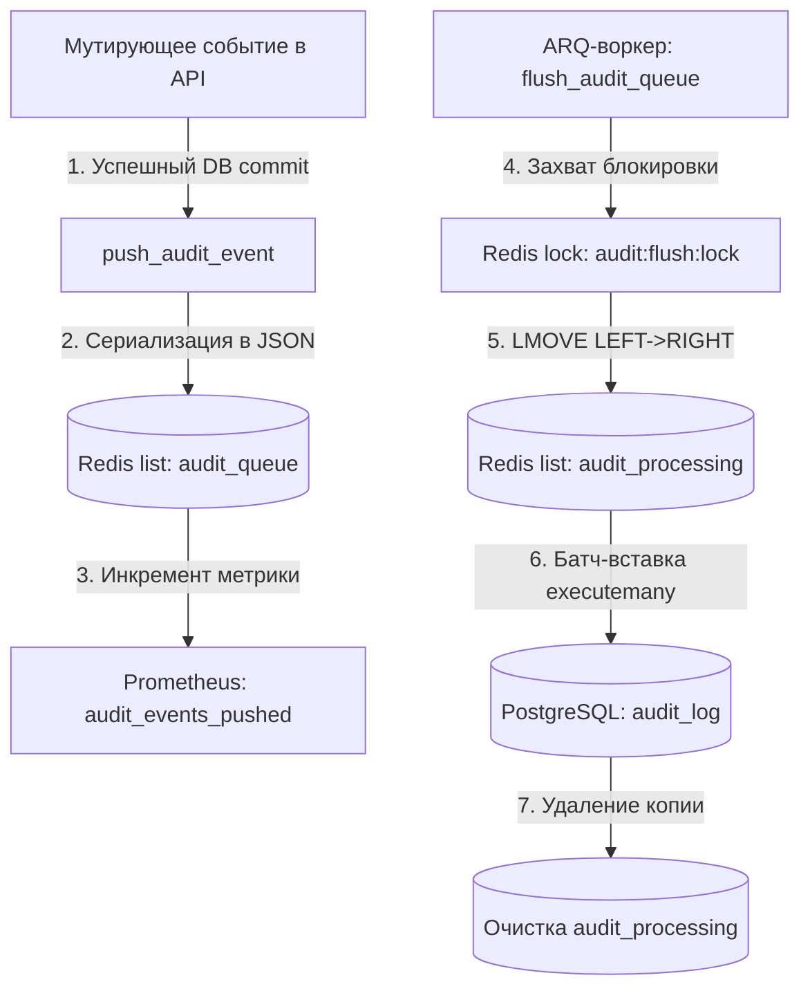

# Модуль «Аудит» (Журнал действий)

> **Когда читать:** Требуется понять, как устроен лог аудита действий пользователей и администраторов, как работает буферизованная запись через Redis и ARQ-воркер, как устроено ежемесячное партиционирование таблиц в PostgreSQL.
> **Ключевой код:** `./backend/app/api/audit.py`, `./backend/app/services/audit.py`, `./backend/app/worker/tasks/audit.py`, `./backend/app/services/audit_partitions.py`, `./backend/scripts/create_audit_partitions.py`, `./frontend/src/pages/admin/tabs/AuditTab.vue`.
> **ADR:** —

---

## 1. Обзор

Модуль лога аудита предназначен для гарантированной и производительной фиксации значимых действий пользователей и администраторов на портале. Для исключения накладных расходов при обработке HTTP-запросов используется асинхронный паттерн с буферизацией событий в Redis-очереди и последующей батч-вставкой через фоновые задачи ARQ.

| Аспект | Значение |
|---|---|
| **Backend** | FastAPI (`./backend/app/api/audit.py`), SQLAlchemy, asyncpg |
| **Frontend** | Vue 3 + Pinia + Naive UI (`./frontend/src/pages/admin/tabs/AuditTab.vue`, `./frontend/src/api/audit.ts`) |
| **Воркер** | ARQ (`./backend/app/worker/tasks/audit.py`), задача `flush_audit_queue` запускается периодически для сброса буфера |
| **Буферизация** | Redis list с ключами `audit_queue` и `audit_processing` |
| **Блокировки** | Redis lock `audit:flush:lock` (TTL 30 сек) для предотвращения параллельного сброса очереди |
| **База данных** | PostgreSQL, партиционированная по месяцам таблица `audit_log` (хранение за 12 месяцев) |

---

## 2. Модель данных

Таблица `audit_log` является партиционированной по диапазонам (range partitioning) даты создания записи `created_at`. 

### Схема таблицы `audit_log`

```sql
CREATE TABLE audit_log (
    id             BIGSERIAL,
    event_type     VARCHAR(50)  NOT NULL,
    user_id        UUID,        -- Нет внешнего ключа (FK) к users из-за удаления старых партиций
    user_email     VARCHAR(255),
    resource_type  VARCHAR(50),
    resource_id    VARCHAR(255),
    resource_title VARCHAR(500),
    ip_address     INET,
    user_agent     TEXT,
    metadata       JSONB        NOT NULL DEFAULT '{}',
    created_at     TIMESTAMPTZ  NOT NULL DEFAULT NOW(),
    PRIMARY KEY (id, created_at)
) PARTITION BY RANGE (created_at);
```

### Наложенные индексы
Индексы создаются на родительской таблице PostgreSQL и автоматически наследуются дочерними партициями (начиная с PG16):
- **`idx_audit_user_time`**: `audit_log(user_id, created_at DESC)` — быстрый поиск событий по конкретному пользователю.
- **`idx_audit_event_time`**: `audit_log(event_type, created_at DESC)` — поиск по типу события.
- **`idx_audit_resource`**: `audit_log(resource_type, resource_id)` — выборка логов для конкретного ресурса.
- **`idx_audit_log_metadata_gin`**: GIN-индекс `audit_log USING gin(metadata jsonb_path_ops)` — оптимизация поиска по вложенным JSONB-полям метаданных (миграция 033).

---

## 3. REST API

Все эндпойнты администрирования аудита требуют авторизации с правами глобального администратора (`AdminDep`).

Базовый путь: `/api/v1/audit`

| Метод | Путь | Назначение | Доступ |
|---|---|---|---|
| **GET** | `/` | Получение пагинированного списка событий аудита с фильтрацией | `admin` |
| **GET** | `/event-types` | Список уникальных типов событий, зафиксированных за последние 90 дней | `admin` |
| **GET** | `/queue/depth` | Текущая глубина очереди событий в Redis (ожидающие и обрабатываемые) | `admin` |
| **GET** | `/export.csv` | Стриминговый экспорт отфильтрованных событий лога в формате CSV | `admin` |

---

## 4. Как пишутся события

Запись логов аудита спроектирована по отказоустойчивой асинхронной схеме, исключающей влияние сбоев БД на транзакции бизнес-логики:



### Шаг 1: Инициация записи (`push_audit_event`)
После каждого успешно закомиченного мутирующего действия (создание, изменение, удаление, вход и т.д.) вызывается функция `push_audit_event`:
- Формирует словарь со всеми атрибутами события (`event_type`, `user_id`, `user_email`, `ip_address`, `metadata` и др.).
- Сериализует событие в JSON и добавляет в конец списка Redis `rpush("audit_queue", json_data)`.
- Инкременирует счётчик Prometheus-метрик `audit_events_pushed` по переданному типу события.
- Действие изолировано блоком `try/except`. При сбоях Redis ошибка отправляется в Sentry, но выполнение основного запроса пользователя продолжается без прерывания.

### Шаг 2: Обработка воркером (`flush_audit_queue`)
Воркер ARQ периодически запускает задачу `flush_audit_queue` для сброса накопленного буфера в БД:
1. Захватывает атомарную блокировку в Redis с ключом `audit:flush:lock` на 30 секунд. Если блокировку захватить не удалось (её удерживает другой воркер), выполнение завершается.
2. Перемещает элементы из основной очереди `audit_queue` в резервный рабочий список `audit_processing` с помощью команды **`LMOVE`** (LEFT в `audit_queue` -> RIGHT в `audit_processing`) порциями по `BATCH_SIZE = 500` записей. Использование `LMOVE` гарантирует, что если воркер упадет в процессе записи в БД, данные не потеряются из Redis и будут обработаны повторно при следующем запуске.
3. Парсит перенесенные записи и выполняет батч-вставку в БД за один запрос `executemany` в PostgreSQL.
4. После успешного коммита в PostgreSQL очищает список `audit_processing` с помощью `DEL`.
5. Снимает блокировку `audit:flush:lock` через выполнение Lua-скрипта (для безопасного удаления ключа только его создателем).

---

## 5. Frontend

Интерфейс просмотра логов аудита доступен в панели администратора на вкладке «Аудит» (`./frontend/src/pages/admin/tabs/AuditTab.vue`).

### Функциональные возможности вкладки:
- **Фильтрация событий**: по типу события (выпадающий список, формируемый из `/audit/event-types`), UUID пользователя, IP-адресу и текстовому поиску по полям email, названию ресурса и метаданным.
- **Валидация**: UUID пользователя проверяется на клиенте с помощью регулярного выражения. При некорректном вводе поле подсвечивается ошибкой, а нажатие «Применить» показывает сообщение об ошибке и прерывает применение фильтров.
- **Индикация глубины очереди**: выводится блок статуса очереди Redis (кол-во ожидающих в `pending` и обрабатываемых в `processing` сообщений), опрашиваемый через `/audit/queue/depth`.
- **Интерактивная таблица**: адаптивная пагинация (`25 / 50 / 100 / 200` строк) с удаленным (remote) получением данных, поддержкой `striped`-режима и сокращением длинных строк метаданных до 200 символов с троеточием.
- **Экспорт в CSV**: кнопка экспорта инициирует асинхронный запрос скачивания файла через `ofetch` с передачей активных фильтров.

---

## 6. Особенности и нюансы

### Партиционирование таблиц
- Создание партиций реализовано на нативных механизмах PostgreSQL без сторонних расширений (вроде `pg_partman`).
- **Скрипт ручного создания**: `./backend/scripts/create_audit_partitions.py` запускается во время деплоя приложения. Поддерживает аргументы для создания партиций на несколько месяцев вперед и очистки устаревших таблиц.
- **Автоматизация через воркер**:
  - `create_next_audit_partition`: выполняется раз в месяц, создает пустые партиции на следующие 3 месяца вперед (`months_ahead=3`), исключая пропуск событий при смене месяцев. Имя таблицы имеет вид `audit_log_YYYY_MM`.
  - `drop_old_audit_partitions`: выполняется раз в месяц, осуществляет ротацию данных. Удаляет партиции старше 12 месяцев через команду `DROP TABLE`.

### Ограничения CSV-экспорта
- Метод `/audit/export.csv` оптимизирован под потоковую отдачу данных (`StreamingResponse`) с использованием `io.StringIO` и асинхронного курсора SQLAlchemy (`db.stream`). Это минимизирует расход оперативной памяти API-процесса.
- Наложен жесткий лимит на количество выгружаемых строк — `_EXPORT_HARD_LIMIT = 100_000` записей, чтобы избежать перегрузки СУБД.
- В CSV-файле длинное поле `user_agent` обрезается до 500 символов, а `metadata` сериализуется в JSON-строку с отключенным экранированием не-ASCII символов (`ensure_ascii=False`).
