<!-- AUTO-GENERATED — do not edit manually. Run: cd backend && python -m scripts.generate_db_schema_doc --output ../docs/db-schema.generated.md -->
<!-- Generated: 2026-07-19 20:38 UTC -->

# Database Schema (auto-generated)

> Generated from SQLAlchemy models in `./backend/app/models/`  
> Source of truth: `./docs/db-schema.generated.md` (auto) and `./docs/db-schema.md` (curated).

---

## Table of Contents

- [`bookmarks`](#bookmarks)
- [`email_outbox`](#email-outbox)
- [`feedback`](#feedback)
- [`feedback_attachments`](#feedback-attachments)
- [`feedback_replies`](#feedback-replies)
- [`file_folder_permissions`](#file-folder-permissions)
- [`file_folders`](#file-folders)
- [`file_items`](#file-items)
- [`file_shares`](#file-shares)
- [`helpdesk_agents`](#helpdesk-agents)
- [`helpdesk_attachments`](#helpdesk-attachments)
- [`helpdesk_digest_settings`](#helpdesk-digest-settings)
- [`helpdesk_email_log`](#helpdesk-email-log)
- [`helpdesk_mailbox_settings`](#helpdesk-mailbox-settings)
- [`helpdesk_max_bot_settings`](#helpdesk-max-bot-settings)
- [`helpdesk_messages`](#helpdesk-messages)
- [`helpdesk_ticket_reads`](#helpdesk-ticket-reads)
- [`helpdesk_tickets`](#helpdesk-tickets)
- [`helpdesk_tickets_archive`](#helpdesk-tickets-archive)
- [`kb_article_comments`](#kb-article-comments)
- [`kb_article_feedback`](#kb-article-feedback)
- [`kb_article_files`](#kb-article-files)
- [`kb_article_permissions`](#kb-article-permissions)
- [`kb_article_tags`](#kb-article-tags)
- [`kb_article_versions`](#kb-article-versions)
- [`kb_articles`](#kb-articles)
- [`kb_section_permissions`](#kb-section-permissions)
- [`kb_sections`](#kb-sections)
- [`kb_suggestions`](#kb-suggestions)
- [`kb_tags`](#kb-tags)
- [`mailing_recipients`](#mailing-recipients)
- [`meeting_booking_rooms`](#meeting-booking-rooms)
- [`meeting_bookings`](#meeting-bookings)
- [`meeting_rooms`](#meeting-rooms)
- [`messenger_outbox`](#messenger-outbox)
- [`news`](#news)
- [`news_attachments`](#news-attachments)
- [`news_comments`](#news-comments)
- [`news_gallery_images`](#news-gallery-images)
- [`news_likes`](#news-likes)
- [`news_poll_options`](#news-poll-options)
- [`news_poll_questions`](#news-poll-questions)
- [`news_poll_voters`](#news-poll-voters)
- [`news_poll_votes`](#news-poll-votes)
- [`news_polls`](#news-polls)
- [`news_versions`](#news-versions)
- [`notifications`](#notifications)
- [`object_directories`](#object-directories)
- [`object_directory_entries`](#object-directory-entries)
- [`object_entry_contacts`](#object-entry-contacts)
- [`photo_folder_permissions`](#photo-folder-permissions)
- [`photo_folder_share_tokens`](#photo-folder-share-tokens)
- [`photo_folders`](#photo-folders)
- [`photo_share_tokens`](#photo-share-tokens)
- [`photo_tag_assignments`](#photo-tag-assignments)
- [`photo_tags`](#photo-tags)
- [`photo_zip_jobs`](#photo-zip-jobs)
- [`photos`](#photos)
- [`service_links`](#service-links)
- [`staff_department_orders`](#staff-department-orders)
- [`user_attribute_mappings`](#user-attribute-mappings)
- [`users`](#users)

---

## ER Diagram (FK graph)

```mermaid
erDiagram
    bookmarks ||--o{ users : "FK user_id"
    feedback ||--o{ users : "FK user_id"
    feedback_attachments ||--o{ feedback : "FK feedback_id"
    feedback_attachments ||--o{ users : "FK uploaded_by"
    feedback_replies ||--o{ feedback : "FK feedback_id"
    feedback_replies ||--o{ users : "FK admin_id"
    file_folder_permissions ||--o{ file_folders : "FK folder_id"
    file_folder_permissions ||--o{ users : "FK granted_by"
    file_folders ||--o{ file_folders : "FK parent_id"
    file_folders ||--o{ users : "FK created_by"
    file_items ||--o{ file_folders : "FK folder_id"
    file_items ||--o{ users : "FK uploaded_by"
    file_shares ||--o{ file_folders : "FK folder_id"
    file_shares ||--o{ users : "FK shared_by"
    helpdesk_agents ||--o{ users : "FK user_id"
    helpdesk_attachments ||--o{ helpdesk_tickets : "FK ticket_id"
    helpdesk_attachments ||--o{ helpdesk_messages : "FK message_id"
    helpdesk_attachments ||--o{ users : "FK uploaded_by_user_id"
    helpdesk_digest_settings ||--o{ users : "FK updated_by_user_id"
    helpdesk_email_log ||--o{ helpdesk_tickets : "FK ticket_id"
    helpdesk_email_log ||--o{ helpdesk_messages : "FK message_db_id"
    helpdesk_mailbox_settings ||--o{ users : "FK updated_by_user_id"
    helpdesk_max_bot_settings ||--o{ users : "FK updated_by_user_id"
    helpdesk_messages ||--o{ helpdesk_tickets : "FK ticket_id"
    helpdesk_messages ||--o{ users : "FK author_user_id"
    helpdesk_ticket_reads ||--o{ helpdesk_tickets : "FK ticket_id"
    helpdesk_ticket_reads ||--o{ users : "FK user_id"
    helpdesk_tickets ||--o{ users : "FK requester_user_id"
    kb_article_comments ||--o{ kb_articles : "FK article_id"
    kb_article_comments ||--o{ users : "FK author_id"
    kb_article_feedback ||--o{ kb_articles : "FK article_id"
    kb_article_feedback ||--o{ users : "FK user_id"
    kb_article_files ||--o{ kb_articles : "FK article_id"
    kb_article_files ||--o{ users : "FK uploaded_by"
    kb_article_permissions ||--o{ kb_articles : "FK article_id"
    kb_article_permissions ||--o{ users : "FK granted_by"
    kb_article_tags ||--o{ kb_articles : "FK article_id"
    kb_article_tags ||--o{ kb_tags : "FK tag_id"
    kb_article_versions ||--o{ kb_articles : "FK article_id"
    kb_article_versions ||--o{ users : "FK changed_by"
    kb_articles ||--o{ kb_sections : "FK section_id"
    kb_articles ||--o{ users : "FK created_by"
    kb_section_permissions ||--o{ kb_sections : "FK section_id"
    kb_section_permissions ||--o{ users : "FK granted_by"
    kb_sections ||--o{ kb_sections : "FK parent_id"
    kb_sections ||--o{ users : "FK created_by"
    kb_suggestions ||--o{ kb_articles : "FK article_id"
    kb_suggestions ||--o{ users : "FK author_id"
    mailing_recipients ||--o{ users : "FK created_by_user_id"
    meeting_booking_rooms ||--o{ meeting_bookings : "FK booking_id"
    meeting_booking_rooms ||--o{ meeting_rooms : "FK room_id"
    meeting_bookings ||--o{ users : "FK creator_id"
    news ||--o{ users : "FK author_id"
    news_attachments ||--o{ news : "FK news_id"
    news_comments ||--o{ news : "FK news_id"
    news_comments ||--o{ users : "FK author_id"
    news_gallery_images ||--o{ news : "FK news_id"
    news_likes ||--o{ news : "FK news_id"
    news_likes ||--o{ users : "FK user_id"
    news_poll_options ||--o{ news_poll_questions : "FK question_id"
    news_poll_questions ||--o{ news_polls : "FK poll_id"
    news_poll_voters ||--o{ news_polls : "FK poll_id"
    news_poll_voters ||--o{ users : "FK user_id"
    news_poll_votes ||--o{ news_polls : "FK poll_id"
    news_poll_votes ||--o{ news_poll_voters : "FK voter_id"
    news_poll_votes ||--o{ news_poll_questions : "FK question_id"
    news_poll_votes ||--o{ news_poll_options : "FK option_id"
    news_polls ||--o{ news : "FK news_id"
    news_versions ||--o{ news : "FK news_id"
    news_versions ||--o{ users : "FK editor_id"
    notifications ||--o{ users : "FK user_id"
    object_directory_entries ||--o{ object_directories : "FK directory_id"
    object_directory_entries ||--o{ file_folders : "FK folder_id"
    object_directory_entries ||--o{ users : "FK created_by"
    object_entry_contacts ||--o{ object_directory_entries : "FK entry_id"
    photo_folder_permissions ||--o{ photo_folders : "FK folder_id"
    photo_folder_permissions ||--o{ users : "FK granted_by"
    photo_folder_share_tokens ||--o{ photo_folders : "FK folder_id"
    photo_folder_share_tokens ||--o{ users : "FK created_by"
    photo_folders ||--o{ photo_folders : "FK parent_id"
    photo_folders ||--o{ photos : "FK cover_photo_id"
    photo_folders ||--o{ users : "FK created_by"
    photo_share_tokens ||--o{ photos : "FK photo_id"
    photo_share_tokens ||--o{ users : "FK created_by"
    photo_tag_assignments ||--o{ photos : "FK photo_id"
    photo_tag_assignments ||--o{ photo_tags : "FK tag_id"
    photo_zip_jobs ||--o{ photo_folders : "FK folder_id"
    photo_zip_jobs ||--o{ users : "FK user_id"
    photos ||--o{ photo_folders : "FK folder_id"
    photos ||--o{ users : "FK uploaded_by"
    service_links ||--o{ users : "FK created_by"
```

---

## `bookmarks`

### Columns

| Column | Type | Nullable | PK | FK | Unique | Default | Comment |
|--------|------|----------|----|----|--------|---------|---------|
| `id` | `UUID` |  | ✓ |  |  | `gen_random_uuid()` |  |
| `user_id` | `UUID` | ✓ |  | `users.id` |  |  |  |
| `title` | `VARCHAR(300)` |  |  |  |  |  |  |
| `url` | `VARCHAR(2048)` |  |  |  |  |  |  |
| `resource_type` | `VARCHAR(50)` | ✓ |  |  |  |  |  |
| `resource_id` | `VARCHAR(100)` | ✓ |  |  |  |  |  |
| `group_name` | `VARCHAR(100)` | ✓ |  |  |  |  |  |
| `sort_order` | `INTEGER` |  |  |  |  | `0` |  |
| `created_at` | `TIMESTAMP WITH TIME ZONE` |  |  |  |  | `NOW()` |  |

### Indexes

| Name | Columns | Unique |
|------|---------|--------|
| `idx_bookmarks_resource` | `resource_type`, `resource_id` |  |
| `idx_bookmarks_user_id` | `user_id` |  |
| `idx_bookmarks_user_sort` | `user_id`, `sort_order` |  |

### Relationships

| Attribute | Target | Type | Back-populates |
|-----------|--------|------|----------------|
| `user` | `User` | many-to-one | `` |

---

## `email_outbox`

### Columns

| Column | Type | Nullable | PK | FK | Unique | Default | Comment |
|--------|------|----------|----|----|--------|---------|---------|
| `id` | `UUID` |  | ✓ |  |  | `gen_random_uuid()` |  |
| `kind` | `VARCHAR(64)` |  |  |  |  |  |  |
| `to_email` | `VARCHAR(320)` |  |  |  |  |  |  |
| `subject` | `VARCHAR(998)` |  |  |  |  |  |  |
| `body_html` | `TEXT` |  |  |  |  | `''` |  |
| `body_text` | `TEXT` | ✓ |  |  |  |  |  |
| `payload` | `JSONB` |  |  |  |  | `'{}'::jsonb` |  |
| `status` | `VARCHAR(16)` |  |  |  |  | `'PENDING'` |  |
| `attempts` | `INTEGER` |  |  |  |  | `0` |  |
| `max_attempts` | `INTEGER` |  |  |  |  | `6` |  |
| `next_attempt_at` | `TIMESTAMP WITH TIME ZONE` |  |  |  |  | `NOW()` |  |
| `last_error` | `TEXT` | ✓ |  |  |  |  |  |
| `last_error_type` | `VARCHAR(128)` | ✓ |  |  |  |  |  |
| `last_error_class` | `VARCHAR(16)` | ✓ |  |  |  |  |  |
| `related_resource_type` | `VARCHAR(64)` | ✓ |  |  |  |  |  |
| `related_resource_id` | `UUID` | ✓ |  |  |  |  |  |
| `created_by_user_id` | `UUID` | ✓ |  |  |  |  |  |
| `created_at` | `TIMESTAMP WITH TIME ZONE` |  |  |  |  | `NOW()` |  |
| `updated_at` | `TIMESTAMP WITH TIME ZONE` |  |  |  |  | `NOW()` |  |
| `sent_at` | `TIMESTAMP WITH TIME ZONE` | ✓ |  |  |  |  |  |

### Constraints

| Name | Type | Definition |
|------|------|------------|
| `ck_email_outbox_status` | CHECK | `status IN ('PENDING','SENDING','SENT','FAILED','DLQ','CANCELLED')` |

---

## `feedback`

### Columns

| Column | Type | Nullable | PK | FK | Unique | Default | Comment |
|--------|------|----------|----|----|--------|---------|---------|
| `id` | `UUID` |  | ✓ |  |  | `gen_random_uuid()` |  |
| `user_id` | `UUID` | ✓ |  | `users.id` |  |  |  |
| `category` | `VARCHAR(30)` |  |  |  |  |  |  |
| `message` | `TEXT` |  |  |  |  |  |  |
| `page_url` | `VARCHAR(2000)` | ✓ |  |  |  |  |  |
| `status` | `VARCHAR(20)` |  |  |  |  | `'open'` |  |
| `created_at` | `TIMESTAMP WITH TIME ZONE` |  |  |  |  | `NOW()` |  |
| `updated_at` | `TIMESTAMP WITH TIME ZONE` |  |  |  |  | `NOW()` |  |

### Constraints

| Name | Type | Definition |
|------|------|------------|
| `ck_feedback_category` | CHECK | `category IN ('bug','suggestion','other')` |
| `ck_feedback_status` | CHECK | `status IN ('open','in_progress','closed')` |

### Indexes

| Name | Columns | Unique |
|------|---------|--------|
| `ix_feedback_user_id` | `user_id` |  |

### Relationships

| Attribute | Target | Type | Back-populates |
|-----------|--------|------|----------------|
| `author` | `User` | many-to-one | `` |
| `replies` | `FeedbackReply` | one-to-many | `feedback` |
| `attachments` | `FeedbackAttachment` | one-to-many | `feedback` |

---

## `feedback_attachments`

### Columns

| Column | Type | Nullable | PK | FK | Unique | Default | Comment |
|--------|------|----------|----|----|--------|---------|---------|
| `id` | `UUID` |  | ✓ |  |  | `gen_random_uuid()` |  |
| `feedback_id` | `UUID` |  |  | `feedback.id` |  |  |  |
| `filename` | `VARCHAR(500)` |  |  |  |  |  |  |
| `original_name` | `VARCHAR(500)` |  |  |  |  |  |  |
| `size_bytes` | `BIGINT` |  |  |  |  |  |  |
| `mime_type` | `VARCHAR(255)` | ✓ |  |  |  |  |  |
| `uploaded_by` | `UUID` | ✓ |  | `users.id` |  |  |  |
| `created_at` | `TIMESTAMP WITH TIME ZONE` |  |  |  |  | `NOW()` |  |

### Indexes

| Name | Columns | Unique |
|------|---------|--------|
| `ix_feedback_attachments_feedback_id` | `feedback_id` |  |

### Relationships

| Attribute | Target | Type | Back-populates |
|-----------|--------|------|----------------|
| `feedback` | `Feedback` | many-to-one | `attachments` |

---

## `feedback_replies`

### Columns

| Column | Type | Nullable | PK | FK | Unique | Default | Comment |
|--------|------|----------|----|----|--------|---------|---------|
| `id` | `UUID` |  | ✓ |  |  | `gen_random_uuid()` |  |
| `feedback_id` | `UUID` |  |  | `feedback.id` |  |  |  |
| `admin_id` | `UUID` | ✓ |  | `users.id` |  |  |  |
| `message` | `TEXT` |  |  |  |  |  |  |
| `created_at` | `TIMESTAMP WITH TIME ZONE` |  |  |  |  | `NOW()` |  |

### Indexes

| Name | Columns | Unique |
|------|---------|--------|
| `ix_feedback_replies_feedback_id` | `feedback_id` |  |

### Relationships

| Attribute | Target | Type | Back-populates |
|-----------|--------|------|----------------|
| `feedback` | `Feedback` | many-to-one | `replies` |
| `admin` | `User` | many-to-one | `` |

---

## `file_folder_permissions`

### Columns

| Column | Type | Nullable | PK | FK | Unique | Default | Comment |
|--------|------|----------|----|----|--------|---------|---------|
| `id` | `UUID` |  | ✓ |  |  | `gen_random_uuid()` |  |
| `folder_id` | `UUID` |  |  | `file_folders.id` |  |  |  |
| `subject_type` | `VARCHAR(10)` |  |  |  |  |  |  |
| `subject_id` | `VARCHAR(255)` |  |  |  |  |  |  |
| `subject_name` | `VARCHAR(255)` |  |  |  |  |  |  |
| `permission` | `VARCHAR(20)` |  |  |  |  |  |  |
| `granted_by` | `UUID` | ✓ |  | `users.id` |  |  |  |
| `created_at` | `TIMESTAMP WITH TIME ZONE` |  |  |  |  |  |  |

### Constraints

| Name | Type | Definition |
|------|------|------------|
| `uq_file_folder_perm_folder_subject` | UNIQUE | `folder_id`, `subject_id` |
| `ck_file_folder_perm_permission` | CHECK | `permission IN ('viewer', 'editor', 'manager')` |
| `ck_file_folder_perm_subject_type` | CHECK | `subject_type IN ('user', 'group')` |

### Indexes

| Name | Columns | Unique |
|------|---------|--------|
| `ix_file_folder_permissions_folder_id` | `folder_id` |  |
| `ix_file_folder_permissions_subject_id` | `subject_id` |  |

### Relationships

| Attribute | Target | Type | Back-populates |
|-----------|--------|------|----------------|
| `folder` | `FileFolder` | many-to-one | `permissions` |

---

## `file_folders`

### Columns

| Column | Type | Nullable | PK | FK | Unique | Default | Comment |
|--------|------|----------|----|----|--------|---------|---------|
| `id` | `UUID` |  | ✓ |  |  | `gen_random_uuid()` |  |
| `parent_id` | `UUID` | ✓ |  | `file_folders.id` |  |  |  |
| `name` | `VARCHAR(500)` |  |  |  |  |  |  |
| `nc_path` | `VARCHAR(2000)` |  |  |  | ✓ |  | Path relative to portal-svc WebDAV root (e.g. PortalFiles/HR/Docs) |
| `description` | `TEXT` | ✓ |  |  |  |  |  |
| `inherit_permissions` | `BOOLEAN` |  |  |  |  | `true` |  |
| `created_by` | `UUID` | ✓ |  | `users.id` |  |  |  |
| `created_at` | `TIMESTAMP WITH TIME ZONE` |  |  |  |  |  |  |
| `updated_at` | `TIMESTAMP WITH TIME ZONE` |  |  |  |  |  |  |
| `deleted_at` | `TIMESTAMP WITH TIME ZONE` | ✓ |  |  |  |  |  |

### Constraints

| Name | Type | Definition |
|------|------|------------|
| `` | UNIQUE | `nc_path` |

### Indexes

| Name | Columns | Unique |
|------|---------|--------|
| `ix_file_folders_parent_id` | `parent_id` |  |

### Relationships

| Attribute | Target | Type | Back-populates |
|-----------|--------|------|----------------|
| `permissions` | `FileFolderPermission` | one-to-many | `folder` |

---

## `file_items`

Tracks files uploaded through the portal (migration 038).

    One record per file. Soft-deleted when the file is removed via portal.
    Files uploaded directly to Nextcloud (bypassing portal) won't have a record.

### Columns

| Column | Type | Nullable | PK | FK | Unique | Default | Comment |
|--------|------|----------|----|----|--------|---------|---------|
| `id` | `UUID` |  | ✓ |  |  | `gen_random_uuid()` |  |
| `folder_id` | `UUID` |  |  | `file_folders.id` |  |  |  |
| `nc_path` | `VARCHAR(2000)` |  |  |  |  |  | Full nc_path: folder.nc_path + '/' + filename |
| `name` | `VARCHAR(500)` |  |  |  |  |  |  |
| `size_bytes` | `BIGINT` |  |  |  |  | `0` |  |
| `mime_type` | `VARCHAR(255)` | ✓ |  |  |  |  |  |
| `uploaded_by` | `UUID` | ✓ |  | `users.id` |  |  |  |
| `uploaded_at` | `TIMESTAMP WITH TIME ZONE` |  |  |  |  |  |  |
| `deleted_at` | `TIMESTAMP WITH TIME ZONE` | ✓ |  |  |  |  |  |

### Indexes

| Name | Columns | Unique |
|------|---------|--------|
| `ix_file_items_folder_id` | `folder_id` |  |
| `uq_file_items_folder_name_active` | `folder_id`, `name` | ✓ |

---

## `file_shares`

Per-file share (ADR-032 / sharing.md).

    Addresses a single file by (folder_id, filename); nc_path is stored
    denormalized for persistence and the admin registry. Only viewer/editor
    levels are granted on a file (manager is never issued).

### Columns

| Column | Type | Nullable | PK | FK | Unique | Default | Comment |
|--------|------|----------|----|----|--------|---------|---------|
| `id` | `UUID` |  | ✓ |  |  | `gen_random_uuid()` |  |
| `folder_id` | `UUID` |  |  | `file_folders.id` |  |  |  |
| `filename` | `VARCHAR(500)` |  |  |  |  |  |  |
| `nc_path` | `VARCHAR(2000)` |  |  |  |  |  | Denormalized folder.nc_path + '/' + filename |
| `subject_type` | `VARCHAR(10)` |  |  |  |  |  |  |
| `subject_id` | `VARCHAR(255)` |  |  |  |  |  |  |
| `subject_name` | `VARCHAR(255)` |  |  |  |  |  |  |
| `permission` | `VARCHAR(20)` |  |  |  |  |  |  |
| `shared_by` | `UUID` | ✓ |  | `users.id` |  |  |  |
| `expires_at` | `TIMESTAMP WITH TIME ZONE` | ✓ |  |  |  |  |  |
| `created_at` | `TIMESTAMP WITH TIME ZONE` |  |  |  |  |  |  |
| `revoked_at` | `TIMESTAMP WITH TIME ZONE` | ✓ |  |  |  |  |  |

### Constraints

| Name | Type | Definition |
|------|------|------------|
| `ck_file_share_subject_type` | CHECK | `subject_type IN ('user', 'group')` |
| `uq_file_share_folder_file_subject` | UNIQUE | `folder_id`, `filename`, `subject_id` |
| `ck_file_share_permission` | CHECK | `permission IN ('viewer', 'editor')` |

### Indexes

| Name | Columns | Unique |
|------|---------|--------|
| `ix_file_shares_subject_id` | `subject_id` |  |

---

## `helpdesk_agents`

A support agent — an operational unit, distinct from portal roles
    (``users.role``). Membership in this table is the single source of truth for
    agent privileges (checked per-request by ``require_helpdesk_agent``).

### Columns

| Column | Type | Nullable | PK | FK | Unique | Default | Comment |
|--------|------|----------|----|----|--------|---------|---------|
| `user_id` | `UUID` |  | ✓ | `users.id` |  |  |  |
| `added_by` | `UUID` | ✓ |  | `users.id` |  |  |  |
| `added_at` | `TIMESTAMP WITH TIME ZONE` |  |  |  |  | `NOW()` |  |
| `notify_new` | `BOOLEAN` |  |  |  |  | `TRUE` |  |

### Relationships

| Attribute | Target | Type | Back-populates |
|-----------|--------|------|----------------|
| `user` | `User` | many-to-one | `` |
| `adder` | `User` | many-to-one | `` |

---

## `helpdesk_attachments`

File attached to a ticket message. Stored **locally** in
    ``/data/helpdesk/TKT-{number}/{filename}`` (по образцу feedback); only
    metadata lives in the DB. Nextcloud is NOT used for helpdesk attachments.

### Columns

| Column | Type | Nullable | PK | FK | Unique | Default | Comment |
|--------|------|----------|----|----|--------|---------|---------|
| `id` | `UUID` |  | ✓ |  |  | `gen_random_uuid()` |  |
| `ticket_id` | `UUID` |  |  | `helpdesk_tickets.id` |  |  |  |
| `message_id` | `UUID` | ✓ |  | `helpdesk_messages.id` |  |  |  |
| `filename` | `VARCHAR(500)` |  |  |  |  |  |  |
| `original_name` | `VARCHAR(500)` |  |  |  |  |  |  |
| `content_type` | `VARCHAR(255)` |  |  |  |  |  |  |
| `size_bytes` | `BIGINT` |  |  |  |  |  |  |
| `is_inline` | `BOOLEAN` |  |  |  |  | `false` |  |
| `content_id` | `VARCHAR(320)` | ✓ |  |  |  |  |  |
| `uploaded_by_user_id` | `UUID` | ✓ |  | `users.id` |  |  |  |
| `created_at` | `TIMESTAMP WITH TIME ZONE` |  |  |  |  | `NOW()` |  |

### Indexes

| Name | Columns | Unique |
|------|---------|--------|
| `ix_helpdesk_attachments_message` | `message_id` |  |
| `ix_helpdesk_attachments_ticket` | `ticket_id` |  |

### Relationships

| Attribute | Target | Type | Back-populates |
|-----------|--------|------|----------------|
| `message` | `HelpdeskMessage` | many-to-one | `attachments` |
| `uploaded_by` | `User` | many-to-one | `` |

---

## `helpdesk_digest_settings`

Singleton row (``id = 1``) holding the daily digest email schedule.

    The digest is sent once per day (cron-driven worker
    ``send_helpdesk_digest``) to every active helpdesk agent: their assigned
    ``open``/``pending`` tickets plus all ``unassigned`` tickets. Unlike
    :class:`HelpdeskMailboxSettings`, the row is seeded by the migration (no
    NOT NULL column without a DEFAULT), so it always exists and ``enabled``
    can be toggled without a separate "configured" state.

### Columns

| Column | Type | Nullable | PK | FK | Unique | Default | Comment |
|--------|------|----------|----|----|--------|---------|---------|
| `id` | `SMALLINT` |  | ✓ |  |  | `1` |  |
| `enabled` | `BOOLEAN` |  |  |  |  | `TRUE` |  |
| `digest_hour` | `SMALLINT` |  |  |  |  | `8` |  |
| `digest_minute` | `SMALLINT` |  |  |  |  | `0` |  |
| `digest_schedule` | `VARCHAR(16)` |  |  |  |  | `'weekdays'` |  |
| `updated_by_user_id` | `UUID` | ✓ |  | `users.id` |  |  |  |
| `created_at` | `TIMESTAMP WITH TIME ZONE` |  |  |  |  | `NOW()` |  |
| `updated_at` | `TIMESTAMP WITH TIME ZONE` |  |  |  |  | `NOW()` |  |

### Relationships

| Attribute | Target | Type | Back-populates |
|-----------|--------|------|----------------|
| `updated_by` | `User` | many-to-one | `` |

---

## `helpdesk_email_log`

Idempotency log for IMAP ingress — keyed by the incoming ``Message-ID``
    (or synthetic id) so that re-downloading the same message never creates a
    duplicate ticket/message.

### Columns

| Column | Type | Nullable | PK | FK | Unique | Default | Comment |
|--------|------|----------|----|----|--------|---------|---------|
| `message_id` | `VARCHAR(998)` |  | ✓ |  |  |  |  |
| `ticket_id` | `UUID` | ✓ |  | `helpdesk_tickets.id` |  |  |  |
| `message_db_id` | `UUID` | ✓ |  | `helpdesk_messages.id` |  |  |  |
| `received_at` | `TIMESTAMP WITH TIME ZONE` |  |  |  |  | `NOW()` |  |
| `status` | `VARCHAR(20)` |  |  |  |  |  |  |
| `error` | `TEXT` | ✓ |  |  |  |  |  |

### Indexes

| Name | Columns | Unique |
|------|---------|--------|
| `ix_helpdesk_email_log_received` | `received_at` |  |

---

## `helpdesk_mailbox_settings`

Singleton row (``id = 1``) holding the IMAP/SMTP configuration of the
    support mailbox. The IMAP password is stored encrypted at rest
    (``imap_password_enc``); the plaintext is never returned by the API.

### Columns

| Column | Type | Nullable | PK | FK | Unique | Default | Comment |
|--------|------|----------|----|----|--------|---------|---------|
| `id` | `SMALLINT` |  | ✓ |  |  | `1` |  |
| `imap_host` | `VARCHAR(255)` |  |  |  |  |  |  |
| `imap_port` | `INTEGER` |  |  |  |  | `993` |  |
| `imap_username` | `VARCHAR(255)` |  |  |  |  |  |  |
| `imap_password_enc` | `TEXT` |  |  |  |  |  |  |
| `imap_use_ssl` | `BOOLEAN` |  |  |  |  | `TRUE` |  |
| `imap_folder` | `VARCHAR(255)` |  |  |  |  | `'INBOX'` |  |
| `poll_interval_seconds` | `INTEGER` |  |  |  |  | `60` |  |
| `delete_after_fetch` | `BOOLEAN` |  |  |  |  | `FALSE` |  |
| `support_address` | `VARCHAR(320)` |  |  |  |  |  |  |
| `support_reply_to` | `VARCHAR(320)` | ✓ |  |  |  |  |  |
| `updated_by_user_id` | `UUID` | ✓ |  | `users.id` |  |  |  |
| `created_at` | `TIMESTAMP WITH TIME ZONE` |  |  |  |  | `NOW()` |  |
| `updated_at` | `TIMESTAMP WITH TIME ZONE` |  |  |  |  | `NOW()` |  |

### Relationships

| Attribute | Target | Type | Back-populates |
|-----------|--------|------|----------------|
| `updated_by` | `User` | many-to-one | `` |

---

## `helpdesk_max_bot_settings`

Singleton row (``id = 1``) holding the MAX-messenger bot configuration
    for helpdesk notifications (new tickets → common support chat).

    ``bot_token_enc`` is encrypted at rest through ``app.core.secret_crypto``
    (Fernet derived from ``SECRET_KEY``); the plaintext is never returned by
    the API (write-only, like ``HelpdeskMailboxSettings.imap_password_enc``).

    By design (mirrors :class:`HelpdeskDigestSettings`, migration 076): every
    column is either nullable or has a DEFAULT, the row is seeded by migration
    081 with ``enabled=False``, and the admin flips the switch in the Helpdesk
    tab after entering the token and chat_id. No separate ``configured`` state
    is tracked — ``enabled=False`` until both token and chat_id are provided.

### Columns

| Column | Type | Nullable | PK | FK | Unique | Default | Comment |
|--------|------|----------|----|----|--------|---------|---------|
| `id` | `SMALLINT` |  | ✓ |  |  | `1` |  |
| `enabled` | `BOOLEAN` |  |  |  |  | `FALSE` |  |
| `bot_token_enc` | `TEXT` | ✓ |  |  |  |  |  |
| `chat_id` | `VARCHAR(64)` | ✓ |  |  |  |  |  |
| `updated_by_user_id` | `UUID` | ✓ |  | `users.id` |  |  |  |
| `created_at` | `TIMESTAMP WITH TIME ZONE` |  |  |  |  | `NOW()` |  |
| `updated_at` | `TIMESTAMP WITH TIME ZONE` |  |  |  |  | `NOW()` |  |

### Relationships

| Attribute | Target | Type | Back-populates |
|-----------|--------|------|----------------|
| `updated_by` | `User` | many-to-one | `` |

---

## `helpdesk_messages`

A single message in a ticket thread — public (visible to the requester)
    or internal (agent-only note), inbound (from the requester) or outbound
    (from an agent).

### Columns

| Column | Type | Nullable | PK | FK | Unique | Default | Comment |
|--------|------|----------|----|----|--------|---------|---------|
| `id` | `UUID` |  | ✓ |  |  | `gen_random_uuid()` |  |
| `ticket_id` | `UUID` |  |  | `helpdesk_tickets.id` |  |  |  |
| `author_user_id` | `UUID` | ✓ |  | `users.id` |  |  |  |
| `author_email` | `VARCHAR(320)` |  |  |  |  |  |  |
| `author_name` | `VARCHAR(255)` | ✓ |  |  |  |  |  |
| `direction` | `VARCHAR(10)` |  |  |  |  |  |  |
| `visibility` | `VARCHAR(10)` |  |  |  |  | `'public'` |  |
| `body_text` | `TEXT` |  |  |  |  |  |  |
| `body_html` | `TEXT` | ✓ |  |  |  |  |  |
| `body_tsvector` | `TSVECTOR` | ✓ |  |  |  | Computed(<sqlalchemy.sql.elements.TextClause object at 0x7902a2d6be60>, persisted=True) |  |
| `source` | `VARCHAR(20)` |  |  |  |  |  |  |
| `email_message_id` | `VARCHAR(998)` | ✓ |  |  |  |  |  |
| `in_reply_to` | `VARCHAR(998)` | ✓ |  |  |  |  |  |
| `created_at` | `TIMESTAMP WITH TIME ZONE` |  |  |  |  | `NOW()` |  |

### Indexes

| Name | Columns | Unique |
|------|---------|--------|
| `idx_helpdesk_messages_fts` | `body_tsvector` |  |
| `ix_helpdesk_messages_ticket` | `ticket_id`, `created_at` |  |
| `uq_helpdesk_messages_email_msg_id` | `email_message_id` | ✓ |

### Relationships

| Attribute | Target | Type | Back-populates |
|-----------|--------|------|----------------|
| `ticket` | `HelpdeskTicket` | many-to-one | `messages` |
| `author` | `User` | many-to-one | `` |
| `attachments` | `HelpdeskAttachment` | one-to-many | `message` |

---

## `helpdesk_ticket_reads`

Per-agent read-state marker: «когда этот агент последний раз видел тикет».

    Подсветка непрочитанных заявок в инбоксе агента (миграция 080). Тикет
    «непрочитан» для агента, если существует публичное входящее сообщение
    (``direction='inbound'``, ``visibility='public'`` — ответ заявителя) с
    ``created_at > COALESCE(last_seen_at, '-infinity')``. Ответы других агентов
    и свои собственные НЕ считаются (агент и так их видел — он их писал);
    internal-заметки НЕ считаются (это служебная активность).

    Одна строка на пару ``ticket_id`` × ``user_id`` (UNIQUE-индекс), UPSERT
    через ``ON CONFLICT`` при открытии карточки агента. ``ON DELETE CASCADE``
    на обеих FK → чистится автоматически при архивации/удалении тикета или
    аккаунта, cleanup-cron не нужен.

    По образцу ``news_likes`` / ``kb_article_feedback`` (marker-таблица с
    композитным UNIQUE); архитектурно ближе к Zammad/FreeScout
    (``conversation_user`` pivot с ``last_seen_at``), чем к OTRS (per-article
    ``ticket_flag`` — избыточно для наших объёмов).

### Columns

| Column | Type | Nullable | PK | FK | Unique | Default | Comment |
|--------|------|----------|----|----|--------|---------|---------|
| `id` | `UUID` |  | ✓ |  |  | `gen_random_uuid()` |  |
| `ticket_id` | `UUID` |  |  | `helpdesk_tickets.id` |  |  |  |
| `user_id` | `UUID` |  |  | `users.id` |  |  |  |
| `last_seen_at` | `TIMESTAMP WITH TIME ZONE` |  |  |  |  | `NOW()` |  |
| `created_at` | `TIMESTAMP WITH TIME ZONE` |  |  |  |  | `NOW()` |  |

### Constraints

| Name | Type | Definition |
|------|------|------------|
| `uq_helpdesk_ticket_reads_ticket_user` | UNIQUE | `ticket_id`, `user_id` |

### Indexes

| Name | Columns | Unique |
|------|---------|--------|
| `ix_helpdesk_ticket_reads_user` | `user_id` |  |

---

## `helpdesk_tickets`

A support request: ``new → open → pending → closed``.

    ``number`` is the human-readable ``TKT-{number}`` identifier, generated by
    PostgreSQL as an IDENTITY column (not a regular SERIAL) so it cannot be
    overwritten by INSERTs.

### Columns

| Column | Type | Nullable | PK | FK | Unique | Default | Comment |
|--------|------|----------|----|----|--------|---------|---------|
| `id` | `UUID` |  | ✓ |  |  | `gen_random_uuid()` |  |
| `number` | `BIGINT` |  |  |  | ✓ | Identity(always=True) |  |
| `subject` | `VARCHAR(500)` |  |  |  |  |  |  |
| `description` | `TEXT` |  |  |  |  |  |  |
| `description_html` | `TEXT` | ✓ |  |  |  |  |  |
| `status` | `VARCHAR(20)` |  |  |  |  | `'new'` |  |
| `source` | `VARCHAR(20)` |  |  |  |  |  |  |
| `requester_user_id` | `UUID` | ✓ |  | `users.id` |  |  |  |
| `requester_email` | `VARCHAR(320)` |  |  |  |  |  |  |
| `requester_name` | `VARCHAR(255)` | ✓ |  |  |  |  |  |
| `assignee_user_id` | `UUID` | ✓ |  | `users.id` |  |  |  |
| `assigned_at` | `TIMESTAMP WITH TIME ZONE` | ✓ |  |  |  |  |  |
| `closed_at` | `TIMESTAMP WITH TIME ZONE` | ✓ |  |  |  |  |  |
| `closed_by_user_id` | `UUID` | ✓ |  | `users.id` |  |  |  |
| `last_activity_at` | `TIMESTAMP WITH TIME ZONE` |  |  |  |  | `NOW()` |  |
| `references_archived_ticket_number` | `BIGINT` | ✓ |  |  |  |  |  |
| `created_at` | `TIMESTAMP WITH TIME ZONE` |  |  |  |  | `NOW()` |  |
| `updated_at` | `TIMESTAMP WITH TIME ZONE` |  |  |  |  | `NOW()` |  |
| `search_tsvector` | `TSVECTOR` | ✓ |  |  |  | Computed(<sqlalchemy.sql.elements.TextClause object at 0x7902a2d6a090>, persisted=True) |  |

### Constraints

| Name | Type | Definition |
|------|------|------------|
| `` | UNIQUE | `number` |

### Indexes

| Name | Columns | Unique |
|------|---------|--------|
| `idx_helpdesk_tickets_fts` | `search_tsvector` |  |
| `ix_helpdesk_tickets_assignee` | `assignee_user_id` |  |
| `ix_helpdesk_tickets_email` | `None` |  |
| `ix_helpdesk_tickets_last_activity` | `last_activity_at` |  |
| `ix_helpdesk_tickets_open_list` | `status`, `last_activity_at` |  |
| `ix_helpdesk_tickets_ref_archive` | `references_archived_ticket_number` |  |
| `ix_helpdesk_tickets_requester` | `requester_user_id` |  |
| `ix_helpdesk_tickets_status` | `status` |  |

### Relationships

| Attribute | Target | Type | Back-populates |
|-----------|--------|------|----------------|
| `requester_user` | `User` | many-to-one | `` |
| `assignee` | `User` | many-to-one | `` |
| `closed_by` | `User` | many-to-one | `` |
| `messages` | `HelpdeskMessage` | one-to-many | `ticket` |

---

## `helpdesk_tickets_archive`

Read-only archive of closed tickets (partitioned by ``closed_at``).
    The full ticket with its messages and attachment metadata is captured in
    ``payload`` as JSONB; the live row is removed from :class:`HelpdeskTicket`
    after archival. Accessed in practice through raw SQL in the archive
    service; the model exists for metadata introspection and consistent typing.

### Columns

| Column | Type | Nullable | PK | FK | Unique | Default | Comment |
|--------|------|----------|----|----|--------|---------|---------|
| `id` | `UUID` |  | ✓ |  |  |  |  |
| `number` | `BIGINT` |  |  |  |  |  |  |
| `subject` | `VARCHAR(500)` |  |  |  |  |  |  |
| `requester_email` | `VARCHAR(320)` |  |  |  |  |  |  |
| `requester_user_id` | `UUID` | ✓ |  |  |  |  |  |
| `assignee_user_id` | `UUID` | ✓ |  |  |  |  |  |
| `opened_at` | `TIMESTAMP WITH TIME ZONE` |  |  |  |  |  |  |
| `closed_at` | `TIMESTAMP WITH TIME ZONE` |  | ✓ |  |  |  |  |
| `closed_by_user_id` | `UUID` | ✓ |  |  |  |  |  |
| `payload` | `JSONB` |  |  |  |  |  |  |
| `archived_at` | `TIMESTAMP WITH TIME ZONE` |  |  |  |  | `NOW()` |  |

---

## `kb_article_comments`

### Columns

| Column | Type | Nullable | PK | FK | Unique | Default | Comment |
|--------|------|----------|----|----|--------|---------|---------|
| `id` | `UUID` |  | ✓ |  |  | `gen_random_uuid()` |  |
| `article_id` | `UUID` |  |  | `kb_articles.id` |  |  |  |
| `author_id` | `UUID` | ✓ |  | `users.id` |  |  |  |
| `body` | `TEXT` |  |  |  |  |  |  |
| `deleted_at` | `TIMESTAMP WITH TIME ZONE` | ✓ |  |  |  |  |  |
| `created_at` | `TIMESTAMP WITH TIME ZONE` |  |  |  |  | `NOW()` |  |
| `updated_at` | `TIMESTAMP WITH TIME ZONE` |  |  |  |  | `NOW()` |  |

### Indexes

| Name | Columns | Unique |
|------|---------|--------|
| `idx_kb_comments_active` | `article_id` |  |
| `idx_kb_comments_article` | `article_id`, `created_at` |  |

### Relationships

| Attribute | Target | Type | Back-populates |
|-----------|--------|------|----------------|
| `article` | `KbArticle` | many-to-one | `comments` |

---

## `kb_article_feedback`

### Columns

| Column | Type | Nullable | PK | FK | Unique | Default | Comment |
|--------|------|----------|----|----|--------|---------|---------|
| `id` | `UUID` |  | ✓ |  |  | `gen_random_uuid()` |  |
| `article_id` | `UUID` |  |  | `kb_articles.id` |  |  |  |
| `user_id` | `UUID` |  |  | `users.id` |  |  |  |
| `is_helpful` | `BOOLEAN` |  |  |  |  |  |  |
| `created_at` | `TIMESTAMP WITH TIME ZONE` |  |  |  |  | `NOW()` |  |

### Constraints

| Name | Type | Definition |
|------|------|------------|
| `uq_kb_feedback_article_user` | UNIQUE | `article_id`, `user_id` |

### Indexes

| Name | Columns | Unique |
|------|---------|--------|
| `idx_kb_feedback_article` | `article_id` |  |

---

## `kb_article_files`

### Columns

| Column | Type | Nullable | PK | FK | Unique | Default | Comment |
|--------|------|----------|----|----|--------|---------|---------|
| `id` | `UUID` |  | ✓ |  |  | `gen_random_uuid()` |  |
| `article_id` | `UUID` |  |  | `kb_articles.id` |  |  |  |
| `filename` | `VARCHAR(500)` |  |  |  |  |  |  |
| `original_name` | `VARCHAR(500)` |  |  |  |  |  |  |
| `size_bytes` | `BIGINT` |  |  |  |  |  |  |
| `mime_type` | `VARCHAR(255)` | ✓ |  |  |  |  |  |
| `uploaded_by` | `UUID` | ✓ |  | `users.id` |  |  |  |
| `created_at` | `TIMESTAMP WITH TIME ZONE` |  |  |  |  | `NOW()` |  |

### Indexes

| Name | Columns | Unique |
|------|---------|--------|
| `idx_kb_article_files_article` | `article_id` |  |

---

## `kb_article_permissions`

### Columns

| Column | Type | Nullable | PK | FK | Unique | Default | Comment |
|--------|------|----------|----|----|--------|---------|---------|
| `id` | `UUID` |  | ✓ |  |  | `gen_random_uuid()` |  |
| `article_id` | `UUID` |  |  | `kb_articles.id` |  |  |  |
| `subject_type` | `VARCHAR(10)` |  |  |  |  |  |  |
| `subject_id` | `VARCHAR(255)` |  |  |  |  |  |  |
| `subject_name` | `VARCHAR(255)` |  |  |  |  |  |  |
| `permission` | `VARCHAR(20)` |  |  |  |  |  |  |
| `granted_by` | `UUID` | ✓ |  | `users.id` |  |  |  |
| `created_at` | `TIMESTAMP WITH TIME ZONE` |  |  |  |  | `NOW()` |  |

### Constraints

| Name | Type | Definition |
|------|------|------------|
| `ck_kb_art_perm_subject_type` | CHECK | `subject_type IN ('user', 'group')` |
| `ck_kb_art_perm_permission` | CHECK | `permission IN ('viewer', 'editor', 'manager')` |
| `uq_kb_art_perm_article_subject` | UNIQUE | `article_id`, `subject_id` |

### Indexes

| Name | Columns | Unique |
|------|---------|--------|
| `idx_kb_art_perm_article` | `article_id` |  |
| `idx_kb_art_perm_subject` | `subject_id` |  |

---

## `kb_article_tags`

### Columns

| Column | Type | Nullable | PK | FK | Unique | Default | Comment |
|--------|------|----------|----|----|--------|---------|---------|
| `article_id` | `UUID` |  | ✓ | `kb_articles.id` |  |  |  |
| `tag_id` | `UUID` |  | ✓ | `kb_tags.id` |  |  |  |

### Constraints

| Name | Type | Definition |
|------|------|------------|
| `pk_kb_article_tags` | UNIQUE | `article_id`, `tag_id` |

---

## `kb_article_versions`

### Columns

| Column | Type | Nullable | PK | FK | Unique | Default | Comment |
|--------|------|----------|----|----|--------|---------|---------|
| `id` | `UUID` |  | ✓ |  |  | `gen_random_uuid()` |  |
| `article_id` | `UUID` |  |  | `kb_articles.id` |  |  |  |
| `version` | `INTEGER` |  |  |  |  |  |  |
| `title` | `VARCHAR(500)` | ✓ |  |  |  |  |  |
| `body` | `TEXT` |  |  |  |  |  |  |
| `changed_by` | `UUID` | ✓ |  | `users.id` |  |  |  |
| `change_comment` | `VARCHAR(500)` | ✓ |  |  |  |  |  |
| `created_at` | `TIMESTAMP WITH TIME ZONE` |  |  |  |  | `NOW()` |  |

### Constraints

| Name | Type | Definition |
|------|------|------------|
| `uq_kb_versions_article_version` | UNIQUE | `article_id`, `version` |

### Indexes

| Name | Columns | Unique |
|------|---------|--------|
| `idx_kb_versions_article` | `article_id`, `version` |  |

### Relationships

| Attribute | Target | Type | Back-populates |
|-----------|--------|------|----------------|
| `article` | `KbArticle` | many-to-one | `versions` |

---

## `kb_articles`

### Columns

| Column | Type | Nullable | PK | FK | Unique | Default | Comment |
|--------|------|----------|----|----|--------|---------|---------|
| `id` | `UUID` |  | ✓ |  |  | `gen_random_uuid()` |  |
| `section_id` | `UUID` | ✓ |  | `kb_sections.id` |  |  |  |
| `title` | `VARCHAR(500)` |  |  |  |  |  |  |
| `body` | `TEXT` |  |  |  |  | `` |  |
| `inherit_permissions` | `BOOLEAN` |  |  |  |  | `True` |  |
| `body_tsvector` | `TSVECTOR` | ✓ |  |  |  | Computed(<sqlalchemy.sql.elements.TextClause object at 0x7902a2a6a9f0>, persisted=True) |  |
| `status` | `VARCHAR(20)` |  |  |  |  | `draft` |  |
| `version` | `INTEGER` |  |  |  |  | `1` |  |
| `view_count` | `INTEGER` |  |  |  |  | `0` |  |
| `created_by` | `UUID` | ✓ |  | `users.id` |  |  |  |
| `updated_by` | `UUID` | ✓ |  | `users.id` |  |  |  |
| `published_at` | `TIMESTAMP WITH TIME ZONE` | ✓ |  |  |  |  |  |
| `deleted_at` | `TIMESTAMP WITH TIME ZONE` | ✓ |  |  |  |  |  |
| `created_at` | `TIMESTAMP WITH TIME ZONE` |  |  |  |  | `NOW()` |  |
| `updated_at` | `TIMESTAMP WITH TIME ZONE` |  |  |  |  | `NOW()` |  |

### Constraints

| Name | Type | Definition |
|------|------|------------|
| `ck_kb_articles_status` | CHECK | `status IN ('draft', 'published', 'archived')` |

### Indexes

| Name | Columns | Unique |
|------|---------|--------|
| `idx_kb_articles_active` | `section_id` |  |
| `idx_kb_articles_fts` | `body_tsvector` |  |
| `idx_kb_articles_section` | `section_id` |  |

### Relationships

| Attribute | Target | Type | Back-populates |
|-----------|--------|------|----------------|
| `section` | `KbSection` | many-to-one | `articles` |
| `versions` | `KbArticleVersion` | one-to-many | `article` |
| `tags` | `KbTag` | one-to-many | `articles` |
| `comments` | `KbArticleComment` | one-to-many | `article` |

---

## `kb_section_permissions`

### Columns

| Column | Type | Nullable | PK | FK | Unique | Default | Comment |
|--------|------|----------|----|----|--------|---------|---------|
| `id` | `UUID` |  | ✓ |  |  | `gen_random_uuid()` |  |
| `section_id` | `UUID` |  |  | `kb_sections.id` |  |  |  |
| `subject_type` | `VARCHAR(10)` |  |  |  |  |  |  |
| `subject_id` | `VARCHAR(255)` |  |  |  |  |  |  |
| `subject_name` | `VARCHAR(255)` |  |  |  |  |  |  |
| `permission` | `VARCHAR(20)` |  |  |  |  |  |  |
| `granted_by` | `UUID` | ✓ |  | `users.id` |  |  |  |
| `created_at` | `TIMESTAMP WITH TIME ZONE` |  |  |  |  | `NOW()` |  |

### Constraints

| Name | Type | Definition |
|------|------|------------|
| `ck_kb_sec_perm_subject_type` | CHECK | `subject_type IN ('user', 'group')` |
| `uq_kb_sec_perm_section_subject` | UNIQUE | `section_id`, `subject_id` |
| `ck_kb_sec_perm_permission` | CHECK | `permission IN ('viewer', 'editor', 'manager')` |

### Indexes

| Name | Columns | Unique |
|------|---------|--------|
| `idx_kb_sec_perm_section` | `section_id` |  |
| `idx_kb_sec_perm_subject` | `subject_id` |  |

---

## `kb_sections`

### Columns

| Column | Type | Nullable | PK | FK | Unique | Default | Comment |
|--------|------|----------|----|----|--------|---------|---------|
| `id` | `UUID` |  | ✓ |  |  | `gen_random_uuid()` |  |
| `parent_id` | `UUID` | ✓ |  | `kb_sections.id` |  |  |  |
| `title` | `VARCHAR(255)` |  |  |  |  |  |  |
| `slug` | `VARCHAR(255)` |  |  |  |  |  |  |
| `description` | `TEXT` | ✓ |  |  |  |  |  |
| `sort_order` | `INTEGER` |  |  |  |  | `0` |  |
| `inherit_permissions` | `BOOLEAN` |  |  |  |  | `TRUE` |  |
| `deleted_at` | `TIMESTAMP WITH TIME ZONE` | ✓ |  |  |  |  |  |
| `created_by` | `UUID` | ✓ |  | `users.id` |  |  |  |
| `created_at` | `TIMESTAMP WITH TIME ZONE` |  |  |  |  | `NOW()` |  |

### Constraints

| Name | Type | Definition |
|------|------|------------|
| `uq_kb_sections_parent_slug` | UNIQUE | `parent_id`, `slug` |

### Indexes

| Name | Columns | Unique |
|------|---------|--------|
| `idx_kb_sections_active` | `parent_id` |  |
| `idx_kb_sections_parent` | `parent_id` |  |

### Relationships

| Attribute | Target | Type | Back-populates |
|-----------|--------|------|----------------|
| `children` | `KbSection` | one-to-many | `parent` |
| `parent` | `KbSection` | many-to-one | `children` |
| `articles` | `KbArticle` | one-to-many | `section` |

---

## `kb_suggestions`

### Columns

| Column | Type | Nullable | PK | FK | Unique | Default | Comment |
|--------|------|----------|----|----|--------|---------|---------|
| `id` | `UUID` |  | ✓ |  |  | `gen_random_uuid()` |  |
| `article_id` | `UUID` |  |  | `kb_articles.id` |  |  |  |
| `author_id` | `UUID` | ✓ |  | `users.id` |  |  |  |
| `body` | `TEXT` |  |  |  |  |  |  |
| `comment` | `VARCHAR(500)` | ✓ |  |  |  |  |  |
| `status` | `VARCHAR(20)` |  |  |  |  | `pending` |  |
| `reviewed_by` | `UUID` | ✓ |  | `users.id` |  |  |  |
| `reviewed_at` | `TIMESTAMP WITH TIME ZONE` | ✓ |  |  |  |  |  |
| `created_at` | `TIMESTAMP WITH TIME ZONE` |  |  |  |  | `NOW()` |  |

### Constraints

| Name | Type | Definition |
|------|------|------------|
| `ck_kb_suggestions_status` | CHECK | `status IN ('pending', 'approved', 'rejected')` |

### Indexes

| Name | Columns | Unique |
|------|---------|--------|
| `idx_kb_suggestions_article` | `article_id`, `status` |  |

---

## `kb_tags`

### Columns

| Column | Type | Nullable | PK | FK | Unique | Default | Comment |
|--------|------|----------|----|----|--------|---------|---------|
| `id` | `UUID` |  | ✓ |  |  | `gen_random_uuid()` |  |
| `name` | `VARCHAR(100)` |  |  |  |  |  |  |
| `slug` | `VARCHAR(100)` |  |  |  |  |  |  |

### Constraints

| Name | Type | Definition |
|------|------|------------|
| `uq_kb_tags_name` | UNIQUE | `name` |
| `uq_kb_tags_slug` | UNIQUE | `slug` |

### Relationships

| Attribute | Target | Type | Back-populates |
|-----------|--------|------|----------------|
| `articles` | `KbArticle` | one-to-many | `tags` |

---

## `mailing_recipients`

### Columns

| Column | Type | Nullable | PK | FK | Unique | Default | Comment |
|--------|------|----------|----|----|--------|---------|---------|
| `id` | `UUID` |  | ✓ |  |  | `gen_random_uuid()` |  |
| `name` | `VARCHAR(255)` |  |  |  |  |  |  |
| `email` | `VARCHAR(320)` |  |  |  |  |  |  |
| `label` | `VARCHAR(100)` | ✓ |  |  |  |  |  |
| `created_by_user_id` | `UUID` | ✓ |  | `users.id` |  |  |  |
| `created_at` | `TIMESTAMP WITH TIME ZONE` |  |  |  |  | `NOW()` |  |
| `updated_at` | `TIMESTAMP WITH TIME ZONE` |  |  |  |  | `NOW()` |  |
| `deleted_at` | `TIMESTAMP WITH TIME ZONE` | ✓ |  |  |  |  |  |

### Indexes

| Name | Columns | Unique |
|------|---------|--------|
| `idx_mailing_recipients_active` | `deleted_at` |  |
| `idx_mailing_recipients_email_ci_active` | `None` | ✓ |

---

## `meeting_booking_rooms`

### Columns

| Column | Type | Nullable | PK | FK | Unique | Default | Comment |
|--------|------|----------|----|----|--------|---------|---------|
| `booking_id` | `UUID` |  | ✓ | `meeting_bookings.id` |  |  |  |
| `room_id` | `UUID` |  | ✓ | `meeting_rooms.id` |  |  |  |
| `start_time` | `TIMESTAMP WITH TIME ZONE` |  |  |  |  |  |  |
| `end_time` | `TIMESTAMP WITH TIME ZONE` |  |  |  |  |  |  |

### Indexes

| Name | Columns | Unique |
|------|---------|--------|
| `idx_meeting_booking_rooms_room` | `room_id` |  |

### Relationships

| Attribute | Target | Type | Back-populates |
|-----------|--------|------|----------------|
| `booking` | `MeetingBooking` | many-to-one | `rooms` |
| `room` | `MeetingRoom` | many-to-one | `bookings` |

---

## `meeting_bookings`

### Columns

| Column | Type | Nullable | PK | FK | Unique | Default | Comment |
|--------|------|----------|----|----|--------|---------|---------|
| `id` | `UUID` |  | ✓ |  |  | `gen_random_uuid()` |  |
| `title` | `VARCHAR(500)` |  |  |  |  |  |  |
| `organizer_name` | `VARCHAR(255)` |  |  |  |  |  |  |
| `creator_id` | `UUID` | ✓ |  | `users.id` |  |  |  |
| `description` | `TEXT` | ✓ |  |  |  |  |  |
| `start_time` | `TIMESTAMP WITH TIME ZONE` |  |  |  |  |  |  |
| `end_time` | `TIMESTAMP WITH TIME ZONE` |  |  |  |  |  |  |
| `invited_users` | `JSONB` |  |  |  |  | `'[]'::jsonb` |  |
| `series_id` | `UUID` | ✓ |  |  |  |  |  |
| `recurrence_rule` | `TEXT` | ✓ |  |  |  |  |  |
| `update_count` | `INTEGER` |  |  |  |  | `0` |  |
| `created_at` | `TIMESTAMP WITH TIME ZONE` |  |  |  |  | `NOW()` |  |
| `updated_at` | `TIMESTAMP WITH TIME ZONE` |  |  |  |  | `NOW()` |  |

### Constraints

| Name | Type | Definition |
|------|------|------------|
| `ck_meeting_bookings_time_order` | CHECK | `end_time > start_time` |

### Indexes

| Name | Columns | Unique |
|------|---------|--------|
| `idx_meeting_bookings_creator` | `creator_id` |  |
| `idx_meeting_bookings_series` | `series_id` |  |
| `idx_meeting_bookings_time` | `start_time`, `end_time` |  |

### Relationships

| Attribute | Target | Type | Back-populates |
|-----------|--------|------|----------------|
| `creator` | `User` | many-to-one | `` |
| `rooms` | `MeetingBookingRoom` | one-to-many | `booking` |

---

## `meeting_rooms`

### Columns

| Column | Type | Nullable | PK | FK | Unique | Default | Comment |
|--------|------|----------|----|----|--------|---------|---------|
| `id` | `UUID` |  | ✓ |  |  | `gen_random_uuid()` |  |
| `name` | `VARCHAR(200)` |  |  |  |  |  |  |
| `kind` | `VARCHAR(16)` |  |  |  |  | `physical` |  |
| `email` | `VARCHAR(320)` | ✓ |  |  |  |  |  |
| `link` | `VARCHAR(2048)` | ✓ |  |  |  |  |  |
| `timezone` | `VARCHAR(64)` |  |  |  |  | `Europe/Moscow` |  |
| `is_active` | `BOOLEAN` |  |  |  |  | `true` |  |
| `sort_order` | `INTEGER` |  |  |  |  | `0` |  |
| `created_at` | `TIMESTAMP WITH TIME ZONE` |  |  |  |  | `NOW()` |  |
| `updated_at` | `TIMESTAMP WITH TIME ZONE` |  |  |  |  | `NOW()` |  |

### Constraints

| Name | Type | Definition |
|------|------|------------|
| `ck_meeting_rooms_kind` | CHECK | `kind IN ('physical', 'virtual')` |
| `uq_meeting_rooms_name` | UNIQUE | `name` |

### Indexes

| Name | Columns | Unique |
|------|---------|--------|
| `idx_meeting_rooms_active` | `is_active` |  |
| `idx_meeting_rooms_sort` | `sort_order`, `name` |  |

### Relationships

| Attribute | Target | Type | Back-populates |
|-----------|--------|------|----------------|
| `bookings` | `MeetingBookingRoom` | one-to-many | `room` |

---

## `messenger_outbox`

Transactional outbox for outbound messenger notifications (mirror of
    :class:`email_outbox` for non-email channels).

    ``provider`` reserves room for future channels (Telegram/Slack); only
    ``'max'`` is implemented. CRUD is done through raw SQL in
    :mod:`app.services.messenger_outbox` (FOR UPDATE SKIP LOCKED, retry/backoff);
    this ORM mapping exists only for metadata introspection and typing.

    ``payload`` (JSONB) stores provider-specific content: for MAX it carries
    ``attachments`` (inline-keyboard with a "open on portal" URL button) and
    any extra metadata. ``text`` is the message body itself.

### Columns

| Column | Type | Nullable | PK | FK | Unique | Default | Comment |
|--------|------|----------|----|----|--------|---------|---------|
| `id` | `UUID` |  | ✓ |  |  | `gen_random_uuid()` |  |
| `provider` | `VARCHAR(32)` |  |  |  |  |  |  |
| `chat_id` | `VARCHAR(64)` |  |  |  |  |  |  |
| `text` | `TEXT` |  |  |  |  |  |  |
| `payload` | `JSONB` |  |  |  |  | `'{}'::jsonb` |  |
| `status` | `VARCHAR(16)` |  |  |  |  | `'PENDING'` |  |
| `attempts` | `INTEGER` |  |  |  |  | `0` |  |
| `max_attempts` | `INTEGER` |  |  |  |  | `6` |  |
| `next_attempt_at` | `TIMESTAMP WITH TIME ZONE` |  |  |  |  | `NOW()` |  |
| `last_error_type` | `VARCHAR(128)` | ✓ |  |  |  |  |  |
| `last_error_class` | `VARCHAR(16)` | ✓ |  |  |  |  |  |
| `last_error` | `TEXT` | ✓ |  |  |  |  |  |
| `sent_at` | `TIMESTAMP WITH TIME ZONE` | ✓ |  |  |  |  |  |
| `related_resource_type` | `VARCHAR(64)` | ✓ |  |  |  |  |  |
| `related_resource_id` | `UUID` | ✓ |  |  |  |  |  |
| `created_by_user_id` | `UUID` | ✓ |  |  |  |  |  |
| `created_at` | `TIMESTAMP WITH TIME ZONE` |  |  |  |  | `NOW()` |  |
| `updated_at` | `TIMESTAMP WITH TIME ZONE` |  |  |  |  | `NOW()` |  |

### Indexes

| Name | Columns | Unique |
|------|---------|--------|
| `ix_messenger_outbox_pending` | `next_attempt_at` |  |
| `ix_messenger_outbox_stale` | `updated_at` |  |

---

## `news`

### Columns

| Column | Type | Nullable | PK | FK | Unique | Default | Comment |
|--------|------|----------|----|----|--------|---------|---------|
| `id` | `UUID` |  | ✓ |  |  | `gen_random_uuid()` |  |
| `title` | `VARCHAR(500)` |  |  |  |  |  |  |
| `body` | `TEXT` |  |  |  |  | `` |  |
| `body_tsvector` | `TSVECTOR` | ✓ |  |  |  | Computed(<sqlalchemy.sql.elements.TextClause object at 0x7902a295d550>, persisted=True) |  |
| `status` | `VARCHAR(20)` |  |  |  |  | `draft` |  |
| `is_pinned` | `BOOLEAN` |  |  |  |  | `False` |  |
| `categories` | `VARCHAR(100)[]` |  |  |  |  | `{}` |  |
| `target_departments` | `VARCHAR[]` | ✓ |  |  |  |  |  |
| `target_roles` | `VARCHAR[]` | ✓ |  |  |  |  |  |
| `author_id` | `UUID` | ✓ |  | `users.id` |  |  |  |
| `publish_at` | `TIMESTAMP WITH TIME ZONE` | ✓ |  |  |  |  |  |
| `archive_at` | `TIMESTAMP WITH TIME ZONE` | ✓ |  |  |  |  |  |
| `published_at` | `TIMESTAMP WITH TIME ZONE` | ✓ |  |  |  |  |  |
| `cover_image` | `VARCHAR(500)` | ✓ |  |  |  |  |  |
| `cover_focal_x` | `SMALLINT` | ✓ |  |  |  |  |  |
| `cover_focal_y` | `SMALLINT` | ✓ |  |  |  |  |  |
| `cover_focal_zoom` | `SMALLINT` | ✓ |  |  |  |  |  |
| `cover_dominant_color` | `VARCHAR(7)` | ✓ |  |  |  |  |  |
| `cover_variants` | `INTEGER[]` | ✓ |  |  |  |  |  |
| `view_count` | `INTEGER` |  |  |  |  | `0` |  |
| `like_count` | `INTEGER` |  |  |  |  | `0` |  |
| `comment_count` | `INTEGER` |  |  |  |  | `0` |  |
| `current_version` | `INTEGER` |  |  |  |  | `1` |  |
| `deleted_at` | `TIMESTAMP WITH TIME ZONE` | ✓ |  |  |  |  |  |
| `previous_status` | `VARCHAR(20)` | ✓ |  |  |  |  |  |
| `created_at` | `TIMESTAMP WITH TIME ZONE` |  |  |  |  | `NOW()` |  |
| `updated_at` | `TIMESTAMP WITH TIME ZONE` |  |  |  |  | `NOW()` |  |

### Constraints

| Name | Type | Definition |
|------|------|------------|
| `ck_news_cover_focal_y_range` | CHECK | `cover_focal_y IS NULL OR (cover_focal_y BETWEEN 0 AND 100)` |
| `ck_news_cover_focal_zoom_range` | CHECK | `cover_focal_zoom IS NULL OR (cover_focal_zoom BETWEEN 100 AND 300)` |
| `ck_news_status` | CHECK | `status IN ('draft', 'published', 'archived')` |
| `ck_news_cover_focal_x_range` | CHECK | `cover_focal_x IS NULL OR (cover_focal_x BETWEEN 0 AND 100)` |

### Indexes

| Name | Columns | Unique |
|------|---------|--------|
| `idx_news_active` | `status`, `publish_at` |  |
| `idx_news_author` | `author_id` |  |
| `idx_news_fts` | `body_tsvector` |  |
| `idx_news_status_published_at` | `status`, `publish_at` |  |

### Relationships

| Attribute | Target | Type | Back-populates |
|-----------|--------|------|----------------|
| `author` | `User` | many-to-one | `` |
| `versions` | `NewsVersion` | one-to-many | `news` |
| `poll` | `NewsPoll` | many-to-one | `news` |

---

## `news_attachments`

### Columns

| Column | Type | Nullable | PK | FK | Unique | Default | Comment |
|--------|------|----------|----|----|--------|---------|---------|
| `id` | `UUID` |  | ✓ |  |  | `gen_random_uuid()` |  |
| `news_id` | `UUID` |  |  | `news.id` |  |  |  |
| `filename` | `VARCHAR(500)` |  |  |  |  |  |  |
| `original_name` | `VARCHAR(500)` |  |  |  |  |  |  |
| `mime_type` | `VARCHAR(255)` | ✓ |  |  |  |  |  |
| `file_size` | `INTEGER` | ✓ |  |  |  |  |  |
| `created_at` | `TIMESTAMP WITH TIME ZONE` |  |  |  |  | `NOW()` |  |

### Indexes

| Name | Columns | Unique |
|------|---------|--------|
| `idx_attachments_news_id` | `news_id` |  |

---

## `news_comments`

### Columns

| Column | Type | Nullable | PK | FK | Unique | Default | Comment |
|--------|------|----------|----|----|--------|---------|---------|
| `id` | `UUID` |  | ✓ |  |  | `gen_random_uuid()` |  |
| `news_id` | `UUID` |  |  | `news.id` |  |  |  |
| `author_id` | `UUID` | ✓ |  | `users.id` |  |  |  |
| `body` | `TEXT` |  |  |  |  |  |  |
| `deleted_at` | `TIMESTAMP WITH TIME ZONE` | ✓ |  |  |  |  |  |
| `created_at` | `TIMESTAMP WITH TIME ZONE` |  |  |  |  | `NOW()` |  |
| `updated_at` | `TIMESTAMP WITH TIME ZONE` |  |  |  |  | `NOW()` |  |

### Indexes

| Name | Columns | Unique |
|------|---------|--------|
| `idx_news_comments_active` | `news_id` |  |
| `idx_news_comments_news` | `news_id`, `created_at` |  |

---

## `news_gallery_images`

### Columns

| Column | Type | Nullable | PK | FK | Unique | Default | Comment |
|--------|------|----------|----|----|--------|---------|---------|
| `id` | `UUID` |  | ✓ |  |  | `gen_random_uuid()` |  |
| `news_id` | `UUID` |  |  | `news.id` |  |  |  |
| `filename` | `VARCHAR(500)` |  |  |  |  |  |  |
| `original_name` | `VARCHAR(500)` |  |  |  |  |  |  |
| `sort_order` | `INTEGER` |  |  |  |  | `0` |  |
| `file_size` | `INTEGER` | ✓ |  |  |  |  |  |
| `created_at` | `TIMESTAMP WITH TIME ZONE` |  |  |  |  | `NOW()` |  |

### Indexes

| Name | Columns | Unique |
|------|---------|--------|
| `idx_gallery_news_id_sort` | `news_id`, `sort_order` |  |

---

## `news_likes`

### Columns

| Column | Type | Nullable | PK | FK | Unique | Default | Comment |
|--------|------|----------|----|----|--------|---------|---------|
| `id` | `UUID` |  | ✓ |  |  | `gen_random_uuid()` |  |
| `news_id` | `UUID` |  |  | `news.id` |  |  |  |
| `user_id` | `UUID` |  |  | `users.id` |  |  |  |
| `created_at` | `TIMESTAMP WITH TIME ZONE` |  |  |  |  | `NOW()` |  |

### Constraints

| Name | Type | Definition |
|------|------|------------|
| `uq_news_likes_news_user` | UNIQUE | `news_id`, `user_id` |

### Indexes

| Name | Columns | Unique |
|------|---------|--------|
| `idx_news_likes_user` | `user_id` |  |

---

## `news_poll_options`

### Columns

| Column | Type | Nullable | PK | FK | Unique | Default | Comment |
|--------|------|----------|----|----|--------|---------|---------|
| `id` | `UUID` |  | ✓ |  |  | `gen_random_uuid()` |  |
| `question_id` | `UUID` |  |  | `news_poll_questions.id` |  |  |  |
| `text` | `VARCHAR(200)` | ✓ |  |  |  |  |  |
| `image_url` | `VARCHAR(500)` | ✓ |  |  |  |  |  |
| `sort_order` | `INTEGER` |  |  |  |  | `0` |  |
| `votes_count` | `INTEGER` |  |  |  |  | `0` |  |
| `created_at` | `TIMESTAMP WITH TIME ZONE` |  |  |  |  | `NOW()` |  |

### Constraints

| Name | Type | Definition |
|------|------|------------|
| `ck_news_poll_options_text_or_image` | CHECK | `text IS NOT NULL OR image_url IS NOT NULL` |

### Indexes

| Name | Columns | Unique |
|------|---------|--------|
| `idx_news_poll_options_question_sort` | `question_id`, `sort_order` |  |

### Relationships

| Attribute | Target | Type | Back-populates |
|-----------|--------|------|----------------|
| `question` | `NewsPollQuestion` | many-to-one | `options` |
| `votes` | `NewsPollVote` | one-to-many | `option` |

---

## `news_poll_questions`

### Columns

| Column | Type | Nullable | PK | FK | Unique | Default | Comment |
|--------|------|----------|----|----|--------|---------|---------|
| `id` | `UUID` |  | ✓ |  |  | `gen_random_uuid()` |  |
| `poll_id` | `UUID` |  |  | `news_polls.id` |  |  |  |
| `text` | `VARCHAR(500)` |  |  |  |  |  |  |
| `sort_order` | `INTEGER` |  |  |  |  | `0` |  |
| `is_required` | `BOOLEAN` |  |  |  |  | `True` |  |
| `is_multiple` | `BOOLEAN` |  |  |  |  | `False` |  |
| `max_choices` | `INTEGER` | ✓ |  |  |  |  |  |
| `allow_custom_answer` | `BOOLEAN` |  |  |  |  | `False` |  |
| `created_at` | `TIMESTAMP WITH TIME ZONE` |  |  |  |  | `NOW()` |  |

### Constraints

| Name | Type | Definition |
|------|------|------------|
| `ck_news_poll_questions_max_choices` | CHECK | `max_choices IS NULL OR (is_multiple = true AND max_choices >= 1)` |

### Indexes

| Name | Columns | Unique |
|------|---------|--------|
| `idx_news_poll_questions_poll_sort` | `poll_id`, `sort_order` |  |

### Relationships

| Attribute | Target | Type | Back-populates |
|-----------|--------|------|----------------|
| `poll` | `NewsPoll` | many-to-one | `questions` |
| `options` | `NewsPollOption` | one-to-many | `question` |
| `votes` | `NewsPollVote` | one-to-many | `question` |

---

## `news_poll_voters`

### Columns

| Column | Type | Nullable | PK | FK | Unique | Default | Comment |
|--------|------|----------|----|----|--------|---------|---------|
| `id` | `UUID` |  | ✓ |  |  | `gen_random_uuid()` |  |
| `poll_id` | `UUID` |  |  | `news_polls.id` |  |  |  |
| `user_id` | `UUID` |  |  | `users.id` |  |  |  |
| `created_at` | `TIMESTAMP WITH TIME ZONE` |  |  |  |  | `NOW()` |  |

### Constraints

| Name | Type | Definition |
|------|------|------------|
| `uq_news_poll_voters_poll_user` | UNIQUE | `poll_id`, `user_id` |

### Indexes

| Name | Columns | Unique |
|------|---------|--------|
| `idx_news_poll_voters_user_id` | `user_id` |  |

### Relationships

| Attribute | Target | Type | Back-populates |
|-----------|--------|------|----------------|
| `poll` | `NewsPoll` | many-to-one | `voters` |
| `user` | `User` | many-to-one | `` |
| `votes` | `NewsPollVote` | one-to-many | `voter` |

---

## `news_poll_votes`

### Columns

| Column | Type | Nullable | PK | FK | Unique | Default | Comment |
|--------|------|----------|----|----|--------|---------|---------|
| `id` | `UUID` |  | ✓ |  |  | `gen_random_uuid()` |  |
| `poll_id` | `UUID` |  |  | `news_polls.id` |  |  |  |
| `voter_id` | `UUID` |  |  | `news_poll_voters.id` |  |  |  |
| `question_id` | `UUID` |  |  | `news_poll_questions.id` |  |  |  |
| `option_id` | `UUID` | ✓ |  | `news_poll_options.id` |  |  |  |
| `custom_text` | `VARCHAR(500)` | ✓ |  |  |  |  |  |
| `created_at` | `TIMESTAMP WITH TIME ZONE` |  |  |  |  | `NOW()` |  |

### Constraints

| Name | Type | Definition |
|------|------|------------|
| `ck_news_poll_votes_kind` | CHECK | `(option_id IS NOT NULL AND custom_text IS NULL) OR (option_id IS NULL AND custom_text IS NOT NULL)` |

### Indexes

| Name | Columns | Unique |
|------|---------|--------|
| `idx_news_poll_votes_question_option` | `question_id`, `option_id` |  |
| `idx_news_poll_votes_voter_question` | `voter_id`, `question_id` |  |

### Relationships

| Attribute | Target | Type | Back-populates |
|-----------|--------|------|----------------|
| `voter` | `NewsPollVoter` | many-to-one | `votes` |
| `question` | `NewsPollQuestion` | many-to-one | `votes` |
| `option` | `NewsPollOption` | many-to-one | `votes` |

---

## `news_polls`

### Columns

| Column | Type | Nullable | PK | FK | Unique | Default | Comment |
|--------|------|----------|----|----|--------|---------|---------|
| `id` | `UUID` |  | ✓ |  |  | `gen_random_uuid()` |  |
| `news_id` | `UUID` |  |  | `news.id` | ✓ |  |  |
| `is_anonymous` | `BOOLEAN` |  |  |  |  | `True` |  |
| `allow_revote` | `BOOLEAN` |  |  |  |  | `False` |  |
| `results_visibility` | `VARCHAR(20)` |  |  |  |  | `after_vote` |  |
| `closes_at` | `TIMESTAMP WITH TIME ZONE` | ✓ |  |  |  |  |  |
| `closed_at` | `TIMESTAMP WITH TIME ZONE` | ✓ |  |  |  |  |  |
| `created_at` | `TIMESTAMP WITH TIME ZONE` |  |  |  |  | `NOW()` |  |
| `updated_at` | `TIMESTAMP WITH TIME ZONE` |  |  |  |  | `NOW()` |  |

### Constraints

| Name | Type | Definition |
|------|------|------------|
| `ck_news_polls_results_visibility` | CHECK | `results_visibility IN ('always', 'after_vote', 'after_close', 'only_admin_editor')` |
| `` | UNIQUE | `news_id` |

### Relationships

| Attribute | Target | Type | Back-populates |
|-----------|--------|------|----------------|
| `news` | `News` | many-to-one | `poll` |
| `questions` | `NewsPollQuestion` | one-to-many | `poll` |
| `voters` | `NewsPollVoter` | one-to-many | `poll` |

---

## `news_versions`

### Columns

| Column | Type | Nullable | PK | FK | Unique | Default | Comment |
|--------|------|----------|----|----|--------|---------|---------|
| `id` | `UUID` |  | ✓ |  |  | `gen_random_uuid()` |  |
| `news_id` | `UUID` |  |  | `news.id` |  |  |  |
| `version` | `INTEGER` |  |  |  |  |  |  |
| `title` | `VARCHAR(500)` |  |  |  |  |  |  |
| `body` | `TEXT` |  |  |  |  | `` |  |
| `editor_id` | `UUID` | ✓ |  | `users.id` |  |  |  |
| `created_at` | `TIMESTAMP WITH TIME ZONE` |  |  |  |  | `NOW()` |  |

### Indexes

| Name | Columns | Unique |
|------|---------|--------|
| `idx_news_versions_news_id` | `news_id` |  |

### Relationships

| Attribute | Target | Type | Back-populates |
|-----------|--------|------|----------------|
| `news` | `News` | many-to-one | `versions` |

---

## `notifications`

### Columns

| Column | Type | Nullable | PK | FK | Unique | Default | Comment |
|--------|------|----------|----|----|--------|---------|---------|
| `id` | `UUID` |  | ✓ |  |  | `gen_random_uuid()` |  |
| `user_id` | `UUID` | ✓ |  | `users.id` |  |  |  |
| `type` | `VARCHAR(80)` |  |  |  |  |  |  |
| `title` | `VARCHAR(500)` |  |  |  |  |  |  |
| `body` | `TEXT` | ✓ |  |  |  |  |  |
| `link` | `VARCHAR(1000)` | ✓ |  |  |  |  |  |
| `is_read` | `BOOLEAN` |  |  |  |  | `False` |  |
| `created_at` | `TIMESTAMP WITH TIME ZONE` |  |  |  |  | `NOW()` |  |
| `read_at` | `TIMESTAMP WITH TIME ZONE` | ✓ |  |  |  |  |  |

### Indexes

| Name | Columns | Unique |
|------|---------|--------|
| `ix_notifications_user_id` | `user_id` |  |

---

## `object_directories`

### Columns

| Column | Type | Nullable | PK | FK | Unique | Default | Comment |
|--------|------|----------|----|----|--------|---------|---------|
| `id` | `UUID` |  | ✓ |  |  | `gen_random_uuid()` |  |
| `slug` | `VARCHAR(50)` |  |  |  | ✓ |  |  |
| `label_ru` | `VARCHAR(100)` |  |  |  |  |  |  |
| `label_en` | `VARCHAR(100)` | ✓ |  |  |  |  |  |
| `icon` | `VARCHAR(50)` | ✓ |  |  |  |  |  |
| `description` | `VARCHAR(500)` | ✓ |  |  |  |  |  |
| `field_schema` | `JSONB` |  |  |  |  | `'[]'::jsonb` |  |
| `channels` | `JSONB` |  |  |  |  | `'[]'::jsonb` |  |
| `enabled` | `BOOLEAN` |  |  |  |  | `TRUE` |  |
| `sort_order` | `INTEGER` |  |  |  |  | `0` |  |
| `created_at` | `TIMESTAMP WITH TIME ZONE` |  |  |  |  | `NOW()` |  |
| `updated_at` | `TIMESTAMP WITH TIME ZONE` |  |  |  |  | `NOW()` |  |
| `deleted_at` | `TIMESTAMP WITH TIME ZONE` | ✓ |  |  |  |  |  |

### Constraints

| Name | Type | Definition |
|------|------|------------|
| `` | UNIQUE | `slug` |

### Indexes

| Name | Columns | Unique |
|------|---------|--------|
| `idx_object_directories_sort` | `sort_order` |  |

### Relationships

| Attribute | Target | Type | Back-populates |
|-----------|--------|------|----------------|
| `entries` | `ObjectDirectoryEntry` | one-to-many | `directory` |

---

## `object_directory_entries`

### Columns

| Column | Type | Nullable | PK | FK | Unique | Default | Comment |
|--------|------|----------|----|----|--------|---------|---------|
| `id` | `UUID` |  | ✓ |  |  | `gen_random_uuid()` |  |
| `directory_id` | `UUID` |  |  | `object_directories.id` |  |  |  |
| `name` | `VARCHAR(200)` |  |  |  |  |  |  |
| `folder_id` | `UUID` | ✓ |  | `file_folders.id` |  |  |  |
| `attributes` | `JSONB` |  |  |  |  | `'{}'::jsonb` |  |
| `note` | `VARCHAR(1000)` | ✓ |  |  |  |  |  |
| `sort_order` | `INTEGER` |  |  |  |  | `0` |  |
| `created_by` | `UUID` | ✓ |  | `users.id` |  |  |  |
| `created_at` | `TIMESTAMP WITH TIME ZONE` |  |  |  |  | `NOW()` |  |
| `updated_at` | `TIMESTAMP WITH TIME ZONE` |  |  |  |  | `NOW()` |  |
| `deleted_at` | `TIMESTAMP WITH TIME ZONE` | ✓ |  |  |  |  |  |

### Indexes

| Name | Columns | Unique |
|------|---------|--------|
| `idx_ode_active` | `deleted_at` |  |
| `idx_ode_directory` | `directory_id`, `sort_order` |  |
| `idx_ode_folder` | `folder_id` |  |

### Relationships

| Attribute | Target | Type | Back-populates |
|-----------|--------|------|----------------|
| `directory` | `ObjectDirectory` | many-to-one | `entries` |
| `contacts` | `ObjectEntryContact` | one-to-many | `entry` |
| `creator` | `User` | many-to-one | `` |
| `folder` | `FileFolder` | many-to-one | `` |

---

## `object_entry_contacts`

### Columns

| Column | Type | Nullable | PK | FK | Unique | Default | Comment |
|--------|------|----------|----|----|--------|---------|---------|
| `id` | `UUID` |  | ✓ |  |  | `gen_random_uuid()` |  |
| `entry_id` | `UUID` |  |  | `object_directory_entries.id` |  |  |  |
| `role` | `VARCHAR(100)` | ✓ |  |  |  |  |  |
| `channel` | `VARCHAR(50)` |  |  |  |  |  |  |
| `label` | `VARCHAR(200)` | ✓ |  |  |  |  |  |
| `value` | `VARCHAR(255)` |  |  |  |  |  |  |
| `sort_order` | `INTEGER` |  |  |  |  | `0` |  |

### Indexes

| Name | Columns | Unique |
|------|---------|--------|
| `idx_oec_entry` | `entry_id`, `sort_order` |  |

### Relationships

| Attribute | Target | Type | Back-populates |
|-----------|--------|------|----------------|
| `entry` | `ObjectDirectoryEntry` | many-to-one | `contacts` |

---

## `photo_folder_permissions`

### Columns

| Column | Type | Nullable | PK | FK | Unique | Default | Comment |
|--------|------|----------|----|----|--------|---------|---------|
| `id` | `UUID` |  | ✓ |  |  | `gen_random_uuid()` |  |
| `folder_id` | `UUID` |  |  | `photo_folders.id` |  |  |  |
| `subject_type` | `VARCHAR(10)` |  |  |  |  |  |  |
| `subject_id` | `VARCHAR(255)` |  |  |  |  |  |  |
| `subject_name` | `VARCHAR(255)` |  |  |  |  |  |  |
| `permission` | `VARCHAR(20)` |  |  |  |  |  |  |
| `granted_by` | `UUID` | ✓ |  | `users.id` |  |  |  |
| `created_at` | `TIMESTAMP WITH TIME ZONE` |  |  |  |  | `NOW()` |  |

### Constraints

| Name | Type | Definition |
|------|------|------------|
| `ck_photo_folder_perm_permission` | CHECK | `permission IN ('viewer', 'uploader', 'manager')` |
| `uq_photo_folder_perm_folder_subject` | UNIQUE | `folder_id`, `subject_type`, `subject_id` |
| `ck_photo_folder_perm_subject_type` | CHECK | `subject_type IN ('user', 'group')` |

### Indexes

| Name | Columns | Unique |
|------|---------|--------|
| `idx_photo_folder_perm_folder` | `folder_id` |  |
| `idx_photo_folder_perm_subject` | `subject_id` |  |

---

## `photo_folder_share_tokens`

### Columns

| Column | Type | Nullable | PK | FK | Unique | Default | Comment |
|--------|------|----------|----|----|--------|---------|---------|
| `id` | `UUID` |  | ✓ |  |  | `gen_random_uuid()` |  |
| `folder_id` | `UUID` |  |  | `photo_folders.id` |  |  |  |
| `token` | `TEXT` |  |  |  |  |  |  |
| `created_by` | `UUID` | ✓ |  | `users.id` |  |  |  |
| `created_at` | `TIMESTAMP WITH TIME ZONE` |  |  |  |  | `NOW()` |  |
| `expires_at` | `TIMESTAMP WITH TIME ZONE` | ✓ |  |  |  |  |  |
| `revoked_at` | `TIMESTAMP WITH TIME ZONE` | ✓ |  |  |  |  |  |

### Constraints

| Name | Type | Definition |
|------|------|------------|
| `uq_pfst_token` | UNIQUE | `token` |

### Indexes

| Name | Columns | Unique |
|------|---------|--------|
| `idx_pfst_folder` | `folder_id` |  |

---

## `photo_folders`

### Columns

| Column | Type | Nullable | PK | FK | Unique | Default | Comment |
|--------|------|----------|----|----|--------|---------|---------|
| `id` | `UUID` |  | ✓ |  |  | `gen_random_uuid()` |  |
| `parent_id` | `UUID` | ✓ |  | `photo_folders.id` |  |  |  |
| `name` | `VARCHAR(255)` |  |  |  |  |  |  |
| `slug` | `VARCHAR(255)` |  |  |  |  |  |  |
| `path` | `VARCHAR(2000)` |  |  |  |  | `` |  |
| `fs_path` | `VARCHAR(2000)` |  |  |  |  | `` |  |
| `storage_kind` | `VARCHAR(20)` |  |  |  |  | `'originals'` |  |
| `storage_root` | `VARCHAR(500)` | ✓ |  |  |  |  |  |
| `description` | `TEXT` | ✓ |  |  |  |  |  |
| `cover_photo_id` | `UUID` | ✓ |  | `photos.id` |  |  |  |
| `created_by` | `UUID` | ✓ |  | `users.id` |  |  |  |
| `created_at` | `TIMESTAMP WITH TIME ZONE` |  |  |  |  | `NOW()` |  |
| `updated_at` | `TIMESTAMP WITH TIME ZONE` |  |  |  |  | `NOW()` |  |
| `deleted_at` | `TIMESTAMP WITH TIME ZONE` | ✓ |  |  |  |  |  |

### Constraints

| Name | Type | Definition |
|------|------|------------|
| `ck_photo_folders_storage_kind` | CHECK | `storage_kind IN ('originals', 'import')` |
| `uq_photo_folders_parent_slug` | UNIQUE | `parent_id`, `slug` |

### Indexes

| Name | Columns | Unique |
|------|---------|--------|
| `idx_photo_folders_active` | `parent_id` |  |
| `idx_photo_folders_parent` | `parent_id` |  |
| `idx_photo_folders_path` | `path` |  |

---

## `photo_share_tokens`

### Columns

| Column | Type | Nullable | PK | FK | Unique | Default | Comment |
|--------|------|----------|----|----|--------|---------|---------|
| `id` | `UUID` |  | ✓ |  |  | `gen_random_uuid()` |  |
| `photo_id` | `UUID` |  |  | `photos.id` |  |  |  |
| `token` | `VARCHAR(64)` |  |  |  | ✓ |  |  |
| `created_by` | `UUID` | ✓ |  | `users.id` |  |  |  |
| `created_at` | `TIMESTAMP WITH TIME ZONE` |  |  |  |  | `NOW()` |  |
| `expires_at` | `TIMESTAMP WITH TIME ZONE` | ✓ |  |  |  |  |  |
| `revoked_at` | `TIMESTAMP WITH TIME ZONE` | ✓ |  |  |  |  |  |

### Constraints

| Name | Type | Definition |
|------|------|------------|
| `` | UNIQUE | `token` |

### Indexes

| Name | Columns | Unique |
|------|---------|--------|
| `idx_photo_share_tokens_photo` | `photo_id` |  |
| `idx_photo_share_tokens_token` | `token` | ✓ |

---

## `photo_tag_assignments`

### Columns

| Column | Type | Nullable | PK | FK | Unique | Default | Comment |
|--------|------|----------|----|----|--------|---------|---------|
| `photo_id` | `UUID` |  | ✓ | `photos.id` |  |  |  |
| `tag_id` | `UUID` |  | ✓ | `photo_tags.id` |  |  |  |

### Indexes

| Name | Columns | Unique |
|------|---------|--------|
| `idx_pta_photo` | `photo_id` |  |
| `idx_pta_tag` | `tag_id` |  |

---

## `photo_tags`

### Columns

| Column | Type | Nullable | PK | FK | Unique | Default | Comment |
|--------|------|----------|----|----|--------|---------|---------|
| `id` | `UUID` |  | ✓ |  |  | `gen_random_uuid()` |  |
| `name` | `VARCHAR(100)` |  |  |  |  |  |  |
| `slug` | `VARCHAR(100)` |  |  |  |  |  |  |
| `created_at` | `TIMESTAMP WITH TIME ZONE` |  |  |  |  | `NOW()` |  |

### Constraints

| Name | Type | Definition |
|------|------|------------|
| `uq_photo_tags_name` | UNIQUE | `name` |
| `uq_photo_tags_slug` | UNIQUE | `slug` |

---

## `photo_zip_jobs`

### Columns

| Column | Type | Nullable | PK | FK | Unique | Default | Comment |
|--------|------|----------|----|----|--------|---------|---------|
| `id` | `UUID` |  | ✓ |  |  | `gen_random_uuid()` |  |
| `folder_id` | `UUID` |  |  | `photo_folders.id` |  |  |  |
| `user_id` | `UUID` | ✓ |  | `users.id` |  |  |  |
| `status` | `VARCHAR(20)` |  |  |  |  | `'pending'` |  |
| `file_path` | `VARCHAR(500)` | ✓ |  |  |  |  |  |
| `error` | `TEXT` | ✓ |  |  |  |  |  |
| `created_at` | `TIMESTAMP WITH TIME ZONE` |  |  |  |  | `NOW()` |  |
| `expires_at` | `TIMESTAMP WITH TIME ZONE` | ✓ |  |  |  |  |  |

### Indexes

| Name | Columns | Unique |
|------|---------|--------|
| `idx_photo_zip_jobs_folder` | `folder_id` |  |
| `idx_photo_zip_jobs_user` | `user_id` |  |

---

## `photos`

### Columns

| Column | Type | Nullable | PK | FK | Unique | Default | Comment |
|--------|------|----------|----|----|--------|---------|---------|
| `id` | `UUID` |  | ✓ |  |  | `gen_random_uuid()` |  |
| `folder_id` | `UUID` |  |  | `photo_folders.id` |  |  |  |
| `filename` | `VARCHAR(500)` |  |  |  |  |  |  |
| `original_name` | `VARCHAR(500)` |  |  |  |  |  |  |
| `size_bytes` | `BIGINT` |  |  |  |  |  |  |
| `mime_type` | `VARCHAR(100)` | ✓ |  |  |  |  |  |
| `width` | `INTEGER` | ✓ |  |  |  |  |  |
| `height` | `INTEGER` | ✓ |  |  |  |  |  |
| `taken_at` | `TIMESTAMP WITH TIME ZONE` | ✓ |  |  |  |  |  |
| `exif` | `JSONB` | ✓ |  |  |  |  |  |
| `description` | `TEXT` | ✓ |  |  |  |  |  |
| `inherit_permissions` | `BOOLEAN` |  |  |  |  | `true` |  |
| `processed` | `BOOLEAN` |  |  |  |  | `false` |  |
| `blurhash` | `VARCHAR(64)` | ✓ |  |  |  |  |  |
| `uploaded_by` | `UUID` | ✓ |  | `users.id` |  |  |  |
| `created_at` | `TIMESTAMP WITH TIME ZONE` |  |  |  |  | `NOW()` |  |
| `deleted_at` | `TIMESTAMP WITH TIME ZONE` | ✓ |  |  |  |  |  |

### Indexes

| Name | Columns | Unique |
|------|---------|--------|
| `idx_photos_active` | `folder_id` |  |
| `idx_photos_folder_created` | `folder_id`, `None` |  |
| `idx_photos_taken_at` | `None` |  |

---

## `service_links`

### Columns

| Column | Type | Nullable | PK | FK | Unique | Default | Comment |
|--------|------|----------|----|----|--------|---------|---------|
| `id` | `UUID` |  | ✓ |  |  | `gen_random_uuid()` |  |
| `title` | `VARCHAR(200)` |  |  |  |  |  |  |
| `url` | `VARCHAR(2048)` |  |  |  |  |  |  |
| `icon_url` | `VARCHAR(2048)` | ✓ |  |  |  |  |  |
| `description` | `VARCHAR(500)` | ✓ |  |  |  |  |  |
| `category` | `VARCHAR(100)` | ✓ |  |  |  |  |  |
| `sort_order` | `INTEGER` |  |  |  |  | `0` |  |
| `supports_sso` | `BOOLEAN` |  |  |  |  | `False` |  |
| `is_active` | `BOOLEAN` |  |  |  |  | `True` |  |
| `show_on_home` | `BOOLEAN` |  |  |  |  | `false` |  |
| `kb_url` | `VARCHAR(2048)` | ✓ |  |  |  |  |  |
| `created_by` | `UUID` | ✓ |  | `users.id` |  |  |  |
| `created_at` | `TIMESTAMP WITH TIME ZONE` |  |  |  |  | `NOW()` |  |
| `updated_at` | `TIMESTAMP WITH TIME ZONE` |  |  |  |  | `NOW()` |  |

### Indexes

| Name | Columns | Unique |
|------|---------|--------|
| `idx_service_links_active` | `is_active` |  |
| `idx_service_links_category` | `category` |  |
| `idx_service_links_sort` | `sort_order` |  |

---

## `staff_department_orders`

### Columns

| Column | Type | Nullable | PK | FK | Unique | Default | Comment |
|--------|------|----------|----|----|--------|---------|---------|
| `department` | `TEXT` |  | ✓ |  |  |  |  |
| `sort_order` | `INTEGER` |  |  |  |  |  |  |

---

## `user_attribute_mappings`

### Columns

| Column | Type | Nullable | PK | FK | Unique | Default | Comment |
|--------|------|----------|----|----|--------|---------|---------|
| `id` | `UUID` |  | ✓ |  |  | `gen_random_uuid()` |  |
| `attr_key` | `VARCHAR(255)` |  |  |  |  |  |  |
| `label_ru` | `VARCHAR(255)` |  |  |  |  |  |  |
| `label_en` | `VARCHAR(255)` | ✓ |  |  |  |  |  |
| `sort_order` | `INTEGER` |  |  |  |  | `0` |  |
| `enabled` | `BOOLEAN` |  |  |  |  | `True` |  |
| `is_full_name_source` | `BOOLEAN` |  |  |  |  | `FALSE` |  |
| `created_at` | `TIMESTAMP WITH TIME ZONE` |  |  |  |  | `NOW()` |  |
| `updated_at` | `TIMESTAMP WITH TIME ZONE` |  |  |  |  | `NOW()` |  |

### Constraints

| Name | Type | Definition |
|------|------|------------|
| `uq_user_attribute_mappings_attr_key` | UNIQUE | `attr_key` |

### Indexes

| Name | Columns | Unique |
|------|---------|--------|
| `idx_user_attribute_mappings_sort` | `sort_order` |  |

---

## `users`

### Columns

| Column | Type | Nullable | PK | FK | Unique | Default | Comment |
|--------|------|----------|----|----|--------|---------|---------|
| `id` | `UUID` |  | ✓ |  |  | `gen_random_uuid()` |  |
| `keycloak_id` | `VARCHAR(36)` | ✓ |  |  |  |  |  |
| `auth_source` | `VARCHAR(20)` |  |  |  |  | `keycloak` |  |
| `password_hash` | `VARCHAR(255)` | ✓ |  |  |  |  |  |
| `email` | `VARCHAR(255)` |  |  |  |  |  |  |
| `full_name` | `VARCHAR(255)` |  |  |  |  |  |  |
| `department` | `VARCHAR(255)` | ✓ |  |  |  |  |  |
| `position` | `VARCHAR(255)` | ✓ |  |  |  |  |  |
| `phone` | `VARCHAR(50)` | ✓ |  |  |  |  |  |
| `role` | `VARCHAR(20)` |  |  |  |  | `reader` |  |
| `avatar_url` | `VARCHAR(512)` | ✓ |  |  |  |  |  |
| `presence_status` | `VARCHAR(20)` |  |  |  |  | `office` |  |
| `notify_email` | `BOOLEAN` |  |  |  |  | `True` |  |
| `notify_inapp` | `BOOLEAN` |  |  |  |  | `True` |  |
| `lang` | `VARCHAR(5)` |  |  |  |  | `ru` |  |
| `preferences` | `JSONB` |  |  |  |  | <function> |  |
| `keycloak_groups` | `TEXT[]` |  |  |  |  | `{}` |  |
| `attributes` | `JSONB` |  |  |  |  | `'{}'::jsonb` |  |
| `created_at` | `TIMESTAMP WITH TIME ZONE` |  |  |  |  | `NOW()` |  |
| `updated_at` | `TIMESTAMP WITH TIME ZONE` |  |  |  |  | `NOW()` |  |
| `last_login_at` | `TIMESTAMP WITH TIME ZONE` | ✓ |  |  |  |  |  |
| `deleted_at` | `TIMESTAMP WITH TIME ZONE` | ✓ |  |  |  |  |  |
| `staff_sort_order` | `INTEGER` | ✓ |  |  |  |  |  |
| `staff_hidden` | `BOOLEAN` |  |  |  |  | `false` |  |

### Constraints

| Name | Type | Definition |
|------|------|------------|
| `ck_users_auth_source` | CHECK | `auth_source IN ('keycloak', 'local')` |
| `uq_users_keycloak_id` | UNIQUE | `keycloak_id` |
| `ck_users_role` | CHECK | `role IN ('reader', 'editor', 'admin')` |
| `ck_users_presence_status` | CHECK | `presence_status IN ('office', 'remote', 'vacation')` |
| `ck_users_lang` | CHECK | `lang IN ('ru', 'en')` |

### Indexes

| Name | Columns | Unique |
|------|---------|--------|
| `idx_users_directory_active` | `department`, `full_name` |  |
| `idx_users_email_ci_active` | `None` | ✓ |
| `idx_users_email_lower` | `None` |  |

---
