<!-- AUTO-GENERATED — do not edit manually. Run: cd backend && python -m scripts.generate_db_schema_doc --output ../docs/db-schema.generated.md -->
<!-- Generated: 2026-05-16 06:33 UTC -->

# Database Schema (auto-generated)

> Generated from SQLAlchemy models in `./backend/app/models/`  
> Source of truth: `./docs/db-schema.generated.md` (auto) and `./docs/db-schema.md` (curated).

---

## Table of Contents

- [`bookmarks`](#bookmarks)
- [`feedback`](#feedback)
- [`feedback_attachments`](#feedback-attachments)
- [`feedback_replies`](#feedback-replies)
- [`file_folder_permissions`](#file-folder-permissions)
- [`file_folders`](#file-folders)
- [`file_items`](#file-items)
- [`kb_article_comments`](#kb-article-comments)
- [`kb_article_feedback`](#kb-article-feedback)
- [`kb_article_files`](#kb-article-files)
- [`kb_article_permissions`](#kb-article-permissions)
- [`kb_article_tags`](#kb-article-tags)
- [`kb_article_versions`](#kb-article-versions)
- [`kb_articles`](#kb-articles)
- [`kb_section_permissions`](#kb-section-permissions)
- [`kb_sections`](#kb-sections)
- [`kb_suggestions`](#kb-suggestions)
- [`kb_tags`](#kb-tags)
- [`news`](#news)
- [`news_attachments`](#news-attachments)
- [`news_gallery_images`](#news-gallery-images)
- [`news_versions`](#news-versions)
- [`notifications`](#notifications)
- [`photo_folder_permissions`](#photo-folder-permissions)
- [`photo_folder_share_tokens`](#photo-folder-share-tokens)
- [`photo_folders`](#photo-folders)
- [`photo_share_tokens`](#photo-share-tokens)
- [`photo_tag_assignments`](#photo-tag-assignments)
- [`photo_tags`](#photo-tags)
- [`photo_zip_jobs`](#photo-zip-jobs)
- [`photos`](#photos)
- [`service_links`](#service-links)
- [`staff_department_orders`](#staff-department-orders)
- [`user_attribute_mappings`](#user-attribute-mappings)
- [`users`](#users)

---

## ER Diagram (FK graph)

```mermaid
erDiagram
    bookmarks ||--o{ users : "FK user_id"
    feedback ||--o{ users : "FK user_id"
    feedback_attachments ||--o{ feedback : "FK feedback_id"
    feedback_attachments ||--o{ users : "FK uploaded_by"
    feedback_replies ||--o{ feedback : "FK feedback_id"
    feedback_replies ||--o{ users : "FK admin_id"
    file_folder_permissions ||--o{ file_folders : "FK folder_id"
    file_folder_permissions ||--o{ users : "FK granted_by"
    file_folders ||--o{ file_folders : "FK parent_id"
    file_folders ||--o{ users : "FK created_by"
    file_items ||--o{ file_folders : "FK folder_id"
    file_items ||--o{ users : "FK uploaded_by"
    kb_article_comments ||--o{ kb_articles : "FK article_id"
    kb_article_comments ||--o{ users : "FK author_id"
    kb_article_feedback ||--o{ kb_articles : "FK article_id"
    kb_article_feedback ||--o{ users : "FK user_id"
    kb_article_files ||--o{ kb_articles : "FK article_id"
    kb_article_files ||--o{ users : "FK uploaded_by"
    kb_article_permissions ||--o{ kb_articles : "FK article_id"
    kb_article_permissions ||--o{ users : "FK granted_by"
    kb_article_tags ||--o{ kb_articles : "FK article_id"
    kb_article_tags ||--o{ kb_tags : "FK tag_id"
    kb_article_versions ||--o{ kb_articles : "FK article_id"
    kb_article_versions ||--o{ users : "FK changed_by"
    kb_articles ||--o{ kb_sections : "FK section_id"
    kb_articles ||--o{ users : "FK created_by"
    kb_section_permissions ||--o{ kb_sections : "FK section_id"
    kb_section_permissions ||--o{ users : "FK granted_by"
    kb_sections ||--o{ kb_sections : "FK parent_id"
    kb_sections ||--o{ users : "FK created_by"
    kb_suggestions ||--o{ kb_articles : "FK article_id"
    kb_suggestions ||--o{ users : "FK author_id"
    news ||--o{ users : "FK author_id"
    news_attachments ||--o{ news : "FK news_id"
    news_gallery_images ||--o{ news : "FK news_id"
    news_versions ||--o{ news : "FK news_id"
    news_versions ||--o{ users : "FK editor_id"
    notifications ||--o{ users : "FK user_id"
    photo_folder_permissions ||--o{ photo_folders : "FK folder_id"
    photo_folder_permissions ||--o{ users : "FK granted_by"
    photo_folder_share_tokens ||--o{ photo_folders : "FK folder_id"
    photo_folder_share_tokens ||--o{ users : "FK created_by"
    photo_folders ||--o{ photo_folders : "FK parent_id"
    photo_folders ||--o{ photos : "FK cover_photo_id"
    photo_folders ||--o{ users : "FK created_by"
    photo_share_tokens ||--o{ photos : "FK photo_id"
    photo_share_tokens ||--o{ users : "FK created_by"
    photo_tag_assignments ||--o{ photos : "FK photo_id"
    photo_tag_assignments ||--o{ photo_tags : "FK tag_id"
    photo_zip_jobs ||--o{ photo_folders : "FK folder_id"
    photo_zip_jobs ||--o{ users : "FK user_id"
    photos ||--o{ photo_folders : "FK folder_id"
    photos ||--o{ users : "FK uploaded_by"
    service_links ||--o{ users : "FK created_by"
```

---

## `bookmarks`

### Columns

| Column | Type | Nullable | PK | FK | Unique | Default | Comment |
|--------|------|----------|----|----|--------|---------|---------|
| `id` | `UUID` |  | ✓ |  |  | `gen_random_uuid()` |  |
| `user_id` | `UUID` | ✓ |  | `users.id` |  |  |  |
| `title` | `VARCHAR(300)` |  |  |  |  |  |  |
| `url` | `VARCHAR(2048)` |  |  |  |  |  |  |
| `resource_type` | `VARCHAR(50)` | ✓ |  |  |  |  |  |
| `resource_id` | `VARCHAR(100)` | ✓ |  |  |  |  |  |
| `group_name` | `VARCHAR(100)` | ✓ |  |  |  |  |  |
| `sort_order` | `INTEGER` |  |  |  |  | `0` |  |
| `created_at` | `TIMESTAMP WITH TIME ZONE` |  |  |  |  | `NOW()` |  |

### Indexes

| Name | Columns | Unique |
|------|---------|--------|
| `idx_bookmarks_resource` | `resource_type`, `resource_id` |  |
| `idx_bookmarks_user_id` | `user_id` |  |
| `idx_bookmarks_user_sort` | `user_id`, `sort_order` |  |

### Relationships

| Attribute | Target | Type | Back-populates |
|-----------|--------|------|----------------|
| `user` | `User` | many-to-one | `` |

---

## `feedback`

### Columns

| Column | Type | Nullable | PK | FK | Unique | Default | Comment |
|--------|------|----------|----|----|--------|---------|---------|
| `id` | `UUID` |  | ✓ |  |  | `gen_random_uuid()` |  |
| `user_id` | `UUID` | ✓ |  | `users.id` |  |  |  |
| `category` | `VARCHAR(30)` |  |  |  |  |  |  |
| `message` | `TEXT` |  |  |  |  |  |  |
| `page_url` | `VARCHAR(2000)` | ✓ |  |  |  |  |  |
| `status` | `VARCHAR(20)` |  |  |  |  | `'open'` |  |
| `created_at` | `TIMESTAMP WITH TIME ZONE` |  |  |  |  | `NOW()` |  |
| `updated_at` | `TIMESTAMP WITH TIME ZONE` |  |  |  |  | `NOW()` |  |

### Constraints

| Name | Type | Definition |
|------|------|------------|
| `ck_feedback_status` | CHECK | `status IN ('open','in_progress','closed')` |
| `ck_feedback_category` | CHECK | `category IN ('bug','suggestion','other')` |

### Indexes

| Name | Columns | Unique |
|------|---------|--------|
| `ix_feedback_user_id` | `user_id` |  |

### Relationships

| Attribute | Target | Type | Back-populates |
|-----------|--------|------|----------------|
| `author` | `User` | many-to-one | `` |
| `replies` | `FeedbackReply` | one-to-many | `feedback` |
| `attachments` | `FeedbackAttachment` | one-to-many | `feedback` |

---

## `feedback_attachments`

### Columns

| Column | Type | Nullable | PK | FK | Unique | Default | Comment |
|--------|------|----------|----|----|--------|---------|---------|
| `id` | `UUID` |  | ✓ |  |  | `gen_random_uuid()` |  |
| `feedback_id` | `UUID` |  |  | `feedback.id` |  |  |  |
| `filename` | `VARCHAR(500)` |  |  |  |  |  |  |
| `original_name` | `VARCHAR(500)` |  |  |  |  |  |  |
| `size_bytes` | `BIGINT` |  |  |  |  |  |  |
| `mime_type` | `VARCHAR(255)` | ✓ |  |  |  |  |  |
| `uploaded_by` | `UUID` | ✓ |  | `users.id` |  |  |  |
| `created_at` | `TIMESTAMP WITH TIME ZONE` |  |  |  |  | `NOW()` |  |

### Indexes

| Name | Columns | Unique |
|------|---------|--------|
| `ix_feedback_attachments_feedback_id` | `feedback_id` |  |

### Relationships

| Attribute | Target | Type | Back-populates |
|-----------|--------|------|----------------|
| `feedback` | `Feedback` | many-to-one | `attachments` |

---

## `feedback_replies`

### Columns

| Column | Type | Nullable | PK | FK | Unique | Default | Comment |
|--------|------|----------|----|----|--------|---------|---------|
| `id` | `UUID` |  | ✓ |  |  | `gen_random_uuid()` |  |
| `feedback_id` | `UUID` |  |  | `feedback.id` |  |  |  |
| `admin_id` | `UUID` | ✓ |  | `users.id` |  |  |  |
| `message` | `TEXT` |  |  |  |  |  |  |
| `created_at` | `TIMESTAMP WITH TIME ZONE` |  |  |  |  | `NOW()` |  |

### Indexes

| Name | Columns | Unique |
|------|---------|--------|
| `ix_feedback_replies_feedback_id` | `feedback_id` |  |

### Relationships

| Attribute | Target | Type | Back-populates |
|-----------|--------|------|----------------|
| `feedback` | `Feedback` | many-to-one | `replies` |
| `admin` | `User` | many-to-one | `` |

---

## `file_folder_permissions`

### Columns

| Column | Type | Nullable | PK | FK | Unique | Default | Comment |
|--------|------|----------|----|----|--------|---------|---------|
| `id` | `UUID` |  | ✓ |  |  | `gen_random_uuid()` |  |
| `folder_id` | `UUID` |  |  | `file_folders.id` |  |  |  |
| `subject_type` | `VARCHAR(10)` |  |  |  |  |  |  |
| `subject_id` | `VARCHAR(255)` |  |  |  |  |  |  |
| `subject_name` | `VARCHAR(255)` |  |  |  |  |  |  |
| `permission` | `VARCHAR(20)` |  |  |  |  |  |  |
| `granted_by` | `UUID` | ✓ |  | `users.id` |  |  |  |
| `created_at` | `TIMESTAMP WITH TIME ZONE` |  |  |  |  |  |  |

### Constraints

| Name | Type | Definition |
|------|------|------------|
| `ck_file_folder_perm_permission` | CHECK | `permission IN ('viewer', 'editor', 'manager')` |
| `ck_file_folder_perm_subject_type` | CHECK | `subject_type IN ('user', 'group')` |
| `uq_file_folder_perm_folder_subject` | UNIQUE | `folder_id`, `subject_id` |

### Indexes

| Name | Columns | Unique |
|------|---------|--------|
| `ix_file_folder_permissions_folder_id` | `folder_id` |  |
| `ix_file_folder_permissions_subject_id` | `subject_id` |  |

### Relationships

| Attribute | Target | Type | Back-populates |
|-----------|--------|------|----------------|
| `folder` | `FileFolder` | many-to-one | `permissions` |

---

## `file_folders`

### Columns

| Column | Type | Nullable | PK | FK | Unique | Default | Comment |
|--------|------|----------|----|----|--------|---------|---------|
| `id` | `UUID` |  | ✓ |  |  | `gen_random_uuid()` |  |
| `parent_id` | `UUID` | ✓ |  | `file_folders.id` |  |  |  |
| `name` | `VARCHAR(500)` |  |  |  |  |  |  |
| `nc_path` | `VARCHAR(2000)` |  |  |  | ✓ |  | Path relative to portal-svc WebDAV root (e.g. PortalFiles/HR/Docs) |
| `description` | `TEXT` | ✓ |  |  |  |  |  |
| `inherit_permissions` | `BOOLEAN` |  |  |  |  | `true` |  |
| `created_by` | `UUID` | ✓ |  | `users.id` |  |  |  |
| `created_at` | `TIMESTAMP WITH TIME ZONE` |  |  |  |  |  |  |
| `updated_at` | `TIMESTAMP WITH TIME ZONE` |  |  |  |  |  |  |
| `deleted_at` | `TIMESTAMP WITH TIME ZONE` | ✓ |  |  |  |  |  |

### Constraints

| Name | Type | Definition |
|------|------|------------|
| `` | UNIQUE | `nc_path` |

### Indexes

| Name | Columns | Unique |
|------|---------|--------|
| `ix_file_folders_parent_id` | `parent_id` |  |

### Relationships

| Attribute | Target | Type | Back-populates |
|-----------|--------|------|----------------|
| `permissions` | `FileFolderPermission` | one-to-many | `folder` |

---

## `file_items`

Tracks files uploaded through the portal (migration 038).

    One record per file. Soft-deleted when the file is removed via portal.
    Files uploaded directly to Nextcloud (bypassing portal) won't have a record.

### Columns

| Column | Type | Nullable | PK | FK | Unique | Default | Comment |
|--------|------|----------|----|----|--------|---------|---------|
| `id` | `UUID` |  | ✓ |  |  | `gen_random_uuid()` |  |
| `folder_id` | `UUID` |  |  | `file_folders.id` |  |  |  |
| `nc_path` | `VARCHAR(2000)` |  |  |  |  |  | Full nc_path: folder.nc_path + '/' + filename |
| `name` | `VARCHAR(500)` |  |  |  |  |  |  |
| `size_bytes` | `BIGINT` |  |  |  |  | `0` |  |
| `mime_type` | `VARCHAR(255)` | ✓ |  |  |  |  |  |
| `uploaded_by` | `UUID` | ✓ |  | `users.id` |  |  |  |
| `uploaded_at` | `TIMESTAMP WITH TIME ZONE` |  |  |  |  |  |  |
| `deleted_at` | `TIMESTAMP WITH TIME ZONE` | ✓ |  |  |  |  |  |

### Indexes

| Name | Columns | Unique |
|------|---------|--------|
| `ix_file_items_folder_id` | `folder_id` |  |

---

## `kb_article_comments`

### Columns

| Column | Type | Nullable | PK | FK | Unique | Default | Comment |
|--------|------|----------|----|----|--------|---------|---------|
| `id` | `UUID` |  | ✓ |  |  | `gen_random_uuid()` |  |
| `article_id` | `UUID` |  |  | `kb_articles.id` |  |  |  |
| `author_id` | `UUID` | ✓ |  | `users.id` |  |  |  |
| `body` | `TEXT` |  |  |  |  |  |  |
| `deleted_at` | `TIMESTAMP WITH TIME ZONE` | ✓ |  |  |  |  |  |
| `created_at` | `TIMESTAMP WITH TIME ZONE` |  |  |  |  | `NOW()` |  |
| `updated_at` | `TIMESTAMP WITH TIME ZONE` |  |  |  |  | `NOW()` |  |

### Indexes

| Name | Columns | Unique |
|------|---------|--------|
| `idx_kb_comments_article` | `article_id`, `created_at` |  |

### Relationships

| Attribute | Target | Type | Back-populates |
|-----------|--------|------|----------------|
| `article` | `KbArticle` | many-to-one | `comments` |

---

## `kb_article_feedback`

### Columns

| Column | Type | Nullable | PK | FK | Unique | Default | Comment |
|--------|------|----------|----|----|--------|---------|---------|
| `id` | `UUID` |  | ✓ |  |  | `gen_random_uuid()` |  |
| `article_id` | `UUID` |  |  | `kb_articles.id` |  |  |  |
| `user_id` | `UUID` |  |  | `users.id` |  |  |  |
| `is_helpful` | `BOOLEAN` |  |  |  |  |  |  |
| `created_at` | `TIMESTAMP WITH TIME ZONE` |  |  |  |  | `NOW()` |  |

### Constraints

| Name | Type | Definition |
|------|------|------------|
| `uq_kb_feedback_article_user` | UNIQUE | `article_id`, `user_id` |

### Indexes

| Name | Columns | Unique |
|------|---------|--------|
| `idx_kb_feedback_article` | `article_id` |  |

---

## `kb_article_files`

### Columns

| Column | Type | Nullable | PK | FK | Unique | Default | Comment |
|--------|------|----------|----|----|--------|---------|---------|
| `id` | `UUID` |  | ✓ |  |  | `gen_random_uuid()` |  |
| `article_id` | `UUID` |  |  | `kb_articles.id` |  |  |  |
| `filename` | `VARCHAR(500)` |  |  |  |  |  |  |
| `original_name` | `VARCHAR(500)` |  |  |  |  |  |  |
| `size_bytes` | `BIGINT` |  |  |  |  |  |  |
| `mime_type` | `VARCHAR(255)` | ✓ |  |  |  |  |  |
| `uploaded_by` | `UUID` | ✓ |  | `users.id` |  |  |  |
| `created_at` | `TIMESTAMP WITH TIME ZONE` |  |  |  |  | `NOW()` |  |

### Indexes

| Name | Columns | Unique |
|------|---------|--------|
| `idx_kb_article_files_article` | `article_id` |  |

---

## `kb_article_permissions`

### Columns

| Column | Type | Nullable | PK | FK | Unique | Default | Comment |
|--------|------|----------|----|----|--------|---------|---------|
| `id` | `UUID` |  | ✓ |  |  | `gen_random_uuid()` |  |
| `article_id` | `UUID` |  |  | `kb_articles.id` |  |  |  |
| `subject_type` | `VARCHAR(10)` |  |  |  |  |  |  |
| `subject_id` | `VARCHAR(255)` |  |  |  |  |  |  |
| `subject_name` | `VARCHAR(255)` |  |  |  |  |  |  |
| `permission` | `VARCHAR(20)` |  |  |  |  |  |  |
| `granted_by` | `UUID` | ✓ |  | `users.id` |  |  |  |
| `created_at` | `TIMESTAMP WITH TIME ZONE` |  |  |  |  | `NOW()` |  |

### Constraints

| Name | Type | Definition |
|------|------|------------|
| `ck_kb_art_perm_permission` | CHECK | `permission IN ('viewer', 'editor', 'manager')` |
| `ck_kb_art_perm_subject_type` | CHECK | `subject_type IN ('user', 'group')` |
| `uq_kb_art_perm_article_subject` | UNIQUE | `article_id`, `subject_id` |

### Indexes

| Name | Columns | Unique |
|------|---------|--------|
| `idx_kb_art_perm_article` | `article_id` |  |
| `idx_kb_art_perm_subject` | `subject_id` |  |

---

## `kb_article_tags`

### Columns

| Column | Type | Nullable | PK | FK | Unique | Default | Comment |
|--------|------|----------|----|----|--------|---------|---------|
| `article_id` | `UUID` |  | ✓ | `kb_articles.id` |  |  |  |
| `tag_id` | `UUID` |  | ✓ | `kb_tags.id` |  |  |  |

### Constraints

| Name | Type | Definition |
|------|------|------------|
| `pk_kb_article_tags` | UNIQUE | `article_id`, `tag_id` |

---

## `kb_article_versions`

### Columns

| Column | Type | Nullable | PK | FK | Unique | Default | Comment |
|--------|------|----------|----|----|--------|---------|---------|
| `id` | `UUID` |  | ✓ |  |  | `gen_random_uuid()` |  |
| `article_id` | `UUID` |  |  | `kb_articles.id` |  |  |  |
| `version` | `INTEGER` |  |  |  |  |  |  |
| `title` | `VARCHAR(500)` | ✓ |  |  |  |  |  |
| `body` | `TEXT` | ✓ |  |  |  |  |  |
| `changed_by` | `UUID` | ✓ |  | `users.id` |  |  |  |
| `change_comment` | `VARCHAR(500)` | ✓ |  |  |  |  |  |
| `created_at` | `TIMESTAMP WITH TIME ZONE` |  |  |  |  | `NOW()` |  |

### Constraints

| Name | Type | Definition |
|------|------|------------|
| `uq_kb_versions_article_version` | UNIQUE | `article_id`, `version` |

### Indexes

| Name | Columns | Unique |
|------|---------|--------|
| `idx_kb_versions_article` | `article_id`, `version` |  |

### Relationships

| Attribute | Target | Type | Back-populates |
|-----------|--------|------|----------------|
| `article` | `KbArticle` | many-to-one | `versions` |

---

## `kb_articles`

### Columns

| Column | Type | Nullable | PK | FK | Unique | Default | Comment |
|--------|------|----------|----|----|--------|---------|---------|
| `id` | `UUID` |  | ✓ |  |  | `gen_random_uuid()` |  |
| `section_id` | `UUID` | ✓ |  | `kb_sections.id` |  |  |  |
| `title` | `VARCHAR(500)` |  |  |  |  |  |  |
| `body` | `TEXT` |  |  |  |  | `` |  |
| `inherit_permissions` | `BOOLEAN` |  |  |  |  | `True` |  |
| `body_tsvector` | `TSVECTOR` | ✓ |  |  |  | Computed(<sqlalchemy.sql.elements.TextClause object at 0x7a6cd9151910>, persisted=True) |  |
| `status` | `VARCHAR(20)` |  |  |  |  | `draft` |  |
| `version` | `INTEGER` |  |  |  |  | `1` |  |
| `view_count` | `INTEGER` |  |  |  |  | `0` |  |
| `created_by` | `UUID` | ✓ |  | `users.id` |  |  |  |
| `updated_by` | `UUID` | ✓ |  | `users.id` |  |  |  |
| `published_at` | `TIMESTAMP WITH TIME ZONE` | ✓ |  |  |  |  |  |
| `deleted_at` | `TIMESTAMP WITH TIME ZONE` | ✓ |  |  |  |  |  |
| `created_at` | `TIMESTAMP WITH TIME ZONE` |  |  |  |  | `NOW()` |  |
| `updated_at` | `TIMESTAMP WITH TIME ZONE` |  |  |  |  | `NOW()` |  |

### Constraints

| Name | Type | Definition |
|------|------|------------|
| `ck_kb_articles_status` | CHECK | `status IN ('draft', 'published', 'archived')` |

### Indexes

| Name | Columns | Unique |
|------|---------|--------|
| `idx_kb_articles_active` | `section_id`, `deleted_at` |  |
| `idx_kb_articles_fts` | `body_tsvector` |  |
| `idx_kb_articles_section` | `section_id` |  |

### Relationships

| Attribute | Target | Type | Back-populates |
|-----------|--------|------|----------------|
| `section` | `KbSection` | many-to-one | `articles` |
| `versions` | `KbArticleVersion` | one-to-many | `article` |
| `tags` | `KbTag` | one-to-many | `articles` |
| `comments` | `KbArticleComment` | one-to-many | `article` |

---

## `kb_section_permissions`

### Columns

| Column | Type | Nullable | PK | FK | Unique | Default | Comment |
|--------|------|----------|----|----|--------|---------|---------|
| `id` | `UUID` |  | ✓ |  |  | `gen_random_uuid()` |  |
| `section_id` | `UUID` |  |  | `kb_sections.id` |  |  |  |
| `subject_type` | `VARCHAR(10)` |  |  |  |  |  |  |
| `subject_id` | `VARCHAR(255)` |  |  |  |  |  |  |
| `subject_name` | `VARCHAR(255)` |  |  |  |  |  |  |
| `permission` | `VARCHAR(20)` |  |  |  |  |  |  |
| `granted_by` | `UUID` | ✓ |  | `users.id` |  |  |  |
| `created_at` | `TIMESTAMP WITH TIME ZONE` |  |  |  |  | `NOW()` |  |

### Constraints

| Name | Type | Definition |
|------|------|------------|
| `ck_kb_sec_perm_subject_type` | CHECK | `subject_type IN ('user', 'group')` |
| `uq_kb_sec_perm_section_subject` | UNIQUE | `section_id`, `subject_id` |
| `ck_kb_sec_perm_permission` | CHECK | `permission IN ('viewer', 'editor', 'manager')` |

### Indexes

| Name | Columns | Unique |
|------|---------|--------|
| `idx_kb_sec_perm_section` | `section_id` |  |
| `idx_kb_sec_perm_subject` | `subject_id` |  |

---

## `kb_sections`

### Columns

| Column | Type | Nullable | PK | FK | Unique | Default | Comment |
|--------|------|----------|----|----|--------|---------|---------|
| `id` | `UUID` |  | ✓ |  |  | `gen_random_uuid()` |  |
| `parent_id` | `UUID` | ✓ |  | `kb_sections.id` |  |  |  |
| `title` | `VARCHAR(255)` |  |  |  |  |  |  |
| `slug` | `VARCHAR(255)` |  |  |  |  |  |  |
| `description` | `TEXT` | ✓ |  |  |  |  |  |
| `sort_order` | `INTEGER` |  |  |  |  | `0` |  |
| `deleted_at` | `TIMESTAMP WITH TIME ZONE` | ✓ |  |  |  |  |  |
| `created_by` | `UUID` | ✓ |  | `users.id` |  |  |  |
| `created_at` | `TIMESTAMP WITH TIME ZONE` |  |  |  |  | `NOW()` |  |

### Constraints

| Name | Type | Definition |
|------|------|------------|
| `uq_kb_sections_slug` | UNIQUE | `slug` |

### Indexes

| Name | Columns | Unique |
|------|---------|--------|
| `idx_kb_sections_active` | `parent_id` |  |
| `idx_kb_sections_parent` | `parent_id` |  |

### Relationships

| Attribute | Target | Type | Back-populates |
|-----------|--------|------|----------------|
| `children` | `KbSection` | one-to-many | `parent` |
| `parent` | `KbSection` | many-to-one | `children` |
| `articles` | `KbArticle` | one-to-many | `section` |

---

## `kb_suggestions`

### Columns

| Column | Type | Nullable | PK | FK | Unique | Default | Comment |
|--------|------|----------|----|----|--------|---------|---------|
| `id` | `UUID` |  | ✓ |  |  | `gen_random_uuid()` |  |
| `article_id` | `UUID` |  |  | `kb_articles.id` |  |  |  |
| `author_id` | `UUID` | ✓ |  | `users.id` |  |  |  |
| `body` | `TEXT` |  |  |  |  |  |  |
| `comment` | `VARCHAR(500)` | ✓ |  |  |  |  |  |
| `status` | `VARCHAR(20)` |  |  |  |  | `pending` |  |
| `reviewed_by` | `UUID` | ✓ |  | `users.id` |  |  |  |
| `reviewed_at` | `TIMESTAMP WITH TIME ZONE` | ✓ |  |  |  |  |  |
| `created_at` | `TIMESTAMP WITH TIME ZONE` |  |  |  |  | `NOW()` |  |

### Constraints

| Name | Type | Definition |
|------|------|------------|
| `ck_kb_suggestions_status` | CHECK | `status IN ('pending', 'approved', 'rejected')` |

### Indexes

| Name | Columns | Unique |
|------|---------|--------|
| `idx_kb_suggestions_article` | `article_id`, `status` |  |

---

## `kb_tags`

### Columns

| Column | Type | Nullable | PK | FK | Unique | Default | Comment |
|--------|------|----------|----|----|--------|---------|---------|
| `id` | `UUID` |  | ✓ |  |  | `gen_random_uuid()` |  |
| `name` | `VARCHAR(100)` |  |  |  |  |  |  |
| `slug` | `VARCHAR(100)` |  |  |  |  |  |  |

### Constraints

| Name | Type | Definition |
|------|------|------------|
| `uq_kb_tags_slug` | UNIQUE | `slug` |
| `uq_kb_tags_name` | UNIQUE | `name` |

### Relationships

| Attribute | Target | Type | Back-populates |
|-----------|--------|------|----------------|
| `articles` | `KbArticle` | one-to-many | `tags` |

---

## `news`

### Columns

| Column | Type | Nullable | PK | FK | Unique | Default | Comment |
|--------|------|----------|----|----|--------|---------|---------|
| `id` | `UUID` |  | ✓ |  |  | `gen_random_uuid()` |  |
| `title` | `VARCHAR(500)` |  |  |  |  |  |  |
| `body` | `TEXT` |  |  |  |  | `` |  |
| `body_tsvector` | `TSVECTOR` | ✓ |  |  |  | Computed(<sqlalchemy.sql.elements.TextClause object at 0x7a6cd91d7bf0>, persisted=True) |  |
| `status` | `VARCHAR(20)` |  |  |  |  | `draft` |  |
| `is_pinned` | `BOOLEAN` |  |  |  |  | `False` |  |
| `categories` | `VARCHAR(100)[]` |  |  |  |  | `{}` |  |
| `target_departments` | `VARCHAR[]` | ✓ |  |  |  |  |  |
| `target_roles` | `VARCHAR[]` | ✓ |  |  |  |  |  |
| `author_id` | `UUID` | ✓ |  | `users.id` |  |  |  |
| `publish_at` | `TIMESTAMP WITH TIME ZONE` | ✓ |  |  |  |  |  |
| `archive_at` | `TIMESTAMP WITH TIME ZONE` | ✓ |  |  |  |  |  |
| `published_at` | `TIMESTAMP WITH TIME ZONE` | ✓ |  |  |  |  |  |
| `cover_image` | `VARCHAR(500)` | ✓ |  |  |  |  |  |
| `cover_focal_point` | `VARCHAR(16)` | ✓ |  |  |  |  |  |
| `cover_dominant_color` | `VARCHAR(7)` | ✓ |  |  |  |  |  |
| `cover_variants` | `INTEGER[]` | ✓ |  |  |  |  |  |
| `view_count` | `INTEGER` |  |  |  |  | `0` |  |
| `current_version` | `INTEGER` |  |  |  |  | `1` |  |
| `deleted_at` | `TIMESTAMP WITH TIME ZONE` | ✓ |  |  |  |  |  |
| `previous_status` | `VARCHAR(20)` | ✓ |  |  |  |  |  |
| `created_at` | `TIMESTAMP WITH TIME ZONE` |  |  |  |  | `NOW()` |  |
| `updated_at` | `TIMESTAMP WITH TIME ZONE` |  |  |  |  | `NOW()` |  |

### Constraints

| Name | Type | Definition |
|------|------|------------|
| `ck_news_status` | CHECK | `status IN ('draft', 'published', 'archived')` |

### Indexes

| Name | Columns | Unique |
|------|---------|--------|
| `idx_news_author` | `author_id` |  |
| `idx_news_fts` | `body_tsvector` |  |
| `idx_news_status_published_at` | `status`, `publish_at` |  |

### Relationships

| Attribute | Target | Type | Back-populates |
|-----------|--------|------|----------------|
| `author` | `User` | many-to-one | `` |
| `versions` | `NewsVersion` | one-to-many | `news` |

---

## `news_attachments`

### Columns

| Column | Type | Nullable | PK | FK | Unique | Default | Comment |
|--------|------|----------|----|----|--------|---------|---------|
| `id` | `UUID` |  | ✓ |  |  | `gen_random_uuid()` |  |
| `news_id` | `UUID` |  |  | `news.id` |  |  |  |
| `filename` | `VARCHAR(500)` |  |  |  |  |  |  |
| `original_name` | `VARCHAR(500)` |  |  |  |  |  |  |
| `mime_type` | `VARCHAR(255)` | ✓ |  |  |  |  |  |
| `file_size` | `INTEGER` | ✓ |  |  |  |  |  |
| `created_at` | `TIMESTAMP WITH TIME ZONE` |  |  |  |  | `NOW()` |  |

### Indexes

| Name | Columns | Unique |
|------|---------|--------|
| `idx_attachments_news_id` | `news_id` |  |

---

## `news_gallery_images`

### Columns

| Column | Type | Nullable | PK | FK | Unique | Default | Comment |
|--------|------|----------|----|----|--------|---------|---------|
| `id` | `UUID` |  | ✓ |  |  | `gen_random_uuid()` |  |
| `news_id` | `UUID` |  |  | `news.id` |  |  |  |
| `filename` | `VARCHAR(500)` |  |  |  |  |  |  |
| `original_name` | `VARCHAR(500)` |  |  |  |  |  |  |
| `sort_order` | `INTEGER` |  |  |  |  | `0` |  |
| `file_size` | `INTEGER` | ✓ |  |  |  |  |  |
| `created_at` | `TIMESTAMP WITH TIME ZONE` |  |  |  |  | `NOW()` |  |

### Indexes

| Name | Columns | Unique |
|------|---------|--------|
| `idx_gallery_news_id_sort` | `news_id`, `sort_order` |  |

---

## `news_versions`

### Columns

| Column | Type | Nullable | PK | FK | Unique | Default | Comment |
|--------|------|----------|----|----|--------|---------|---------|
| `id` | `UUID` |  | ✓ |  |  | `gen_random_uuid()` |  |
| `news_id` | `UUID` |  |  | `news.id` |  |  |  |
| `version` | `INTEGER` |  |  |  |  |  |  |
| `title` | `VARCHAR(500)` |  |  |  |  |  |  |
| `body` | `TEXT` |  |  |  |  | `` |  |
| `editor_id` | `UUID` | ✓ |  | `users.id` |  |  |  |
| `created_at` | `TIMESTAMP WITH TIME ZONE` |  |  |  |  | `NOW()` |  |

### Indexes

| Name | Columns | Unique |
|------|---------|--------|
| `idx_news_versions_news_id` | `news_id` |  |

### Relationships

| Attribute | Target | Type | Back-populates |
|-----------|--------|------|----------------|
| `news` | `News` | many-to-one | `versions` |

---

## `notifications`

### Columns

| Column | Type | Nullable | PK | FK | Unique | Default | Comment |
|--------|------|----------|----|----|--------|---------|---------|
| `id` | `UUID` |  | ✓ |  |  | `gen_random_uuid()` |  |
| `user_id` | `UUID` | ✓ |  | `users.id` |  |  |  |
| `type` | `VARCHAR(80)` |  |  |  |  |  |  |
| `title` | `VARCHAR(500)` |  |  |  |  |  |  |
| `body` | `TEXT` | ✓ |  |  |  |  |  |
| `link` | `VARCHAR(1000)` | ✓ |  |  |  |  |  |
| `is_read` | `BOOLEAN` |  |  |  |  | `False` |  |
| `created_at` | `TIMESTAMP WITH TIME ZONE` |  |  |  |  | `NOW()` |  |
| `read_at` | `TIMESTAMP WITH TIME ZONE` | ✓ |  |  |  |  |  |

### Indexes

| Name | Columns | Unique |
|------|---------|--------|
| `ix_notifications_user_id` | `user_id` |  |

---

## `photo_folder_permissions`

### Columns

| Column | Type | Nullable | PK | FK | Unique | Default | Comment |
|--------|------|----------|----|----|--------|---------|---------|
| `id` | `UUID` |  | ✓ |  |  | `gen_random_uuid()` |  |
| `folder_id` | `UUID` |  |  | `photo_folders.id` |  |  |  |
| `subject_type` | `VARCHAR(10)` |  |  |  |  |  |  |
| `subject_id` | `VARCHAR(255)` |  |  |  |  |  |  |
| `subject_name` | `VARCHAR(255)` |  |  |  |  |  |  |
| `permission` | `VARCHAR(20)` |  |  |  |  |  |  |
| `granted_by` | `UUID` | ✓ |  | `users.id` |  |  |  |
| `created_at` | `TIMESTAMP WITH TIME ZONE` |  |  |  |  | `NOW()` |  |

### Constraints

| Name | Type | Definition |
|------|------|------------|
| `uq_photo_folder_perm_folder_subject` | UNIQUE | `folder_id`, `subject_id` |
| `ck_photo_folder_perm_subject_type` | CHECK | `subject_type IN ('user', 'group')` |
| `ck_photo_folder_perm_permission` | CHECK | `permission IN ('viewer', 'uploader', 'manager')` |

### Indexes

| Name | Columns | Unique |
|------|---------|--------|
| `idx_photo_folder_perm_folder` | `folder_id` |  |
| `idx_photo_folder_perm_subject` | `subject_id` |  |

---

## `photo_folder_share_tokens`

### Columns

| Column | Type | Nullable | PK | FK | Unique | Default | Comment |
|--------|------|----------|----|----|--------|---------|---------|
| `id` | `UUID` |  | ✓ |  |  | `gen_random_uuid()` |  |
| `folder_id` | `UUID` |  |  | `photo_folders.id` |  |  |  |
| `token` | `TEXT` |  |  |  |  |  |  |
| `created_by` | `UUID` | ✓ |  | `users.id` |  |  |  |
| `created_at` | `TIMESTAMP WITH TIME ZONE` |  |  |  |  | `NOW()` |  |
| `expires_at` | `TIMESTAMP WITH TIME ZONE` | ✓ |  |  |  |  |  |
| `revoked_at` | `TIMESTAMP WITH TIME ZONE` | ✓ |  |  |  |  |  |

### Constraints

| Name | Type | Definition |
|------|------|------------|
| `uq_pfst_token` | UNIQUE | `token` |

### Indexes

| Name | Columns | Unique |
|------|---------|--------|
| `idx_pfst_folder` | `folder_id` |  |

---

## `photo_folders`

### Columns

| Column | Type | Nullable | PK | FK | Unique | Default | Comment |
|--------|------|----------|----|----|--------|---------|---------|
| `id` | `UUID` |  | ✓ |  |  | `gen_random_uuid()` |  |
| `parent_id` | `UUID` | ✓ |  | `photo_folders.id` |  |  |  |
| `name` | `VARCHAR(255)` |  |  |  |  |  |  |
| `slug` | `VARCHAR(255)` |  |  |  |  |  |  |
| `path` | `VARCHAR(2000)` |  |  |  |  | `` |  |
| `fs_path` | `VARCHAR(2000)` |  |  |  |  | `` |  |
| `description` | `TEXT` | ✓ |  |  |  |  |  |
| `cover_photo_id` | `UUID` | ✓ |  | `photos.id` |  |  |  |
| `created_by` | `UUID` | ✓ |  | `users.id` |  |  |  |
| `created_at` | `TIMESTAMP WITH TIME ZONE` |  |  |  |  | `NOW()` |  |
| `updated_at` | `TIMESTAMP WITH TIME ZONE` |  |  |  |  | `NOW()` |  |
| `deleted_at` | `TIMESTAMP WITH TIME ZONE` | ✓ |  |  |  |  |  |

### Constraints

| Name | Type | Definition |
|------|------|------------|
| `uq_photo_folders_parent_slug` | UNIQUE | `parent_id`, `slug` |

### Indexes

| Name | Columns | Unique |
|------|---------|--------|
| `idx_photo_folders_parent` | `parent_id` |  |
| `idx_photo_folders_path` | `path` |  |

---

## `photo_share_tokens`

### Columns

| Column | Type | Nullable | PK | FK | Unique | Default | Comment |
|--------|------|----------|----|----|--------|---------|---------|
| `id` | `UUID` |  | ✓ |  |  | `gen_random_uuid()` |  |
| `photo_id` | `UUID` |  |  | `photos.id` |  |  |  |
| `token` | `VARCHAR(64)` |  |  |  | ✓ |  |  |
| `created_by` | `UUID` | ✓ |  | `users.id` |  |  |  |
| `created_at` | `TIMESTAMP WITH TIME ZONE` |  |  |  |  | `NOW()` |  |
| `expires_at` | `TIMESTAMP WITH TIME ZONE` | ✓ |  |  |  |  |  |
| `revoked_at` | `TIMESTAMP WITH TIME ZONE` | ✓ |  |  |  |  |  |

### Constraints

| Name | Type | Definition |
|------|------|------------|
| `` | UNIQUE | `token` |

### Indexes

| Name | Columns | Unique |
|------|---------|--------|
| `idx_photo_share_tokens_photo` | `photo_id` |  |
| `idx_photo_share_tokens_token` | `token` | ✓ |

---

## `photo_tag_assignments`

### Columns

| Column | Type | Nullable | PK | FK | Unique | Default | Comment |
|--------|------|----------|----|----|--------|---------|---------|
| `photo_id` | `UUID` |  | ✓ | `photos.id` |  |  |  |
| `tag_id` | `UUID` |  | ✓ | `photo_tags.id` |  |  |  |

### Indexes

| Name | Columns | Unique |
|------|---------|--------|
| `idx_pta_photo` | `photo_id` |  |
| `idx_pta_tag` | `tag_id` |  |

---

## `photo_tags`

### Columns

| Column | Type | Nullable | PK | FK | Unique | Default | Comment |
|--------|------|----------|----|----|--------|---------|---------|
| `id` | `UUID` |  | ✓ |  |  | `gen_random_uuid()` |  |
| `name` | `VARCHAR(100)` |  |  |  |  |  |  |
| `slug` | `VARCHAR(100)` |  |  |  |  |  |  |
| `created_at` | `TIMESTAMP WITH TIME ZONE` |  |  |  |  | `NOW()` |  |

### Constraints

| Name | Type | Definition |
|------|------|------------|
| `uq_photo_tags_name` | UNIQUE | `name` |
| `uq_photo_tags_slug` | UNIQUE | `slug` |

---

## `photo_zip_jobs`

### Columns

| Column | Type | Nullable | PK | FK | Unique | Default | Comment |
|--------|------|----------|----|----|--------|---------|---------|
| `id` | `UUID` |  | ✓ |  |  | `gen_random_uuid()` |  |
| `folder_id` | `UUID` |  |  | `photo_folders.id` |  |  |  |
| `user_id` | `UUID` | ✓ |  | `users.id` |  |  |  |
| `status` | `VARCHAR(20)` |  |  |  |  | `'pending'` |  |
| `file_path` | `VARCHAR(500)` | ✓ |  |  |  |  |  |
| `error` | `TEXT` | ✓ |  |  |  |  |  |
| `created_at` | `TIMESTAMP WITH TIME ZONE` |  |  |  |  | `NOW()` |  |
| `expires_at` | `TIMESTAMP WITH TIME ZONE` | ✓ |  |  |  |  |  |

### Indexes

| Name | Columns | Unique |
|------|---------|--------|
| `idx_photo_zip_jobs_folder` | `folder_id` |  |
| `idx_photo_zip_jobs_user` | `user_id` |  |

---

## `photos`

### Columns

| Column | Type | Nullable | PK | FK | Unique | Default | Comment |
|--------|------|----------|----|----|--------|---------|---------|
| `id` | `UUID` |  | ✓ |  |  | `gen_random_uuid()` |  |
| `folder_id` | `UUID` |  |  | `photo_folders.id` |  |  |  |
| `filename` | `VARCHAR(500)` |  |  |  |  |  |  |
| `original_name` | `VARCHAR(500)` |  |  |  |  |  |  |
| `size_bytes` | `BIGINT` |  |  |  |  |  |  |
| `mime_type` | `VARCHAR(100)` | ✓ |  |  |  |  |  |
| `width` | `INTEGER` | ✓ |  |  |  |  |  |
| `height` | `INTEGER` | ✓ |  |  |  |  |  |
| `taken_at` | `TIMESTAMP WITH TIME ZONE` | ✓ |  |  |  |  |  |
| `exif` | `JSONB` | ✓ |  |  |  |  |  |
| `description` | `TEXT` | ✓ |  |  |  |  |  |
| `inherit_permissions` | `BOOLEAN` |  |  |  |  | `true` |  |
| `processed` | `BOOLEAN` |  |  |  |  | `false` |  |
| `uploaded_by` | `UUID` | ✓ |  | `users.id` |  |  |  |
| `created_at` | `TIMESTAMP WITH TIME ZONE` |  |  |  |  | `NOW()` |  |
| `deleted_at` | `TIMESTAMP WITH TIME ZONE` | ✓ |  |  |  |  |  |

### Indexes

| Name | Columns | Unique |
|------|---------|--------|
| `idx_photos_folder_created` | `folder_id`, `None` |  |
| `idx_photos_taken_at` | `None` |  |

---

## `service_links`

### Columns

| Column | Type | Nullable | PK | FK | Unique | Default | Comment |
|--------|------|----------|----|----|--------|---------|---------|
| `id` | `UUID` |  | ✓ |  |  | `gen_random_uuid()` |  |
| `title` | `VARCHAR(200)` |  |  |  |  |  |  |
| `url` | `VARCHAR(2048)` |  |  |  |  |  |  |
| `icon_url` | `VARCHAR(2048)` | ✓ |  |  |  |  |  |
| `description` | `VARCHAR(500)` | ✓ |  |  |  |  |  |
| `category` | `VARCHAR(100)` | ✓ |  |  |  |  |  |
| `sort_order` | `INTEGER` |  |  |  |  | `0` |  |
| `supports_sso` | `BOOLEAN` |  |  |  |  | `False` |  |
| `is_active` | `BOOLEAN` |  |  |  |  | `True` |  |
| `created_by` | `UUID` | ✓ |  | `users.id` |  |  |  |
| `created_at` | `TIMESTAMP WITH TIME ZONE` |  |  |  |  | `NOW()` |  |
| `updated_at` | `TIMESTAMP WITH TIME ZONE` |  |  |  |  | `NOW()` |  |

### Indexes

| Name | Columns | Unique |
|------|---------|--------|
| `idx_service_links_active` | `is_active` |  |
| `idx_service_links_category` | `category` |  |
| `idx_service_links_sort` | `sort_order` |  |

---

## `staff_department_orders`

### Columns

| Column | Type | Nullable | PK | FK | Unique | Default | Comment |
|--------|------|----------|----|----|--------|---------|---------|
| `department` | `TEXT` |  | ✓ |  |  |  |  |
| `sort_order` | `INTEGER` |  |  |  |  |  |  |

---

## `user_attribute_mappings`

### Columns

| Column | Type | Nullable | PK | FK | Unique | Default | Comment |
|--------|------|----------|----|----|--------|---------|---------|
| `id` | `UUID` |  | ✓ |  |  | `gen_random_uuid()` |  |
| `attr_key` | `VARCHAR(255)` |  |  |  |  |  |  |
| `label_ru` | `VARCHAR(255)` |  |  |  |  |  |  |
| `label_en` | `VARCHAR(255)` | ✓ |  |  |  |  |  |
| `sort_order` | `INTEGER` |  |  |  |  | `0` |  |
| `enabled` | `BOOLEAN` |  |  |  |  | `True` |  |
| `created_at` | `TIMESTAMP WITH TIME ZONE` |  |  |  |  | `NOW()` |  |
| `updated_at` | `TIMESTAMP WITH TIME ZONE` |  |  |  |  | `NOW()` |  |

### Constraints

| Name | Type | Definition |
|------|------|------------|
| `uq_user_attribute_mappings_attr_key` | UNIQUE | `attr_key` |

### Indexes

| Name | Columns | Unique |
|------|---------|--------|
| `idx_user_attribute_mappings_sort` | `sort_order` |  |

---

## `users`

### Columns

| Column | Type | Nullable | PK | FK | Unique | Default | Comment |
|--------|------|----------|----|----|--------|---------|---------|
| `id` | `UUID` |  | ✓ |  |  | `gen_random_uuid()` |  |
| `keycloak_id` | `VARCHAR(36)` | ✓ |  |  |  |  |  |
| `auth_source` | `VARCHAR(20)` |  |  |  |  | `keycloak` |  |
| `password_hash` | `VARCHAR(255)` | ✓ |  |  |  |  |  |
| `email` | `VARCHAR(255)` |  |  |  |  |  |  |
| `full_name` | `VARCHAR(255)` |  |  |  |  |  |  |
| `department` | `VARCHAR(255)` | ✓ |  |  |  |  |  |
| `position` | `VARCHAR(255)` | ✓ |  |  |  |  |  |
| `phone` | `VARCHAR(50)` | ✓ |  |  |  |  |  |
| `role` | `VARCHAR(20)` |  |  |  |  | `reader` |  |
| `avatar_url` | `VARCHAR(512)` | ✓ |  |  |  |  |  |
| `presence_status` | `VARCHAR(20)` |  |  |  |  | `office` |  |
| `notify_email` | `BOOLEAN` |  |  |  |  | `True` |  |
| `notify_inapp` | `BOOLEAN` |  |  |  |  | `True` |  |
| `lang` | `VARCHAR(5)` |  |  |  |  | `ru` |  |
| `preferences` | `JSONB` |  |  |  |  | <function> |  |
| `keycloak_groups` | `TEXT[]` |  |  |  |  | `{}` |  |
| `attributes` | `JSONB` |  |  |  |  | `'{}'::jsonb` |  |
| `created_at` | `TIMESTAMP WITH TIME ZONE` |  |  |  |  | `NOW()` |  |
| `updated_at` | `TIMESTAMP WITH TIME ZONE` |  |  |  |  | `NOW()` |  |
| `last_login_at` | `TIMESTAMP WITH TIME ZONE` | ✓ |  |  |  |  |  |
| `deleted_at` | `TIMESTAMP WITH TIME ZONE` | ✓ |  |  |  |  |  |
| `staff_sort_order` | `INTEGER` | ✓ |  |  |  |  |  |
| `staff_hidden` | `BOOLEAN` |  |  |  |  | `false` |  |

### Constraints

| Name | Type | Definition |
|------|------|------------|
| `ck_users_lang` | CHECK | `lang IN ('ru', 'en')` |
| `ck_users_role` | CHECK | `role IN ('reader', 'editor', 'admin')` |
| `ck_users_auth_source` | CHECK | `auth_source IN ('keycloak', 'local')` |
| `uq_users_email` | UNIQUE | `email` |
| `uq_users_keycloak_id` | UNIQUE | `keycloak_id` |
| `ck_users_presence_status` | CHECK | `presence_status IN ('office', 'remote', 'vacation')` |

---
