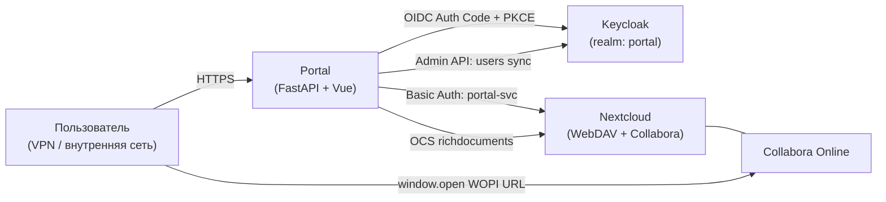

# Интеграция: Keycloak ↔ Nextcloud ↔ Портал

> Инструкция для администратора инфраструктуры. Описывает, как связать
> три внешних компонента, чтобы портал работал как «единое окно».
> Соответствует ТЗ §9 (поставка) и `docs/deploy.md`.

---

## 1. Карта связей



| Компонент | Роль | Версия |
|-----------|------|--------|
| Keycloak | OIDC IdP, источник пользователей и групп | 22+ |
| Nextcloud | Файлохранилище (WebDAV), хост Collabora | 28+ |
| Collabora Online | Совместное редактирование .docx/.xlsx | 23+ |
| Portal | Этот проект (FastAPI + Vue + PG + Redis) | 1.x |

---

## 2. Keycloak

### 2.1. Realm и клиент

1. Создать realm `portal` (или использовать существующий).
2. **Clients → Create client**:
   - Type: `OpenID Connect`
   - Client ID: `portal-web`
   - Authentication: `ON`
   - Standard flow: `ON`
   - Direct access grants: `OFF`
   - Service accounts roles: `ON` (для sync).
3. **Settings**:
   - Valid Redirect URIs: `https://<portal-host>/auth/callback`
   - Valid Post Logout Redirect URIs: `https://<portal-host>/`
   - Web Origins: `https://<portal-host>`
   - Front Channel Logout URL: `https://<portal-host>/auth/logout`
   - PKCE: S256 (Advanced → Proof Key for Code Exchange Code Challenge Method).
4. **Credentials → Regenerate Client Secret** → сохранить в Admin UI портала
   («Настройки → Keycloak → Client Secret») либо в `.env::KEYCLOAK_CLIENT_SECRET`.

### 2.2. Mapper'ы claims

Client → **Client Scopes → portal-web-dedicated → Add mapper**:

| Mapper Type | Token claim | User attribute / source | Add to ID token | Add to access token |
|-------------|-------------|-------------------------|:---------------:|:-------------------:|
| User Property | `email` | `email` | ✓ | ✓ |
| User Property | `given_name` | `firstName` | ✓ | ✓ |
| User Property | `family_name` | `lastName` | ✓ | ✓ |
| User Attribute | `department` | `department` | ✓ | ✓ |
| User Attribute | `job_title` | `jobTitle` | ✓ | ✓ |
| User Attribute | `phone` | `phone` | ✓ | ✓ |
| Group Membership | `groups` | (full path: off) | ✓ | ✓ |

### 2.3. Сервисный аккаунт для sync

Тот же client `portal-web` → **Service accounts roles → Assign role**:
- Realm-management: `view-users`, `query-users`, `view-realm`.

В Admin UI портала («Настройки → Keycloak → Sync client») указать
`client_id` = `portal-web`, `client_secret` = тот же secret, что и для OIDC,
либо завести отдельный sync-клиент `portal-sync` (рекомендуется для prod).

### 2.4. LDAP federation (если есть AD)

User Federation → LDAP → AD. **Обязательно** включить sync ФИО/email/department/
jobTitle/phone в Keycloak attributes (см. таблицу маппинга выше).

### 2.5. Bootstrap

Первый admin портала создаётся локально через `ADMIN_EMAIL`/`ADMIN_PASSWORD`
(см. `docs/deploy.md`). Локальный вход доступен по прямой ссылке
`https://<portal-host>/auth/local` — этот маршрут не индексируется в публичном
UI (backdoor для bootstrap-admin / DevOps на случай недоступности Keycloak).
После того как реальный сотрудник залогинится через Keycloak, повысьте его
роль до `admin` через UI и удалите/отключите локального.

---

## 3. Nextcloud

### 3.1. Service account

Портал не использует JWT пользователя для NC (см. ADR-032). Все файловые
операции идут через единый аккаунт `portal-svc`.

1. **Users → New user**:
   - Username: `portal-svc`
   - Display name: `Portal Service`
   - Password: сгенерировать.
   - Группы: оставить пустым.
2. Войти в NC под `portal-svc` → **Settings → Personal → Security → Devices &
   sessions → Create new app password** → имя «portal-backend» → сохранить
   токен. Это значение пойдёт в Admin UI портала
   («Настройки → Модули → Nextcloud → App Password») либо `.env::NC_SERVICE_APP_PASSWORD`.
3. Корневая папка для файлов портала:
   - Войти под `portal-svc` → создать `PortalFiles` (или другое имя).
   - Указать в Admin UI / `NC_FILES_ROOT`.

### 3.2. Collabora Online

1. **Apps → Office & text → Nextcloud Office (Richdocuments) → Enable**.
2. **Settings → Office → use your own server**: указать URL Collabora
   (внешний `code.example.com` или встроенный `office.<domain>:9980`).
3. CSP: Collabora открывается порталом через `window.open(_blank)`, а не
   iframe — `frame-ancestors` Nextcloud менять не нужно.

### 3.3. Federation — отображение реального ФИО в Collabora (обязательно)

Без этого шага все курсоры в Collabora подписываются как «Анонимный пользователь»
независимо от того, кто открыл документ.

Механизм: портал создаёт initiator-токен, NC обязан перезвонить порталу по
адресу `{PORTAL_BASE_URL}/ocs/v2.php/apps/richdocuments/api/v1/federation`,
чтобы получить `guestDisplayname`. **Перед этим звонком** richdocuments
проверяет `FederationService::isTrustedRemote()` — если хост портала не
доверенный, NC молча возвращает `null`, callback не уходит, имя остаётся
гостевым (см. ADR-032).

**Шаги** (выполнять на хосте, где запущен Nextcloud):

```bash
# 1. Хост портала добавить в gs.trustedHosts.
#    Указывать host[:port], без схемы, без слеша.
docker compose exec --user www-data nextcloud \
    php occ config:system:set gs.trustedHosts 0 --value="portal.company.local"

# 2. Если несколько порталов — увеличивать индекс (1, 2, ...).
# 3. Проверить:
docker compose exec --user www-data nextcloud \
    php occ config:system:get gs.trustedHosts
```

**Альтернатива** (через приложение Federation вместо `gs.trustedHosts`):
включить app `federation`, добавить портал в Trusted servers и выставить
`occ config:app:set richdocuments federation_use_trusted_domains --value=yes`.
Простой `gs.trustedHosts` обычно достаточно.

**Сетевая доступность.** NC должен реально дозваниваться до `PORTAL_BASE_URL`
из своего контейнера. Если у портала self-signed сертификат — либо положить
CA в trust store NC, либо для отладки временно
`occ config:app:set richdocuments disable_certificate_verification --value=yes`
(не для prod).

**Проверка по логам.** При открытии любого .docx/.xlsx в логах backend должен
появиться:

```bash
docker compose logs backend --tail=100 | grep nc.federation_remote_wopi
# ожидаем: "event": "nc.federation_remote_wopi.resolved", "user_id": "<uuid>"
```

Если строки нет — NC не дошёл (не доверяет хосту, не резолвит, TLS).
Параллельно в логах NC ищите `COOL-Federation-Source: ... is not a trusted server`.

### 3.4. Сброс кэша richdocuments после изменения trustedHosts

richdocuments кэширует результат `getRemoteFileDetails()` под ключом
`richdocuments_remote/<md5(remote+token)>`. Кэш живёт пока жив initiator-token
(2 ч, см. `_TOKEN_TTL_SECONDS` в `backend/app/services/nc_federation.py`),
поэтому **уже открытые** в Collabora документы продолжат показывать «Анонимный»
до закрытия даже после правильной настройки trustedHosts. Новые открытия —
сразу с реальным именем (новый токен → новый ключ).

Принудительно сбросить можно:

```bash
# Из корня проекта; оборачивает occ maintenance:repair.
./scripts/flush-nc-richdocuments-cache.sh
```

или вручную:

```bash
docker compose exec --user www-data nextcloud php occ maintenance:repair
```

### 3.5. Проверка

```bash
# Из контейнера portal-backend:
docker compose exec backend python - <<'PY'
import asyncio, os
from app.services.nextcloud import nextcloud_service
print(asyncio.run(nextcloud_service.health_check()))
PY
```

Должно вывести `True`.

В Admin UI: **Настройки → Модули → Nextcloud → Проверить соединение**.

---

## 4. Сетевая модель и доступ

| Зона | Что внутри | Видит |
|------|-----------|-------|
| Внутренняя сеть / VPN | пользователь, портал, Keycloak, Nextcloud, Collabora | всё |
| DMZ | reverse proxy / WAF (опционально) | портал, Keycloak, NC |
| Internet | только Sentry, корпоративный SMTP relay | — |

Nginx портала режет всё вне `system_data/nginx_conf/allowlist.conf` (CIDR
из Admin UI). Прямой доступ к backend (`:8000`) и Postgres/Redis в prod
не публикуется — только через `portal-nginx`.

---

## 5. SSO-цепочка (диагностика)

1. Пользователь открывает `https://<portal-host>/`.
2. Vue app → `GET /api/v1/auth/me` → 401 → `redirectToLogin()`.
3. `GET /auth/login?prompt=none` → 302 на Keycloak.
4. Keycloak возвращает code → `GET /auth/callback?code=...` →
   обмен на token → `users` upsert → `Set-Cookie: portal_session=...`.
5. Vue: `GET /auth/me` → 200 с профилем из БД (роль = `users.role`).
6. При клике на ярлык с `supports_sso=true` →
   `GET /links/{id}/sso-url` → URL с `id_token_hint`.

Если шаг 3 даёт 400 — проверить Web Origins / Redirect URIs.
Если шаг 4 — `keycloak.invalid_audience` — `client_id`/`client_secret`
не совпадает между Admin UI и Keycloak.

---

## 6. Чек-лист готовности (перед запуском в эксплуатацию)

- [ ] Keycloak realm `portal` поднят, mapper'ы настроены, тестовый
      пользователь логинится.
- [ ] LDAP/AD federation работает (или пользователи заведены вручную).
- [ ] `portal-svc` в NC создан, App Password в Admin UI.
- [ ] Collabora открывается на тестовом .docx из папки `PortalFiles`.
- [ ] `https://<portal-host>/api/v1/ready` → 200.
- [ ] Прогон `load/smoke.js` через staging — checks > 99%.
- [ ] OWASP ZAP baseline (`security/zap-scan.sh`) — нет High alerts.
- [ ] Backup-расписание настроено (см. `docs/deploy.md` §7).
- [ ] Sentry DSN задан, `/metrics` собирается Prometheus.
