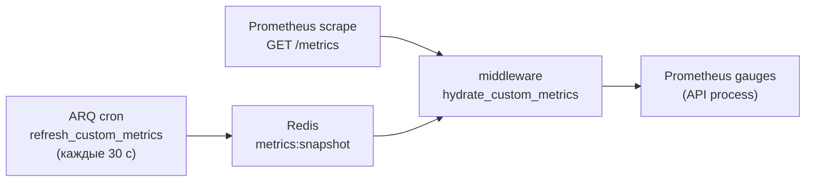

# Мониторинг и наблюдаемость

> **Когда читать:** Нужно понять health/readiness-пробы, как устроен `/metrics` для Prometheus (включая токен-защиту и кастомные гейджи), heartbeat воркера, а также runtime-настройки наблюдаемости из Admin UI (вкладка «Мониторинг»: метрики, уровень логирования, лимит ARQ).
> **Ключевой код:** `./backend/app/api/health.py`, `./backend/app/middleware/metrics.py`, `./backend/app/core/metrics.py`, `./backend/app/worker/tasks/metrics.py`, `./backend/app/api/system_settings/_settings.py`, `./frontend/src/pages/admin/tabs/MonitoringTab.vue`. **Reference-стек alerting/Grafana:** `./monitoring/`.
> **ADR:** 037 (bootstrap env vs runtime JSON). См. также `./deploy.md`, `./audit.md`.

---

## 1. Обзор

Наблюдаемость портала состоит из трёх слоёв (метрики, логи, health-пробы)
плюс reference-стек alerting/Grafana/Loki в `./monitoring/`:

| Слой | Что даёт | Точка входа |
|---|---|---|
| **Health-пробы** | Liveness/readiness для оркестратора и nginx | `GET /health`, `GET /ready` |
| **Метрики** | Prometheus-экспорт (RED-метрики + кастомные гейджи) | `GET /metrics` |
| **Логи** | Структурные логи (structlog), уровень и формат — runtime | `system.json` |

Все runtime-параметры (вкл/выкл метрик, токен, уровень логов, ARQ max jobs)
меняются **без рестарта** через Admin UI и хранятся в
`/data/settings/system.json` (`SystemSettings`, ADR-037). Бутстрап-параметры
(`DATABASE_URL`, `REDIS_URL` и т.п.) остаются в env.

---

## 2. Health-пробы

Роутер `./backend/app/api/health.py` подключается **без префикса** `/api/v1`
(`app.include_router(health_router)`), чтобы оркестратор и nginx дёргали
короткие пути. Аутентификация не требуется; пути исключены из продления сессии и
из инструментирования метрик.

### `GET /health` — liveness

Всегда `200 {"status": "ok"}`. Не ходит в зависимости — проверяет только то, что
процесс жив и отвечает.

### `GET /ready` — readiness

Проверяет зависимости и возвращает `200` либо `503` (`status: "ok"|"error"`) с
картой `checks`:

| Проверка | Условие |
|---|---|
| `postgres` | `SELECT 1` через `AsyncSessionLocal` |
| `redis` | `PING` |
| `nextcloud` | только если модуль включён: `unconfigured` (нет URL) или `health_check()` |
| `audit_partitions` | флаг `app.state.audit_partitions_ok` (партиции аудита созданы) |
| `mime_detection` | `magic` при наличии libmagic, иначе `fallback` (не влияет на код ответа) |

`503` отдаётся, если упала любая из проверок postgres/redis/nextcloud/audit_partitions.
`mime_detection=fallback` — информационный, не фейлит readiness.

> Использование: docker/k8s — `health` как liveness, `ready` как readiness;
> nginx upstream-проверки; staging-чеклист в `./deploy.md` (`/api/v1/ready` за
> прокси).

---

## 3. Метрики Prometheus (`/metrics`)

Инструментирование — `setup_metrics()` в `./backend/app/middleware/metrics.py`
на базе `prometheus_fastapi_instrumentator`. Эндпоинт `/metrics`:

- **не** в OpenAPI (`include_in_schema=False`);
- исключает из RED-метрик служебные хендлеры `/health`, `/ready`, `/metrics`;
- защищён зависимостью `_require_metrics_token`.

### Токен-защита

Заголовок `X-Metrics-Token` сверяется с `system.json::metrics_token` через
`secrets.compare_digest` (constant-time). Если токен **не задан** — эндпоинт
открыт (удобно для закрытого периметра/VPN); если задан — без верного заголовка
`403`. Prometheus настраивается слать токен в scrape-конфиге.

### Кастомные метрики (cross-process snapshot)

Кастомные гейджи объявлены в `./backend/app/core/metrics.py`
(`portal_sse_connections`, `portal_audit_queue_depth`,
`portal_audit_processing_depth`, `portal_active_users_last_1h`,
`portal_photo_storage_bytes`, `portal_kb_articles_total{status}`,
`portal_news_published_total{status}`, `portal_users_total{auth_source}` и
счётчики вроде `portal_arq_jobs_enqueued_total`).

Загвоздка: значения этих гейджей знает **воркер**, а scrape приходит в **API**.
Поэтому:



1. ARQ-cron `refresh_custom_metrics` (`./backend/app/worker/tasks/metrics.py`,
   `second={0,30}`, т.е. каждые 30 с, `run_at_startup=True`) считает значения и
   пишет JSON в Redis-ключ `metrics:snapshot` (`METRICS_SNAPSHOT_KEY`).
2. Middleware `hydrate_custom_metrics` на каждый запрос `/metrics` подтягивает
   снапшот из Redis в гейджи **перед** отдачей. Ошибка гидрации логируется
   (`metrics.hydrate_failed`), но никогда не ломает `/metrics`.

### Heartbeat воркера

`worker_heartbeat` (cron `second={0,30}`) обновляет Redis-ключ `arq:heartbeat`
(`WORKER_HEARTBEAT_KEY`) c TTL **90 с** (`WORKER_HEARTBEAT_TTL`). Если ключ
протух — воркер считается мёртвым (основа для алерта «worker down»).

---

## 4. Логирование

structlog (`./backend/app/core/logging.py`, обязательно
`stdlib.LoggerFactory()` — см. `../AGENTS.md`). Runtime-параметры из
`system.json`:

| Поле | Назначение |
|---|---|
| `log_level` | `DEBUG…CRITICAL` |
| `log_force_json` | `null` = авто (JSON в проде, текст в dev), `true`/`false` = принудительно |
| `log_slow_request_ms` | Порог, выше которого запрос логируется как «медленный» |

Токены/пароли/PII в логи не пишутся (политика безопасности `../AGENTS.md`).
Ошибки и исключения логируются через structlog (`logger.exception(...)` с
полным traceback в JSON) — отдельного error-tracking-сервиса (Sentry и т.п.)
нет, centralized-сбор логов обеспечивает Loki из reference-стека (§7).

---

## 5. Admin-вкладка «Мониторинг»

`./frontend/src/pages/admin/tabs/MonitoringTab.vue` (`AdminPage` → группа
«логи»/«система»). Тонкий редактор подмножества `SystemSettings`; сохранение —
`PATCH /admin/system/settings` (`./backend/app/api/system_settings/_settings.py`),
инвалидация `queryKeys.admin.systemSettings()`.

Секции и поля:

| Секция | Поля |
|---|---|
| **Prometheus** | `prometheus_metrics_enabled`, `metrics_token` |
| **Логирование** | `log_level`, `log_slow_request_ms`, `log_force_json` |
| **Воркер** | `arq_max_jobs` |

**Семантика секрет-полей** (`metrics_token`): на `GET` возвращается
только флаг `*_set` (значение не отдаётся); при `PATCH` `null`/пусто → оставить
как есть, новое значение → задать. i18n-ключи — `admin.monitoring.*`
(`ru.json` мастер + `en.json`).

---

## 7. Alerting и Grafana (reference-стек)

Сам портал **только экспортирует** метрики (`/metrics`). Consumer-сторона —
scrape, alerting-правила, дашборды — оформлена как **reference-конфиги** в
`./monitoring/`. Они **не** подключены к основному `docker-compose.yml`,
поднимаются отдельным overlay, чтобы не тащить тяжёлые образы в базовый деплой.

### Структура

```
monitoring/
├── README.md                          ← детальная инструкция запуска
├── prometheus.yml                     ← scrape portal-backend (/metrics + token)
├── alerts/
│   ├── portal.yml                     ← alerting rules (PromQL)
│   └── alertmanager.yml               ← routing (placeholder receivers)
├── grafana/
│   ├── portal-overview.json           ← дашборд (RED + audit + worker + content)
│   └── provisioning/                  ← auto-provision datasource и dashboards
└── docker-compose.monitoring.yml      ← overlay
```

### Запуск

```bash
docker compose \
  -f docker-compose.yml \
  -f monitoring/docker-compose.monitoring.yml \
  up -d prometheus alertmanager grafana
```

С scrap-токеном (если `system.json::metrics_token` задан):

```bash
PORTAL_METRICS_TOKEN="$(jq -r .metrics_token // empty system_data/settings/system.json)" \
  docker compose -f docker-compose.yml -f monitoring/docker-compose.monitoring.yml up -d prometheus
```

UI (на хосте, прокинут на `127.0.0.1`): Prometheus — `:9090`, Alertmanager —
`:9093`, Grafana — `:3000` (admin/admin при первом старте — сменить!).

### Ключевые алерты (`monitoring/alerts/portal.yml`)

| Alert | Severity | Условие | Что значит |
|---|---|---|---|
| `PortalBackendDown` | 🔴 critical | `up{job="portal"} == 0` 1 мин | Prometheus не получает `/metrics` — backend упал или завис |
| `PortalHighErrorRate` | 🔴 critical | 5xx > 5% при rate > 3/мин | Системная деградация, смотреть логи backend + дашборд Grafana |
| `PortalAuditQueueBacklog` | 🟡 warning | `portal_audit_queue_depth > 1000` 5 мин | ARQ-воркер не успевает flush'ить (или мёртв) |
| `PortalAuditFlushStuck` | 🟡 warning | `portal_audit_processing_depth > 0` 10 мин | Батч взят, но не закоммичен — БД-связность / deadlock |
| `PortalWorkerStale` | 🟡 warning | gauge не менялся 3 мин | ARQ-cron не выполняется — воркер скорее всего мёртв |
| `PortalArqJobsFailing` | 🟡 warning | `rate(portal_arq_jobs_failed_total[5m]) > 0.1` | Задачи систематически падают |
| `PortalHighLatencyP99` | 🟡 warning | p99 latency > 5s | Медленный SQL / блокировки / нехватка пула |
| `PortalPhotoStorageHigh` | 🔵 info | `/data/photos > 100 ГБ` | Планировать ёмкость |

Полный PromQL и rationale — в самом `portal.yml`. Alertmanager-routing —
заглушка (webhook-placeholder), реальный transport (email/Slack/Telegram)
настраивает команда под свою инфраструктуру.

### Грабли reference-стека

- **Scrape-токен через env.** `PORTAL_METRICS_TOKEN` подставляется в
  `prometheus.yml` (`${...}` раскрытие compose-ом при `up`). **Не хардкодить**
  токен в YAML и **не коммитить**.
- **`for:` ≥ 2 мин** на все алерты — даёт лагу cross-process snapshot (≤30с) и
  отдельным всплескам 5xx settle'нуться без будоражащего alerting'а.
- **Inhibition**: `PortalBackendDown` глушит все остальные `service=portal-backend`
  алерты — нет смысла будить из-за error rate, если сам бэкенд лежит.
- **Гейджи без воркера «замерзают».** `PortalWorkerStale` ловит это по
  `changes(portal_audit_queue_depth[3m]) == 0` — см. §7 Грабли основного стека.

---

## 8. Грабли / контекст

- **Кастомные гейджи без воркера «замерзают».** Если ARQ-воркер не запущен,
  `metrics:snapshot` не обновляется и кастомные метрики на `/metrics` показывают
  устаревшие/нулевые значения. RED-метрики самого API при этом живые.
- **Токен сравнивается constant-time.** Не «оптимизируйте» `_require_metrics_token`
  на обычное `==` — это таймин-атака на токен.
- **`mime_detection=fallback` не фейлит readiness** — это сигнал «libmagic
  недоступен, используется запасной детектор», а не отказ.
- **Не логируйте секреты.** Любое новое поле с токеном/паролем должно
  отдаваться наружу только флагом `*_set`, как `metrics_token`.
- **`/health` и `/ready` без префикса** `/api/v1` и без auth — учитывайте при
  настройке allowlist/nginx.
- **Nginx access-log содержит `request_id`.** `system_data/nginx/nginx.conf`
  пишет JSON-access-log с полем `request_id` (берётся из `X-Request-Id`
  клиента или генерируется nginx'ом). Тот же id проксируется в backend через
  `proxy_set_header X-Request-Id` и попадает во все structlog-строки через
  `middleware/logging.py` — сквозная корреляция nginx-access ↔ backend-request.
  Искать по `request_id` в обоих источниках.
