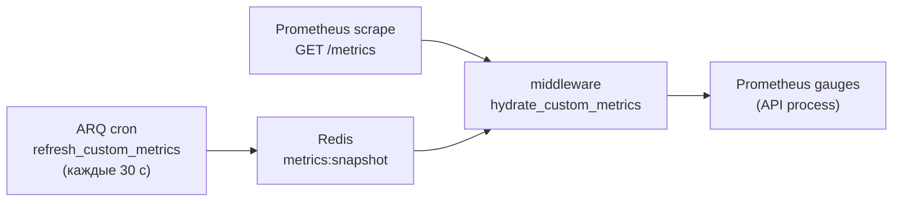

# Мониторинг и наблюдаемость

> **Когда читать:** Нужно понять health/readiness-пробы, как устроен `/metrics` для Prometheus (включая токен-защиту и кастомные гейджи), heartbeat воркера, а также runtime-настройки наблюдаемости из Admin UI (вкладка «Мониторинг»: метрики, уровень логирования, лимит ARQ).
> **Ключевой код:** `./backend/app/api/health.py`, `./backend/app/middleware/metrics.py`, `./backend/app/core/metrics.py`, `./backend/app/worker/tasks/metrics.py`, `./backend/app/api/system_settings/_settings.py`, `./frontend/src/pages/admin/tabs/MonitoringTab.vue`. **Reference-стек alerting/Grafana:** `./monitoring/`.
> **ADR:** 037 (bootstrap env vs runtime JSON). См. также `./deploy.md`, `./audit.md`.

---

## 1. Обзор

Наблюдаемость портала состоит из трёх слоёв (метрики, логи, health-пробы)
плюс reference-стек alerting/Grafana/Loki в `./monitoring/`:

| Слой | Что даёт | Точка входа |
|---|---|---|
| **Health-пробы** | Liveness/readiness для оркестратора и nginx | `GET /health`, `GET /ready` |
| **Метрики** | Prometheus-экспорт (RED-метрики + кастомные гейджи) | `GET /metrics` |
| **Логи** | Структурные логи (structlog), уровень и формат — runtime | `system.json` |

Все runtime-параметры (вкл/выкл метрик, токен, уровень логов, ARQ max jobs)
меняются **без рестарта** через Admin UI и хранятся в
`/data/settings/system.json` (`SystemSettings`, ADR-037). Бутстрап-параметры
(`DATABASE_URL`, `REDIS_URL` и т.п.) остаются в env.

---

## 2. Health-пробы

Роутер `./backend/app/api/health.py` подключается **без префикса** `/api/v1`
(`app.include_router(health_router)`), чтобы оркестратор и nginx дёргали
короткие пути. Аутентификация не требуется; пути исключены из продления сессии и
из инструментирования метрик.

### `GET /health` — liveness

Всегда `200 {"status": "ok"}`. Не ходит в зависимости — проверяет только то, что
процесс жив и отвечает.

### `GET /ready` — readiness

Проверяет зависимости и возвращает `200` либо `503` (`status: "ok"|"error"`) с
картой `checks`:

| Проверка | Условие |
|---|---|
| `postgres` | `SELECT 1` через `AsyncSessionLocal` |
| `redis` | `PING` |
| `nextcloud` | только если модуль включён: `unconfigured` (нет URL) или `health_check()` |
| `audit_partitions` | флаг `app.state.audit_partitions_ok` (партиции аудита созданы) |
| `mime_detection` | `magic` при наличии libmagic, иначе `fallback` (не влияет на код ответа) |

`503` отдаётся, если упала любая из проверок postgres/redis/nextcloud/audit_partitions.
`mime_detection=fallback` — информационный, не фейлит readiness.

> Использование: docker/k8s — `health` как liveness, `ready` как readiness;
> nginx upstream-проверки; staging-чеклист в `./deploy.md` (`/api/v1/ready` за
> прокси).

---

## 3. Метрики Prometheus (`/metrics`)

Инструментирование — `setup_metrics()` в `./backend/app/middleware/metrics.py`
на базе `prometheus_fastapi_instrumentator`. Эндпоинт `/metrics`:

- **не** в OpenAPI (`include_in_schema=False`);
- исключает из RED-метрик служебные хендлеры `/health`, `/ready`, `/metrics`;
- защищён зависимостью `_require_metrics_token`.

### Токен-защита

Backend принимает токен через **любой из двух заголовков** (любого достаточно):

- `Authorization: Bearer <token>` — **канонический транспорт Prometheus**
  (`prometheus.yml::scrape_configs.authorization.credentials` шлёт именно его);
- `X-Metrics-Token: <token>` — legacy/ручной заголовок, удобен для ad-hoc `curl`
  и операторских скриптов.

Схема `Bearer` регистронечувствительна. Сверка — `secrets.compare_digest`
(constant-time). Если токен **не задан** в `system.json::metrics_token` —
эндпоинт открыт (допустимо в закрытом периметре/VPN); если задан — без верного
заголовка `403`.

> **Важно:** ранее backend принимал только `X-Metrics-Token`, а Prometheus шлёт
> `Authorization: Bearer` — при заданном токене scrape падал в 403 и бросал
> ложный `PortalBackendDown` при живом портале. Теперь оба заголовка валидны.

### Кастомные метрики (cross-process snapshot)

Кастомные гейджи объявлены в `./backend/app/core/metrics.py`
(`portal_sse_connections`, `portal_audit_queue_depth`,
`portal_audit_processing_depth`, `portal_active_users_last_1h`,
`portal_photo_storage_bytes`, `portal_kb_articles_total{status}`,
`portal_news_published_total{status}`, `portal_users_total{auth_source}`,
счётчик `portal_audit_events_pushed_total{event_type}`, а также ARQ-метрики
`portal_arq_jobs_total{function,status}` и
`portal_arq_job_duration_seconds{function}`).

ARQ-метрики собирает декоратор `track_arq_job` (`./backend/app/worker/tasks/metrics.py`),
которым обёрнуты все задачи в `WorkerSettings.functions`. Для каждой задачи
записывается: `started`-счётчик (до вызова), терминальный `succeeded`/`failed`
(в `finally`, исключение пробрасывается дальше — retry-логика ARQ не нарушается)
и длительность в мс. Записи идут в Redis-хэши `arq:metrics:jobs` /
`arq:metrics:job_ms` через атомарный `HINCRBY`, затем `refresh_custom_metrics`
затягивает их в snapshot. Гидрация в API-процессе использует
**delta-increment** (Prometheus-счётчики не имеют `.set()`) — см. `middleware/metrics.py`
(кэш `_arq_job_last`). Дашборд Overview показывает failures/started/duration по
функциям.

**Outbox-метрики** (`portal_email_outbox_pending/dlq/sending_stale`,
`portal_messenger_outbox_*`) — здоровье рассылок. Без них копящиеся /
DLQ-ящиеся письма (email + MAX-мессенджер) невидимы до жалоб юзеров.
`refresh_custom_metrics` считает `count(*) GROUP BY status` для обеих таблиц
outbox и кладёт в snapshot.

**Integration probes** (`portal_integration_up{integration}`) — Keycloak /
Nextcloud / SMTP / Collabora. ARQ-cron `probe_integrations` (каждые 60с,
`./backend/app/worker/tasks/integration_health.py`) проверяет каждую интеграцию
коротким запросом (OIDC discovery / status.php / TCP-connect / richdocuments),
результат 1/0 пишет в Redis-хэш `integration:health`. Не сконфигурированные
интеграции (нет настроек / модуль выключен) → `None` → gauge отсутствует (no data).

**Synthetic probes** (`portal_synthetic_probe_up/duration_seconds{flow}`) —
end-to-end user-flow через headless-браузер. ARQ-cron `run_synthetic_probe`
(каждые 5 мин) вызывает screenshot-service `/probe` endpoint, который через
Playwright логинится (local-auth) и проверяет загрузку SPA. Gated за
`PROBE_ADMIN_EMAIL/PASSWORD` env (пусто → probe skip-ается).

Загвоздка: значения этих гейджей знает **воркер**, а scrape приходит в **API**.
Поэтому:



1. ARQ-cron `refresh_custom_metrics` (`./backend/app/worker/tasks/metrics.py`,
   `second={0,30}`, т.е. каждые 30 с, `run_at_startup=True`) считает значения и
   пишет JSON в Redis-ключ `metrics:snapshot` (`METRICS_SNAPSHOT_KEY`).
2. Middleware `hydrate_custom_metrics` на каждый запрос `/metrics` подтягивает
   снапшот из Redis в гейджи **перед** отдачей. Ошибка гидрации логируется
   (`metrics.hydrate_failed`), но никогда не ломает `/metrics`.

### Heartbeat воркера

`worker_heartbeat` (cron `second={0,30}`) обновляет Redis-ключ `arq:heartbeat`
(`WORKER_HEARTBEAT_KEY`) c TTL **90 с** (`WORKER_HEARTBEAT_TTL`). Если ключ
протух — воркер считается мёртвым (основа для алерта «worker down»).

---

## 4. Логирование

structlog (`./backend/app/core/logging.py`, обязательно
`stdlib.LoggerFactory()` — см. `../AGENTS.md`). Runtime-параметры из
`system.json`:

| Поле | Назначение |
|---|---|
| `log_level` | `DEBUG…CRITICAL` |
| `log_force_json` | `null` = авто (JSON в проде, текст в dev), `true`/`false` = принудительно |
| `log_slow_request_ms` | Порог, выше которого запрос логируется как «медленный» |

Токены/пароли/PII в логи не пишутся (политика безопасности `../AGENTS.md`).
Ошибки и исключения логируются через structlog (`logger.exception(...)` с
полным traceback в JSON) — отдельного error-tracking-сервиса (Sentry и т.п.)
нет, centralized-сбор логов обеспечивает Loki из reference-стека (§7).

---

## 5. Admin-вкладка «Мониторинг»

`./frontend/src/pages/admin/tabs/MonitoringTab.vue` (`AdminPage` → группа
«логи»/«система»). Тонкий редактор подмножества `SystemSettings`; сохранение —
`PATCH /admin/system/settings` (`./backend/app/api/system_settings/_settings.py`),
инвалидация `queryKeys.admin.systemSettings()`.

Секции и поля:

| Секция | Поля |
|---|---|
| **Prometheus** | `prometheus_metrics_enabled`, `metrics_token` |
| **Логирование** | `log_level`, `log_slow_request_ms`, `log_force_json` |
| **Воркер** | `arq_max_jobs` |

**Семантика секрет-полей** (`metrics_token`): на `GET` возвращается
только флаг `*_set` (значение не отдаётся); при `PATCH` `null`/пусто → оставить
как есть, новое значение → задать. i18n-ключи — `admin.monitoring.*`
(`ru.json` мастер + `en.json`).

---

## 7. Alerting и Grafana (reference-стек)

Сам портал **только экспортирует** метрики (`/metrics`) и пишет логи в stdout.
Consumer-сторона — scrape, сбор логов, alerting-правила, дашборды — оформлена
как **reference-конфиги** в `./monitoring/`. Они **не** подключены к основному
`docker-compose.yml`, поднимаются отдельным overlay, чтобы не тащить тяжёлые
образы (~900 МБ суммарно) в базовый деплой. См. ADR-044.

### Структура

```
monitoring/
├── README.md                          ← детальная инструкция запуска
├── prometheus.yml                     ← scrape portal-backend + 4 exporter'а (postgres/redis/node/nginx)
├── loki/
│   └── config.yml                     ← single-binary Loki (retention 30d)
├── alloy/
│   └── config.alloy                   ← сбор Docker-логов → Loki (discovery + JSON)
├── alerts/
│   ├── portal.yml                     ← alerting rules (PromQL) — backend + PG + Redis + host + nginx + ARQ
│   └── alertmanager.yml               ← routing + email-receivers (SMTP-relay)
├── grafana/
│   ├── portal-overview.json           ← дашборд метрик (RED + audit + worker + ARQ)
│   ├── portal-logs.json               ← дашборд логов (ошибки, объём, request_id)
│   ├── portal-infrastructure.json     ← дашборд инфры (PostgreSQL + Redis + host + nginx)
│   └── provisioning/                  ← auto-provision datasource (Prometheus+Loki) и dashboards
└── docker-compose.monitoring.yml      ← overlay (5 сервисов + 4 exporter'а)
```

### Запуск (полный стек — метрики + логи + алерты + UI)

```bash
docker compose \
  -f docker-compose.yml \
  -f monitoring/docker-compose.monitoring.yml \
  up -d prometheus alertmanager grafana loki alloy
```

С scrap-токеном (если `system.json::metrics_token` задан) — передать через env:

```bash
PORTAL_METRICS_TOKEN="$(jq -r .metrics_token // empty system_data/settings/system.json)" \
  docker compose -f docker-compose.yml -f monitoring/docker-compose.monitoring.yml up -d prometheus
```

UI (на хосте, проброшены на `127.0.0.1` — через SSH-туннель или reverse-proxy):

| Сервис | Порт | Назначение |
|---|---|---|
| Grafana | `:3001` | Единый UI: метрики + логи (два datasource, три дашборда). admin/admin (смена при первом входе) |
| Prometheus | `:9090` | Метрики: targets, query (PromQL), alert state |
| Alertmanager | `:9093` | Состояние алертов, silences, тест отправки |
| Loki | `:3100` | API логов (обычно через Grafana, напрямую — для отладки) |
| Alloy | `:12345` | UI pipeline сборщика (inspect tailers, debugging) |
| postgres-exporter | `:9187` | Метрики PostgreSQL (пул соединений, cache, XID, долгие TX, дедлоки) |
| redis-exporter | `:9121` | Метрики Redis (память, evictions, клиенты, keyspace) |
| node-exporter | `:9100` | Метрики хоста (диск/CPU/RAM/load) — критично для disk-full-алерта |
| nginx-exporter | `:9113` | Метрики nginx (active connections, request rate — через stub_status) |

Exporter'ы подключаются к `portal_internal` и видят `postgres`/`redis`/`nginx`
по DNS. Секреты (`POSTGRES_PASSWORD`, `REDIS_PASSWORD`) интерполируются из `.env`.
Nginx отдаёт `stub_status` на `http://nginx:80/stub_status` (только из сети
`172.16.0.0/12`), см. `nginx/templates/proxy_locations.conf.tmpl`.

### Email-доставка алертов

`alertmanager.yml` шлёт алерты админам через **прямой SMTP-relay** (env-параметризуемые
`${ALERT_SMTP_*}`), независимый от portal `email_outbox` — критично: алерты уходят
даже при падении backend/worker. При пустом `ALERT_SMTP_HOST` алерты видны только в
UI Alertmanager. Переменные задаются в `.env` (см. `.env.example`, секция Observability).

### Ключевые алерты (`monitoring/alerts/portal.yml`)

| Alert | Severity | Условие | Что значит |
|---|---|---|---|
| `PortalBackendDown` | 🔴 critical | `up{job="portal"} == 0` 1 мин | Prometheus не получает `/metrics` — backend упал или завис |
| `PortalHighErrorRate` | 🔴 critical | 5xx > 5% при rate > 3/мин | Системная деградация, смотреть логи backend + дашборд Grafana |
| `PortalAuditQueueBacklog` | 🟡 warning | `portal_audit_queue_depth > 1000` 5 мин | ARQ-воркер не успевает flush'ить (или мёртв) |
| `PortalAuditFlushStuck` | 🟡 warning | `portal_audit_processing_depth > 0` 10 мин | Батч взят, но не закоммичен — БД-связность / deadlock |
| `PortalWorkerStale` | 🟡 warning | gauge не менялся 3 мин | ARQ-cron не выполняется — воркер скорее всего мёртв |
| `PortalArqJobFailures` | 🟡 warning | `rate(portal_arq_jobs_total{status="failed"}) > 0.1/s` 5 мин | ARQ-задачи падают — смотреть логи worker, возможно упал upstream |
| `PortalHighLatencyP99` | 🟡 warning | p99 latency > 5s | Медленный SQL / блокировки / нехватка пула |
| `PortalSSEConnectionsHigh` | 🟡 warning | `portal_sse_connections > 500` 10 мин | Утечка SSE-стримов (незакрытые EventSource, вкладки-зомби) |
| `PortalPhotoStorageHigh` | 🔵 info | `/data/photos > 100 ГБ` | Планировать ёмкость |
| `PortalPGConnectionsHigh` | 🟡 warning | пул соединений > 80% | Насыщение пула → растёт latency (asyncpg pool / connection leak) |
| `PortalPGCacheHitLow` | 🟡 warning | cache hit ratio < 90% | Нехватка shared_buffers или отсутствующие индексы |
| `PortalPGWraparound` | 🟡 warning | XID возраст > 1.5e9 | autovacuum не справляется — близко к read-only защите |
| `PortalPGDeadlocks` | 🟡 warning | дедлоки > 0 | Конкурирующие транзакции — баг в коде |
| `PortalRedisMemoryHigh` | 🟡 warning | память > 90% maxmemory | Близко к eviction-режиму |
| `PortalRedisEvictions` | 🟡 warning | evictions > 6/мин | Теряются сессии/audit — увеличить REDIS_MAXMEMORY |
| `PortalDiskSpaceLow` | 🔴 critical | диск заполнен > 85% | Disk full ломает запись фото/БД/логов |
| `PortalCPUHigh` | 🟡 warning | CPU > 80% 5 мин | Деградация latency для всех сервисов |
| `PortalRAMLow` | 🟡 warning | свободная RAM < 10% | Риск OOM-kill контейнеров |
| `PortalNginxConnectionsHigh` | 🟡 warning | active connections > 1000 | Утечка keepalive или аномальный трафик |
| `PortalEmailOutboxBacklog` | 🟡 warning | `email_outbox_pending > 50` 5 мин | SMTP недоступен/медленный — письма копятся в очереди |
| `PortalEmailOutboxDLQ` | 🟡 warning | `email_outbox_dlq > 0` 10 мин | Письма в dead-letter (безвозвратно потеряны) — разобрать |
| `PortalMessengerOutboxBacklog` | 🟡 warning | `messenger_outbox_pending > 50` 5 мин | MAX API недоступен / неверный токен / rate-limit |
| `PortalMessengerOutboxDLQ` | 🟡 warning | `messenger_outbox_dlq > 0` 10 мин | MAX-сообщения в dead-letter — разобрать |
| `PortalIntegrationDown` | 🟡 warning | `portal_integration_up == 0` 3 мин | Keycloak/Nextcloud/SMTP/Collabora упал — смотреть какой в Grafana |
| `PortalSyntheticProbeFailed` | 🟡 warning | `portal_synthetic_probe_up == 0` 10 мин | End-to-end user-flow сломан (frontend/auth/backend regression) |

> `PortalArqJobFailures` возрождён на корректной метрике `portal_arq_jobs_total{status="failed"}`
> (гидрируется из Redis через декоратор `track_arq_job`). Прежняя версия на
> `portal_arq_jobs_failed_total` была мёртвой — счётчики объявлялись, но нигде
> не инкрементировались (ARQ 0.26 не передаёт флаг успеха в `on_job_end`).

Полный PromQL и rationale — в самом `portal.yml`. Alertmanager-routing —
email-receivers через SMTP-relay (см. §7 «Email-доставка алертов»).

### Грабли reference-стека

- **Scrape-токен через env.** `PORTAL_METRICS_TOKEN` подставляется в
  `prometheus.yml::authorization.credentials` — Prometheus шлёт его как
  `Authorization: Bearer <token>` (канонический транспорт). Backend также
  принимает legacy-заголовок `X-Metrics-Token` (для ad-hoc `curl`). Раскрытие
  `${...}` делает compose при `up`. **Не хардкодить** токен в YAML и **не
  коммитить**. Пустой токен → `/metrics` открыт (закрытый периметр/VPN).
- **`for:` ≥ 2 мин** на все алерты — даёт лагу cross-process snapshot (≤30с) и
  отдельным всплескам 5xx settle'нуться без будоражащего alerting'а.
- **Inhibition**: `PortalBackendDown` глушит все остальные `service=portal-backend`
  алерты — нет смысла будить из-за error rate, если сам бэкенд лежит.
- **Гейджи без воркера «замерзают».** `PortalWorkerStale` ловит это по
  `changes(portal_audit_queue_depth[3m]) == 0` — см. §7 Грабли основного стека.

---

## 8. Грабли / контекст

- **Кастомные гейджи без воркера «замерзают».** Если ARQ-воркер не запущен,
  `metrics:snapshot` не обновляется и кастомные метрики на `/metrics` показывают
  устаревшие/нулевые значения. RED-метрики самого API при этом живые.
- **Токен сравнивается constant-time.** Не «оптимизируйте» `_require_metrics_token`
  на обычное `==` — это таймин-атака на токен.
- **`mime_detection=fallback` не фейлит readiness** — это сигнал «libmagic
  недоступен, используется запасной детектор», а не отказ.
- **Не логируйте секреты.** Любое новое поле с токеном/паролем должно
  отдаваться наружу только флагом `*_set`, как `metrics_token`.
- **`/health` и `/ready` без префикса** `/api/v1` и без auth — учитывайте при
  настройке allowlist/nginx.
- **Nginx access-log содержит `request_id`.** `system_data/nginx/nginx.conf`
  пишет JSON-access-log с полем `request_id` (берётся из `X-Request-Id`
  клиента или генерируется nginx'ом). Тот же id проксируется в backend через
  `proxy_set_header X-Request-Id` и попадает во все structlog-строки через
  `middleware/logging.py` — сквозная корреляция nginx-access ↔ backend-request.
  Искать по `request_id` в обоих источниках (в Loki — через LogQL, см. §9).

---

## 9. Централизованные логи (Loki + Alloy)

Опциональный слой централизованного сбора логов — поднимается тем же overlay
`monitoring/`, что и метрики (см. §7). Заменяет `docker logs | grep` на
структурированный поиск в Grafana через LogQL. См. ADR-044.

### Архитектура

```
portal internal-сеть
  ├─ backend/worker ──stdout(JSON structlog)──┐
  ├─ nginx ──stdout(JSON json_combined)───────┼──► alloy ──► loki ──┐
  └─ прочие (postgres/redis/...) ──stdout─────┘                    ├──► grafana (datasource Loki)
                                                                  └──► (API :3100 для отладки)
```

- **Alloy** (`monitoring/alloy/config.alloy`) — `loki.source.docker` через Docker
  socket discovery контейнеров `portal-*`, attach к их stdout/stderr. `stage.docker`
  распаковывает json-file envelope, `stage.json` парсит inner (structlog/nginx).
- **Loki** (`monitoring/loki/config.yml`) — single-binary, retention 30d, compactor.
  `auth_enabled: false` (закрытый периметр `portal_internal`).

### Лейбл-стратегия (low-cardinality — критично!)

Loki индексирует **только лейблы**, содержимое логов не индексируется. Высокая
кардинальность лейблов убивает производительность. Поэтому:

| Лейбл | Кардинальность | Источник |
|---|---|---|
| `container` | ~10 (имена контейнеров) | discovery.docker |
| `compose_service` | ~8 (backend/worker/nginx/...) | docker label |
| `service` | 2 (`portal-backend`, `portal-worker`) | structlog JSON |
| `level` | ~6 (info/warning/error/...) | structlog JSON |

**`request_id`, `job_id`, `event`, `logger` — НЕ лейблы** (high-cardinality).
Они извлекаются `stage.json` как структурированные поля и ищутся через LogQL
оператор `| json`:

```logql
# Найти все лог-линии с конкретным request_id (через nginx или backend)
{container=~"portal-.*"} | json | request_id="4fcfdcddc43f129b785926c0c49188b4"

# Ошибки backend за последний час
{service="portal-backend", level=~"error|critical"}

# Медленные запросы nginx (> 2с)
{container="portal-nginx-1"} | json | request_time > 2

# 5xx ошибки nginx
{container="portal-nginx-1"} | json | status >= 500

# События audit-pipeline в воркере
{service="portal-worker"} | json | logger =~ ".*audit.*"
```

### Дашборд логов (`monitoring/grafana/portal-logs.json`)

7 панелей в Grafana (папка Portal): ошибки backend/worker, объём по сервисам,
объём по уровням (stacked), медленные запросы nginx, 5xx, audit-pipeline,
трассировка по `request_id` (с переменной-фильтром по `request_id` из логов
nginx со status ≥ 400).

### Грабли

- **Loki 3.6+ и Alloy не содержат `wget`/`curl`** (busybox убран). Встроенный
  HTTP-healthcheck сделать нечем — убран. Готовность через `restart: unless-stopped`
  + ручная проверка: `curl http://localhost:3100/ready` (Loki),
  `curl http://localhost:12345/-/ready` (Alloy).
- **`${VAR:default}` НЕ работает в alertmanager.yml** — только `${VAR}` без
  дефолта (Alertmanager на Go). Дефолты задаются в overlay compose.
- **Фиксированные UID datasource обязательны** (`uid: loki`, `uid: prometheus`) —
  без них Grafana генерирует случайные UID, дашборды не находят datasource'ы.
- **`request_id` — НЕ лейбл** (см. выше). Делать его лейблом = взорвать индекс
  Loki (миллионы уникальных значений).
- **Объём диска Loki** зависит от трафика логов. Retention 30d, compactor чистит.
  Мониторить `portal_photo_storage`-аналогом или `du -sh` на volume `loki-data`.
  При исчерпании — снизить retention или отфильтровать шумные лейблы в Alloy.
- **Docker socket для Alloy**: `/var/run/docker.sock:ro` — discovery + attach
  работают на чтение. Alloy не управляет контейнерами (не start/stop), только
  читает логи.
