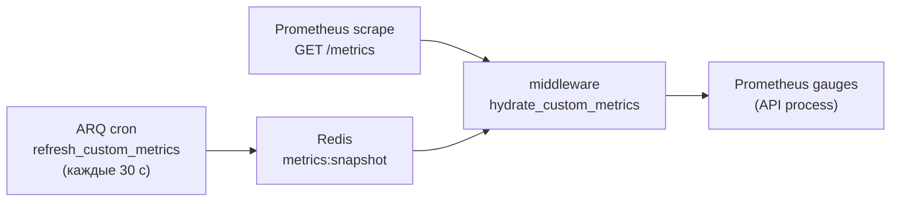

# Мониторинг и наблюдаемость

> **Когда читать:** Нужно понять health/readiness-пробы, как устроен `/metrics` для Prometheus (включая токен-защиту и кастомные гейджи), heartbeat воркера, а также runtime-настройки наблюдаемости из Admin UI (вкладка «Мониторинг»: метрики, уровень логирования, лимит ARQ).
> **Ключевой код:** `./backend/app/api/health.py`, `./backend/app/middleware/metrics.py`, `./backend/app/core/metrics.py`, `./backend/app/worker/tasks/metrics.py`, `./backend/app/api/system_settings/_settings.py`, `./frontend/src/pages/admin/tabs/MonitoringTab.vue`. **Reference-стек alerting/Grafana:** `./monitoring/`.
> **ADR:** 037 (bootstrap env vs runtime JSON). См. также `./deploy.md`, `./audit.md`.

---

## 1. Обзор

Наблюдаемость портала состоит из трёх слоёв (метрики, логи, health-пробы)
плюс reference-стек alerting/Grafana/Loki в `./monitoring/`:

| Слой | Что даёт | Точка входа |
|---|---|---|
| **Health-пробы** | Liveness/readiness для оркестратора и nginx | `GET /health`, `GET /ready` |
| **Метрики** | Prometheus-экспорт (RED-метрики + кастомные гейджи) | `GET /metrics` |
| **Логи** | Структурные логи (structlog), уровень и формат — runtime | `system.json` |

Все runtime-параметры (вкл/выкл метрик, токен, уровень логов, ARQ max jobs)
меняются **без рестарта** через Admin UI и хранятся в
`/data/settings/system.json` (`SystemSettings`, ADR-037). Бутстрап-параметры
(`DATABASE_URL`, `REDIS_URL` и т.п.) остаются в env.

---


### Итог волны достоверности (сент 2026, ADR-053)

Сентябрьская волна (#236–#251) убрала ложные состояния: проценты без подмены
при малом трафике, ARQ timeout/cancel ≠ успех, свежесть снапшота/проб,
per-process пул БД, Collabora по реальным capabilities, dead-man контроль
(Watchdog → Zabbix/внешний приёмник), секреты не попадают в traceback-логи.
Состояния по-русски на Overview: «Работает / Недоступна / Данные устарели /
Отключено / Ещё не проверено / Нет данных». Что делать при тревогах —
[`runbooks.md`](./runbooks.md). Решения — ADR-053, журнал приёмки —
`docs/wip/monitoring-reliability-evidence.md`.

## 2. Health-пробы

Роутер `./backend/app/api/health.py` подключается **без префикса** `/api/v1`
(`app.include_router(health_router)`), чтобы оркестратор и nginx дёргали
короткие пути. Аутентификация не требуется; пути исключены из продления сессии и
из инструментирования метрик.

### `GET /health` — liveness

Всегда `200 {"status": "ok"}`. Не ходит в зависимости — проверяет только то, что
процесс жив и отвечает.

### `GET /ready` — readiness

Проверяет зависимости и возвращает `200` либо `503` (`status: "ok"|"error"`) с
картой `checks`:

| Проверка | Условие |
|---|---|
| `postgres` | `SELECT 1` через `AsyncSessionLocal` |
| `redis` | `PING` |
| `nextcloud` | только если модуль включён: `unconfigured` (нет URL) или `health_check()` |
| `audit_partitions` | флаг `app.state.audit_partitions_ok` (партиции аудита созданы) |
| `mime_detection` | `magic` при наличии libmagic, иначе `fallback` (не влияет на код ответа) |

`503` отдаётся, если упала любая из проверок postgres/redis/nextcloud/audit_partitions.
`mime_detection=fallback` — информационный, не фейлит readiness.

> Использование: docker/k8s — `health` как liveness, `ready` как readiness;
> nginx upstream-проверки; staging-чеклист в `./deploy.md` (`/api/v1/ready` за
> прокси).

---

## 3. Метрики Prometheus (`/metrics`)

Инструментирование — `setup_metrics()` в `./backend/app/middleware/metrics.py`
на базе `prometheus_fastapi_instrumentator`.

**Multiprocess-режим (прод: `uvicorn --workers 2`).** Образ backend'а выставляет
`PROMETHEUS_MULTIPROC_DIR` (Dockerfile; entrypoint чистит per-pid mmap-файлы при
старте, graceful-shutdown помечает pid мёртвым через `mark_process_dead`).
prometheus_client пишет значения в per-pid файлы, а `/metrics` агрегирует их
через `MultiProcessCollector`. Без этого каждый воркер держал собственный реестр,
и scrape видел состояние **одного случайного воркера** — RED/SLO-цифры были шумом
от половины трафика (аудит 2026-08). Кастомные gauge'и объявлены с
`multiprocess_mode="mostrecent"` (свежайшая запись побеждает, pid срезается);
кумулятивы `portal_audit_events_pushed_total` / `portal_arq_jobs_total` /
`portal_arq_job_duration_ms_total` — это **gauge с абсолютом из Redis-снапшота**
(не counter: per-pid counter-агрегация суммировала бы дельты дважды);
`rate()`/`increase()` по монотонному gauge работают как раньше.

Эндпоинт `/metrics`:

- **не** в OpenAPI (`include_in_schema=False`);
- исключает из RED-метрик служебные хендлеры `/health`, `/ready`, `/metrics`;
- защищён зависимостью `_require_metrics_token`.

Набор HTTP-метрик — ЯВНЫЙ (не дефолтный `metrics.default()`): `requests()` +
`latency()` с полными бакетами и лейблами `handler`/`method`. Дефолтный набор
давал две кривые гистограммы (low-res с лейблами + high-res без лейблов) —
p99 по endpoint'ам был фактически невычислим.

**Исходящие HTTP-запросы (httpx)**: долгоживущие клиенты (keycloak/nextcloud/
matrix/max) обёрнуты `instrument_httpx_client()` (`app/core/http_metrics.py`) —
`portal_http_client_requests_total{target,method,status}` и
`portal_http_client_request_duration_seconds{target}`. Видна латентность
интеграций (медленный SSO-логин = Keycloak, а не портал). Считаются только
запросы с ответом (connect-error закрывает `portal_integration_up`); метрики
живут в процессе-владельце клиента (воркерские matrix/max при рассылке outbox
не скрейпятся — латентность видна для API-путей, напр. тестовой отправки).

### Токен-защита

Backend принимает токен через **любой из двух заголовков** (любого достаточно):

- `Authorization: Bearer <token>` — **канонический транспорт Prometheus**
  (`prometheus.yml::scrape_configs.authorization.credentials` шлёт именно его);
- `X-Metrics-Token: <token>` — legacy/ручной заголовок, удобен для ad-hoc `curl`
  и операторских скриптов.

Схема `Bearer` регистронечувствительна. Сверка — `secrets.compare_digest`
(constant-time). Если токен **не задан** в `system.json::metrics_token` —
эндпоинт открыт (допустимо в закрытом периметре/VPN); если задан — без верного
заголовка `403`.

> **Важно:** ранее backend принимал только `X-Metrics-Token`, а Prometheus шлёт
> `Authorization: Bearer` — при заданном токене scrape падал в 403 и бросал
> ложный `PortalBackendDown` при живом портале. Теперь оба заголовка валидны.

### Кастомные метрики (cross-process snapshot)

Кастомные гейджи объявлены в `./backend/app/core/metrics.py`
(`portal_sse_connections`, `portal_audit_queue_depth`,
`portal_audit_processing_depth`, `portal_worker_last_heartbeat_seconds`
(unix-timestamp последнего heartbeat'а воркера — основа алерта
`PortalWorkerDown`, см. §3 «Heartbeat воркера»),
`portal_metrics_snapshot_generated_timestamp_seconds` и
`portal_metrics_snapshot_read_success` (свежесть завершённой публикации и
успех чтения текущим scrape — основа `PortalMetricsSnapshotStale`), а также
`portal_db_pool_size{state}` + `portal_db_pool_limit` — насыщение пула
SQLAlchemy **в каждом API-процессе** (in_use = checked out, idle = checked in).
В отличие от остальных gauge'ов, эти **не гидрируются из Redis-snapshot** — пул
это per-process состояние, читается напрямую из `engine.pool`: каждый
uvicorn-воркер обновляет свои ряды фоновым таском каждые 10 с
(`start_db_pool_updater` в lifespan) плюс при каждом обслуженном scrape.
Режим `liveall` — ряды получают pid-лейбл (одна серия на воркер), поэтому
насыщение любого процесса видно независимо от того, кто обслужил scrape
(MON-09; раньше `mostrecent` показывал только состояние одного случайного
воркера). `portal_db_pool_limit` = `db_pool_size + db_max_overflow`
(дефолт 50); доля насыщения = `portal_db_pool_size{state="in_use"} /
portal_db_pool_limit` (per-pid) — основа алерта `PortalDBPoolHigh`.
Connection leak (незакрытая SQLAlchemy-сессия) проявляется здесь раньше, чем в
`pg_stat_activity`. Возраст `portal_db_pool_update_timestamp_seconds`
(per-pid) ловит живой процесс с зависшим event loop или воркер, умерший без
graceful-завершения, — основа `PortalDBPoolTelemetryStale`; graceful-остановка
чистит ряды процесса через `mark_process_dead`.

`portal_active_users_last_1h`, `portal_photo_storage_bytes`,
`portal_kb_articles_total{status}`, `portal_news_published_total{status}`,
`portal_users_total{auth_source}`, счётчик
`portal_audit_events_pushed_total{event_type}` (кросс-процессный: API пишет
HINCRBY в `audit:metrics:pushed`, а API выставляет кросс-процессный абсолют
через gauge `mostrecent` — иначе серия «прыгала» между процессами при
`--workers 2`), а также ARQ-метрики
`portal_arq_jobs_total{function,status}` (status ∈ `started`/`succeeded`/
`result_failed`/`timeout`/`failed`/`cancelled` — исход попытки, см. ниже),
`portal_arq_job_duration_ms_total{function}` (кумулятивные мс; средняя =
`rate(..._ms_total) / rate(portal_arq_jobs_total{status!="started"})` — per-job
гистограмма в Redis-агрегации невозможна, прежний вариант с observe-средней
искажал перцентили) и gauge глубины очереди
`portal_arq_queue_depth` (Redis ZSET `arq:queue`, читается через `ZCARD` —
основа алерта `PortalArqQueueBacklog`).

**Исходы ARQ-попыток.** `succeeded` — задача вернулась без исключения и
без явного признака ошибки; `result_failed` — она вернула mapping с
`ok is False` или непустым `error` (результат возвращается вызывающему коду,
ARQ retry не меняется); `failed` — обычное исключение; `timeout` —
`TimeoutError`, возникший **внутри** задачи. `cancelled` — наблюдаемое
прерывание через `CancelledError`, включая
внешний deadline ARQ, остановку worker и явную отмену. Декоратор не знает
причину отмены: ARQ оборачивает его в `wait_for`, поэтому внешнее превышение
времени превращается в `TimeoutError` уже за пределами декоратора.

Результаты cron и политика retry не меняются ради мониторинга. Каждый запуск
считается отдельной попыткой: отмена с последующим успешным повтором даёт
два `started`, один `cancelled` и один `succeeded`. Панель «таймауты и
прерывания» показывает `timeout` и `cancelled` раздельно. Старые ошибочно
учтённые успехи не пересчитываются. `PortalArqJobFailures` пока смотрит только
на `failed`; пересмотр политики тревог редких задач — отдельный этап ТЗ.

ARQ-метрики собирает декоратор `track_arq_job` (`./backend/app/worker/tasks/metrics.py`),
которым обёрнуты все задачи в `WorkerSettings.functions`. Для каждой задачи
записывается: `started`-счётчик (до вызова), терминальный `succeeded`/`failed`
(в `finally`, исключение пробрасывается дальше — retry-логика ARQ не нарушается)
и длительность в мс. Записи идут в Redis-хэши `arq:metrics:jobs` /
`arq:metrics:job_ms` через атомарный `HINCRBY`, затем `refresh_custom_metrics`
затягивает их в snapshot. Гидрация в API-процессе использует
**delta-increment** (Prometheus-счётчики не имеют `.set()`) — см. `middleware/metrics.py`
(кэш `_arq_job_last`). Дашборд Overview показывает failures/started/duration по
функциям.

**Свежесть снапшота.** `generated_at_seconds` ставится после завершения всех
сборщиков и успешная публикация сохраняет его в Redis. На каждом `/metrics`
API сначала выставляет `portal_metrics_snapshot_read_success=0` и меняет на
`1` только после чтения, разбора JSON и полной гидратации текущего снапшота.
`PortalMetricsSnapshotStale` срабатывает через 2 минуты, если чтение не удалось
или завершённая публикация старше 120 секунд. Поэтому старые зелёные gauges в
памяти API больше не считаются доказательством актуального состояния.

**Outbox-метрики** (`portal_email_outbox_pending/dlq/sending_stale`,
`portal_messenger_outbox_*`) — здоровье рассылок. Без них копящиеся /
DLQ-ящиеся письма (email + MAX-мессенджер) невидимы до жалоб юзеров.
`refresh_custom_metrics` считает `count(*) GROUP BY status` для обеих таблиц
outbox и кладёт в snapshot.

**`portal_helpdesk_archive_backlog`** — количество закрытых helpdesk-заявок,
которые уже старше archive-retention, но ещё не перенесены. Gauge позволяет
увидеть отставание cron до того, как накопится длинный batch.

**Integration probes** (`portal_integration_up{integration}`) — Keycloak /
Nextcloud / SMTP / Collabora / ERP Sync (свежесть импорта) / ERP Absences
(свежесть потока отсутствий) / Directum (свежесть прогонов) / **1С
согласование** (`erp_approvals` — живой HTTP-зонд `GETTokenByLogin` с
заведомо несопоставленным логином, токены не выдаются; `docs/approvals.md`
§5.1). ARQ-cron `probe_integrations` (каждые 60с,
`./backend/app/worker/tasks/integration_health.py`) проверяет каждую
интеграцию коротким запросом, результат 1/0 пишет в Redis-хэш
`integration:health`. Collabora проверяется fail-closed в два read-only шага:
авторизованный `GET /ocs/v1.php/cloud/capabilities` Nextcloud должен вернуть
успешный OCS envelope с `richdocuments.config.wopi_url`, после чего worker без
Nextcloud Authorization запрашивает опубликованный Collabora endpoint
`/hosting/capabilities`. Только HTTP 200 и непустой `productVersion` означают
UP; redirect/login, 401/404, HTML, отсутствующий app/config и недоступный CODE
означают DOWN. Оба запроса вместе ограничены пятью секундами.

Каждая публикация атомарно заменяет весь hash: отключённая
интеграция удаляется сразу, а чтение не видит промежуток между DEL/HSET. Если
отключены все интеграции, hash удаляется. Persistent
`integration:probe:state` независимо хранит для фиксированного каталога
`expected`, `last_attempt`, `last_completed`, результат и срок его
валидности. Попытка записывается до сетевого await; завершение и полное поколение
публикуются одним MULTI/EXEC. Поэтому отмена или ошибка публикации не продвигает
`last_completed`, а истечение result TTL не стирает ожидание проверки.

Prometheus экспортирует `portal_integration_expected`,
`portal_integration_result_available`,
`portal_integration_probe_last_attempt_timestamp_seconds` и
`portal_integration_probe_last_completed_timestamp_seconds`.
`PortalIntegrationProbeStale` тревожит только для expected=1 при отсутствии
результата или возрасте завершения >180с. Карточки Overview показывают
`DISABLED / STALE / DOWN / UP`; `No data` означает, что expectation ещё
не публиковался. Не сконфигурированные интеграции имеют `expected=0`.

**Synthetic probes** экспортируются напрямую screenshot-service на `/metrics`:
`portal_synthetic_probe_expected`, `portal_synthetic_probe_result_available`,
`portal_synthetic_probe_last_attempt_timestamp_seconds`,
`portal_synthetic_probe_last_completed_timestamp_seconds`,
`portal_synthetic_probe_up` и `portal_synthetic_probe_duration_seconds` с label
`flow`. ARQ-cron `run_synthetic_probe` раз в 5 минут остаётся только
планировщиком вызова `/probe`. Учётные данные `PROBE_ADMIN_EMAIL/PASSWORD`
остаются исключительно в screenshot-service, который является источником истины
для expected и lifecycle. Результат считается свежим 15 минут; после рестарта
сервиса или истечения окна `result_available=0`, а старые `up/duration` не
экспортируются. Prometheus опрашивает отдельный job `screenshot-service`.

<details>
<summary><b>Synthetic probes — детали и грабли (развернуть)</b></summary>

В отличие от `integration_up` (который пингует отдельные сервисы) и backend
`up=1` (процесс отвечает на `/health`), synthetic-проба проверяет связанный
**внутренний local-auth путь**: nginx → backend login/session → HomePage →
авторизованный bootstrap → выполнение SPA без необработанного `pageerror`. Она
не доказывает доступность Keycloak/OIDC, внешний DNS/TLS/proxy/CSP или MFA. Эти
контуры контролируются отдельными integration/blackbox probes и внешней
приёмкой; зелёный local-auth flow нельзя называть полным пользовательским SSO.

**Поток `login_and_load`** (см. `screenshot-service/main.py::run_probe`):
1. `navigate_login` — браузер открывает `{PROBE_FRONTEND_URL}/login`.
2. `login` — POST `/api/v1/auth/local/login` с credentials из `PROBE_ADMIN_*`.
3. Session-cookie нормализуется только для внутреннего HTTP-перехода.
4. Открывается `/`; URL не должен остаться на `/login`, а HomePage обязан
   показать стабильный marker `data-monitoring-ready="home"`.
5. Связанный browser context делает read-only GET `/api/v1/bootstrap`: HTTP 200,
   непустой `user.id`, совпадающий email и `auth_source="local"`. Значения
   пользователя не логируются и не возвращаются.
6. После bounded settle 300 мс flow отклоняется при любом `pageerror`;
   `networkidle` не используется из-за долгоживущего SSE.

**Env-переменные** (`.env`):

| Переменная | Назначение | Дефолт |
|---|---|---|
| `PROBE_ADMIN_EMAIL` | Email отдельного local-auth probe-аккаунта с минимальной ролью `reader` (имя env историческое; права admin не нужны). Пусто → DISABLED. Не переиспользовать bootstrap-admin | — |
| `PROBE_ADMIN_PASSWORD` | Пароль к нему. | — |
| `PROBE_FRONTEND_URL` | URL frontend'а **изнутри** docker-сети. Прод (nginx-маршрутизатор): `http://nginx:8080`. Dev-overlay: тот же `http://nginx:8080` (nginx проксирует `/` на Vite) или напрямую `http://frontend:5173`. | `http://nginx:8080` |

**Грабли: CSRF Origin-mismatch.** Проба делает service-to-service запрос через
внутреннее DNS-имя (`frontend`), а CSRF-middleware проверяет `Origin` против
внешнего `portal_base_url` (`system.json`). Внутреннее имя ≠ внешний домен →
`403 CSRF: Origin mismatch`. Решение: worker читает `portal_base_url` из
SystemSettings и передаёт его в payload `/probe`, а probe проставляет его как
заголовок `Origin` на login-POST (spoof). Безопасно — probe уже аутентифицирован
`SCREENSHOT_SERVICE_SECRET` и живёт в доверенной сети.

**Грабли: Secure-cookie vs internal HTTP-навигация.** На проде
(`ENVIRONMENT=production`) бэкенд ставит `portal_session` с флагом `Secure`
(`is_production` в `app/api/auth/local.py`). Chromium **не отправляет
Secure-cookie по plain-HTTP**, а probe навигирует SPA через внутренний
`PROBE_FRONTEND_URL=http://nginx:8080`. Без коррекции session-cookie теряется
после login → `GET /bootstrap` отдаёт 401 → SPA уходит на SSO → авторизованный HomePage marker не
появляется (метрика
`portal_synthetic_probe_up` падает в 0). На dev (`ENVIRONMENT=development`)
`Secure=False`, поэтому регрессия не ловится локально. Решение: probe
пере-кладёт `portal_session` в BrowserContext **без** `Secure` после успешного
login (`cookie_utils.normalize_session_cookie_for_probe`), то же доверение, что
и spoof-`Origin` (service-to-service в доверенной сети). No-op на dev.

**Грабли: `PROBE_FRONTEND_URL` должен указывать на `portal-nginx`, не на
`portal-frontend`.** На production-деплое есть два nginx-контейнера: `portal-nginx`
(маршрутизатор: `/api/` → backend, `/` → SPA) и `portal-frontend` (чистый
статиксервер, `nginx.spa.conf` без `location /api/`). Probe шлёт POST на
`{PROBE_FRONTEND_URL}/api/v1/auth/local/login` — если указать `frontend:80`,
попадёшь в статиксервер, который отдаст **405 Method Not Allowed** (POST на
статический файл). Правильное значение на проде: `PROBE_FRONTEND_URL=http://nginx:8080`
(внутри docker-сети nginx слушает `:8080`; `:80` — только хостовый маппинг портов,
по нему будет connection refused). Дефолт `http://frontend:80` не работает нигде:
на проде — 405 (статиксервер), на dev-overlay — connection refused (Vite слушает
`:5173`, не `:80`). Текущий дефолт в compose и `.env.example` — `http://nginx:8080`,
он годится для обоих контуров.

**Грабли: rate-limiter на `/auth/local/login` vs probe.** Эндпоинт защищён
`RateLimiter(times=5, minutes=15)` по IP (защита от брутфорса). Probe логинится
каждые 5 мин → на 6-м запросе за окно ловит **429 Too Many Requests**.
Решение: IP-лимит обёрнут в `probe_bypass_rate_limit` (`app/core/limiter.py`) —
запросы из docker-internal подсети `172.16.0.0/12` (где живёт screenshot-service)
срабатывают без счётчика. Brute-force-защита для внешних пользователей
сохраняется: `X-Real-IP` ставит trusted nginx из `$remote_addr`, внешний
атакующий не имеет IP из `172.16/12` и не может его подделать. Email-лимит
(`times=10`, `identifier=email_identifier`) не обходится — probe укладывается
(3 логина/15мин < 10).

**Что значит состояние панели:**
- **DISABLED** — одна или обе `PROBE_ADMIN_*` не заданы (`expected=0`).
- **STALE** — проба ожидается, но нет свежего завершения за 15 минут.
- **DOWN** — свежий завершённый flow вернул ошибку. Поле `step_failed` в
  ответе `/probe` указывает шаг: `navigate_login` (frontend недоступен /
  неверный `PROBE_FRONTEND_URL` — напр. connection refused при порте `:80`
  вместо `:8080`, или `405` если указан `frontend:80`-статиксервер вместо
  nginx-маршрутизатора), `login_status_403` (CSRF / неверные креды),
  `login_status_429` (rate-limit — не должен срабатывать после bypass-фикса;
  если сработал — probe не из 172.16/12 или обход сломан),
  `navigate_home` (главная не открылась), `still_on_login` (сессия не
  сработала), `authorized_content_missing` (нет marker главной),
  `bootstrap_status_<code>` / `bootstrap_request` / `bootstrap_invalid`
  (нет корректного авторизованного ответа нужного local user), `page_error`
  (необработанная ошибка страницы; её текст намеренно не сохраняется).
- **UP** — свежий внутренний поток local-auth → авторизованная главная прошёл.
  Это не статус SSO или внешнего HTTPS-пути.
- **No data** — Prometheus ещё не опросил screenshot-service или target недоступен; это отдельно ловит `PortalScreenshotServiceMetricsDown`.

**Логи:** `docker logs portal-screenshot-service-1 | grep probe` — детали шагов;
`docker logs portal-worker-1 | grep synthetic` — запуск cron'а.

</details>

Загвоздка: значения этих гейджей знает **воркер**, а scrape приходит в **API**.
Поэтому:



1. ARQ-cron `refresh_custom_metrics` (`./backend/app/worker/tasks/metrics.py`,
   `second={0,30}`, т.е. каждые 30 с, `run_at_startup=True`) считает значения и
   пишет JSON в Redis-ключ `metrics:snapshot` (`METRICS_SNAPSHOT_KEY`).

   > **Производительность DB-запроса.** Cron выполняет `count(DISTINCT user_id)
   > FROM audit_log WHERE created_at >= NOW()-1h` каждые 30 с. На первый взгляд
   > это рискованно (`count(DISTINCT)` по растущей таблице), но архитектура
   > снимает риск: `audit_log` партицирована по `created_at` (partition pruning
   > → запрос бьёт только текущую партицию), есть индекс
   > `idx_audit_user_time(user_id, created_at DESC)` (покрывает фильтр + агрегат),
   > а окно 1 час ограничивает объём временем, а не накопленным ростом за месяцы.
   > Проверено на проде (~1400 строк/мес): тривиально, <1 мс. Кеширование с TTL
   > не требуется — не оптимизируйте преждевременно.
2. Middleware `hydrate_custom_metrics` на каждый запрос `/metrics` подтягивает
   снапшот из Redis в гейджи **перед** отдачей. Ошибка гидрации логируется
   (`metrics.hydrate_failed`), но никогда не ломает `/metrics`.

### Heartbeat воркера

`worker_heartbeat` (cron `second={0,30}`) пишет в Redis **два ключа** c TTL
**90 с** (`WORKER_HEARTBEAT_TTL`):

| Ключ | Значение | Назначение |
|---|---|---|
| `arq:heartbeat` | `"1"` | Чистый TTL-key — читает Docker healthcheck воркера (ключ протух → healthcheck fail). |
| `arq:heartbeat:mtime` | unix-timestamp | Читает `refresh_custom_metrics` → gauge `portal_worker_last_heartbeat_seconds`. Возраст = `time() - gauge` — **прямой датчик смерти воркера** для алерта `PortalWorkerDown`. |

Два ключа нужны потому, что у чистого TTL-key нет timestamp'а — потребитель не
может вычислить «как давно воркер тикал». Docker healthcheck работает по факту
наличия ключа (binary alive/dead), а Prometheus-алертингу нужна непрерывная
метрика возраста, поэтому mtime-ключ гидрируется в gauge. Если воркер умер,
mtime-key протухает (TTL 90с), `refresh_custom_metrics` не находит его → gauge
«замерзает» на последнем значении → `time() - gauge` растёт → алерт срабатывает
даже при пустой audit-очереди (в отличие от старого косвенного `PortalWorkerStale`).


---

## 4. Логирование

structlog (`./backend/app/core/logging.py`, обязательно
`stdlib.LoggerFactory()` — см. `../AGENTS.md`). Runtime-параметры из
`system.json`:

| Поле | Назначение |
|---|---|
| `log_level` | `DEBUG…CRITICAL` |
| `log_force_json` | `null` = авто (JSON в проде, текст в dev), `true`/`false` = принудительно |
| `log_slow_request_ms` | Порог, выше которого запрос логируется как «медленный» |

Токены/пароли/PII в логи не пишутся (политика безопасности `../AGENTS.md`).
Ошибки и исключения backend/worker логируются через structlog: тип, сообщение,
цепочка исключений и кадры стека сохраняются, **локальные переменные кадров
не собираются**. JSON-исключение и текстовый traceback формируются **до**
редакции секретов/PII, включая записи сторонних stdlib-логгеров. Затем
маскируются чувствительные поля и распознаваемые credentials в строках:
URL userinfo, token/password assignments, Bearer и Cookie/Authorization headers.
Это не распознавание произвольного секрета без контекста: нельзя логировать
произвольные тела писем, документов или значения паролей без названия поля.
Screenshot-service имеет отдельную конфигурацию логирования и этим изменением
не покрывается. Отдельного error-tracking-сервиса (Sentry и т.п.) нет;
centralized-сбор логов обеспечивает Loki из reference-стека (§7).

При обнаружении секрета в уже сохранённом логе используйте
[инструкцию по инциденту](./monitoring-log-secret-runbook.md). Исправление
источника не удаляет прежние записи и не заменяет ротацию действующего секрета.

---

## 5. Admin-вкладка «Мониторинг»

`./frontend/src/pages/admin/tabs/MonitoringTab.vue` (`AdminPage` → группа
«логи»/«система»). Тонкий редактор подмножества `SystemSettings`; сохранение —
`PATCH /admin/system/settings` (`./backend/app/api/system_settings/_settings.py`),
инвалидация `queryKeys.admin.systemSettings()`.

Секции и поля:

| Секция | Поля |
|---|---|
| **Prometheus** | `prometheus_metrics_enabled`, `metrics_token` |
| **Логирование** | `log_level`, `log_slow_request_ms`, `log_force_json` |
| **Воркер** | `arq_max_jobs` |

**Семантика применения (PA-022):** не все поля применяются на живых
процессах — часть читается только при старте (middleware `/metrics`
ставится при конструировании приложения, JSON-renderer логов выбирается
на старте backend/worker, `WorkerSettings.max_jobs` — class attribute).
Успешный ответ `PATCH` означает «значение сохранено», а не «применено»:

| Поле | Backend | Worker |
|---|---|---|
| `prometheus_metrics_enabled` | после рестарта | — |
| `metrics_token` | сразу (на каждом scrape) | — |
| `log_level` | сразу (SQL echo — после рестарта) | после рестарта |
| `log_slow_request_ms` | сразу (на каждом запросе) | — |
| `log_force_json` | после рестарта | после рестарта |
| `arq_max_jobs` | — | после рестарта |

Контролируемый рестарт: `docker compose restart backend worker`
(доступность кратко прерывается — single-instance топология).

### Backend unhealthy — runbook (PA-023)

Автоматической реакции на `unhealthy` нет: Docker restart policy действует
только на exit контейнера, Nginx продолжает слать трафик. Сигналы оператору:

| Сигнал | Значение |
|---|---|
| `PortalBackendUnhealthy` (gauge `portal_backend_ready == 0`, for 3m) | процесс жив, readiness падает |
| `PortalBackendDown` (`up{job="portal"} == 0`) | процесс мёртв (gauge при этом застывает) |
| `docker compose ps` → `unhealthy` | то же, видимое Docker |

Порядок диагностики:

1. `docker compose exec backend curl -sf http://localhost:8000/ready | jq .checks`
   — какой компонент `error`.
2. `postgres: error` → `docker compose logs postgres --tail 50`, место на диске
   (`df -h`), при необходимости `docker compose restart postgres`.
3. `redis: error` → `docker compose logs redis --tail 50`; redis-клиенты часто
   восстанавливают соединения сами — рестарт backend обычно не нужен.
4. `nextcloud: error/unconfigured` → задать `nextcloud_url` в Admin UI или
   выключить модуль Nextcloud (fail-closed с PA-009): backend вернёт 200.
5. `collabora: error` → проверить, что `portal-svc` видит capability
   `richdocuments`, затем открыть настроенный `wopi_url/hosting/capabilities` из
   worker-контейнера. Redirect, 401/404 или ответ без `productVersion` — не
   рабочий редактор. Проверка не создаёт и не меняет документы.
6. `audit_partitions: error` → партиции аудита; см. `backend/scripts/create_audit_partitions`.
7. Причины не находятся — контролируемый рестарт: `docker compose restart backend`.

**Семантика секрет-полей** (`metrics_token`): на `GET` возвращается
только флаг `*_set` (значение не отдаётся); при `PATCH` `null`/пусто → оставить
как есть, новое значение → задать. i18n-ключи — `admin.monitoring.*`
(`ru.json` мастер + `en.json`).

---

## 7. Alerting и Grafana (reference-стек)

Сам портал **только экспортирует** метрики (`/metrics`) и пишет логи в stdout.
Consumer-сторона — scrape, сбор логов, alerting-правила, дашборды — оформлена
как **reference-конфиги** в `./monitoring/`. Они **не** подключены к основному
`docker-compose.yml`, поднимаются отдельным overlay, чтобы не тащить тяжёлые
образы (~900 МБ суммарно) в базовый деплой. См. ADR-044.

### Структура

```
monitoring/
├── README.md                          ← детальная инструкция запуска
├── prometheus.yml                     ← scrape portal-backend + self + 4 exporter'а + Loki (${VAR}-шаблон)
├── prometheus/
│   └── render-prometheus.sh           ← entrypoint: рендер токена → /tmp/prometheus.yml + promtool check
├── loki/
│   └── config.yml                     ← single-binary Loki (retention 30d)
├── alloy/
│   └── config.alloy                   ← сбор Docker-логов → Loki (discovery + JSON)
├── alerts/
│   ├── portal.yml                     ← alerting rules (PromQL) — 58 правил: мета-мониторинг + backend + audit + PG/пул + Redis + host/Loki + nginx + ARQ/очередь + outbox + probes
│   ├── alertmanager.yml               ← шаблон (с ${VAR}) — рендерится в runtime
│   └── render-alertmanager.sh         ← entrypoint: рендер ${VAR} → /tmp/alertmanager.yml (см. §7 Email-доставка)
├── grafana/
│   ├── portal-overview.json           ← дашборд метрик (RED + audit + worker + ARQ + бизнес + outbox + probes)
│   ├── portal-logs.json               ← дашборд логов (ошибки, объём, request_id)
│   ├── portal-infrastructure.json     ← дашборд инфры (PostgreSQL + Redis + host + nginx)
│   ├── portal-storage.json            ← дашборд хранилища (БД + папки /data + Docker-логи + volumes + Loki)
│   └── provisioning/                  ← auto-provision datasource (Prometheus+Loki) и 4 дашборда
├── node-exporter-textfile/            ← sidecar storage-collector (см. ниже)
│   ├── Dockerfile                     ← alpine + jq + tini + crond
│   ├── collect.sh                     ← du по /data/*, Docker json-file логам, named volumes
│   └── crontab                        ← расписание (каждые 5 мин)
├── textfile/                          ← rw-volume: storage-collector пишет, node-exporter читает
└── docker-compose.monitoring.yml      ← overlay (5 сервисов + 4 exporter'а + storage-collector)
```

### storage-collector (sidecar для объёмов на диске)

node-exporter видит только целые ФС, а дашборд **«Portal — Storage»** хочет показать
размеры отдельных папок (`/data/photos/originals`, `base_data/postgres`, …) и объём
json-file логов каждого контейнера. Для этого служит лёгкий sidecar
`storage-collector` (образ `monitoring/node-exporter-textfile/`, ~10 МБ RAM, без
портов): каждые 5 мин `collect.sh` делает `du -sb` по папкам данных портала и
суммирует логи контейнеров, результат атомарно пишет в
`monitoring/textfile/storage.prom`. node-exporter отдаёт его через
`--collector.textfile.directory=/textfile` как метрики
`portal_storage_folder_bytes`, `portal_storage_docker_logs_bytes`,
`portal_storage_docker_volume_bytes`. Путь портала на хосте — env
`PORTAL_HOST_PATH` (дефолт `/home/snow/portal`). Детали — в `monitoring/README.md`
(раздел «storage-collector»).

Надёжность сбора (MON-12): лейбл `container` у
`portal_storage_docker_logs_bytes` — **уникальное имя контейнера** (включает
compose-проект и номер реплики) плюс лейблы `project`/`service` для агрегации;
два проекта с одинаковым именем сервиса или две реплики дают различные
labelset'ы (раньше лейбл был только compose-service — дубли рядов ломали весь
textfile-scrape). Неверный `PORTAL_HOST_PATH` — это НЕ «свежие нули»:
публикуется `portal_storage_collector_error{reason="root_missing"} 1` с
сохранённой прошлой свежестью. Нечитаемая существующая папка (права) —
`portal_storage_collector_read_errors > 0`; пустая папка — легитимный 0.
`portal_storage_collector_last_run_seconds` обновляется ТОЛЬКО успешным
прогоном — `PortalStorageCollectorStale` честно срабатывает и при частичной
деградации, а не только при смерти cron'а.

### Запуск (полный стек — метрики + логи + алерты + UI)

```bash
docker compose \
  -f docker-compose.yml \
  -f monitoring/docker-compose.monitoring.yml \
  up -d prometheus alertmanager grafana loki alloy
```

С scrap-токеном (если `system.json::metrics_token` задан) — передать через env:

```bash
PORTAL_METRICS_TOKEN="$(jq -r .metrics_token // empty system_data/settings/system.json)" \
  docker compose -f docker-compose.yml -f monitoring/docker-compose.monitoring.yml up -d prometheus
```

UI (проброшены на `127.0.0.1` через `MONITORING_BIND` — доступ с хоста через
SSH-туннель или reverse-proxy). Исключение — Grafana: есть собственная
авторизация, привязана отдельной `GRAFANA_BIND` с дефолтом `0.0.0.0`
(доступна из сети на `:3001`):

| Сервис | Порт | Назначение |
|---|---|---|
| Grafana | `:3001` | Единый UI: метрики + логи (два datasource, **четыре** дашборда). admin/admin (смена при первом входе) |
| Prometheus | `:9090` | Метрики: targets, query (PromQL), alert state |
| Alertmanager | `:9093` | Состояние алертов, silences, тест отправки |
| Loki | `:3100` | API логов (обычно через Grafana, напрямую — для отладки) |
| Alloy | `:12345` | UI pipeline сборщика (inspect tailers, debugging) |
| postgres-exporter | `:9187` | Метрики PostgreSQL (пул соединений, cache, XID, долгие TX, дедлоки) |
| redis-exporter | `:9121` | Метрики Redis (память, evictions, клиенты, keyspace) |
| node-exporter | `:9100` | Метрики хоста (диск/CPU/RAM/load) + textfile-метрики storage-collector |
| nginx-exporter | `:9113` | Метрики nginx (active connections, request rate — через stub_status) |
| cadvisor | `:8081` | Per-container метрики Docker (CPU/RAM/IO по контейнерам, рестарты) |
| blackbox-exporter | `:9115` | Внешние HTTP(S)-пробы + срок TLS-сертификатов (цели — `BLACKBOX_TARGETS` в .env) |

`storage-collector` не открывает портов — он пишет в shared-volume
`monitoring/textfile/`, который читает node-exporter (см. ниже).

Exporter'ы подключаются к `portal_internal` и видят `postgres`/`redis`/`nginx`
по DNS. Секреты (`POSTGRES_PASSWORD`, `REDIS_PASSWORD`) интерполируются из `.env`.
Nginx отдаёт `stub_status` на `http://nginx:8080/stub_status` (только из сети
`172.16.0.0/12`), см. `nginx/templates/proxy_locations.conf.tmpl`.

### Email-доставка алертов

`alertmanager.yml` шлёт алерты админам через **прямой SMTP-relay** (env-параметризуемые
`${ALERT_SMTP_*}`), независимый от portal `email_outbox` — критично: алерты уходят
даже при падении backend/worker. При пустом `ALERT_SMTP_HOST` алерты видны только в
UI Alertmanager. Переменные задаются в `.env` (см. `.env.example`, секция Observability).

### Дубль алертов в Matrix (опционально)

Bridge `matrix-alertmanager` (compose-профиль `matrix`) принимает webhook
Alertmanager и постит в комнату админов — мгновенный канал поверх медленного
email. Тот же receiver `admins-email` получает и `email_configs`, и (при
заданном `ALERT_MATRIX_WEBHOOK_URL`) `webhook_configs`; render-скрипт вырезает
webhook-блок при пустой переменной. Bridge — отдельный контейнер, не через
portal `messenger_outbox`: алерты обязаны доходить при упавшем портале.
Настройка — `monitoring/README.md` §«Дубль алертов в Matrix».

#### Рендеринг `${VAR}` в alertmanager.yml (почему не работает «в лоб»)

Alertmanager (как и большинство Go-приложений) **не умеет** раскрывать `${VAR}` в
YAML-конфиге. Docker Compose интерполирует `${VAR}` только в своих own `.yml`, но
**не в содержимом смонтированных файлов**. Поэтому если просто смонтировать
`alertmanager.yml` с `${ALERT_SMTP_HOST}` — значение останется литеральным
(`smtp_smarthost: "${ALERT_SMTP_HOST}:${ALERT_SMTP_PORT}"`), и доставка упадёт с
`unknown port: tcp/${ALERT_SMTP_PORT}`.

Решение — entrypoint-скрипт `monitoring/alerts/render-alertmanager.sh`: alertmanager
монтирует `alertmanager.yml` как шаблон (`.tmpl`) и запускается через этот скрипт,
который при старте рендерит `${VAR}` значениями из окружения (`awk`, т.к. `envsubst`
в образе `prom/alertmanager` отсутствует — busybox-only) → готовый конфиг в
`/tmp/alertmanager.yml`. Блок `smtp_*` в шаблоне хранит placeholder'ы, финальные
значения подставляются скриптом.

> **`smtp_require_tls` (важно):** дефолт Alertmanager — `true`, «автоматики по
> порту» у него **нет**: plaintext-relay на `:25` без STARTTLS письмо не доставит
> (GoMailer требует STARTTLS при `true`). Значение рендерит скрипт из
> `ALERT_SMTP_REQUIRE_TLS`: пусто → авто (`false` при `ALERT_SMTP_PORT=25`,
> `true` иначе), явное `true`/`false` в `.env` приоритетнее. NB: порт `465`
> (implicit TLS/SMTPS) Alertmanager не поддерживает вовсе — использовать
> `587` (STARTTLS) или `25` + `ALERT_SMTP_REQUIRE_TLS=false`.

> **Кавычки в `.env`:** Docker Compose **не снимает** кавычки со значений. Если пароль
> записан как `ALERT_SMTP_PASSWORD="secret"` (естественный рефлекс при спецсимволах),
> значение станет `"secret"` — YAML получит двойное квотирование `""secret""` и
> упадёт с `did not find expected key`. Скрипт `render-alertmanager.sh` срезает
> одну пару внешних кавычек (`strip_quotes()` через числовые коды 042/047) — поэтому
> пароль можно писать как с кавычками, так и без.

Проверка доставки после настройки SMTP:

```bash
# 1. Перезапустить alertmanager (подхватит env + рендер)
docker compose -f docker-compose.yml -f monitoring/docker-compose.monitoring.yml \
  up -d alertmanager

# 2. Проверить, что конфиг отрендерился (должны быть значения, не ${VAR})
docker exec portal-alertmanager sed -n '28,33p' /tmp/alertmanager.yml

# 3. Отправить тестовый алерт
curl -X POST http://localhost:9093/api/v2/alerts -H "Content-Type: application/json" \
  -d '[{"labels":{"alertname":"TestEmail","severity":"critical","service":"test"},
        "annotations":{"summary":"Проверка доставки алертов"}}]'

# 4. Проверить счётчики доставки (1 = успех, 0 в failed = нет ошибок)
curl -s http://localhost:9093/metrics | grep alertmanager_notifications_total
```


### Обзорный экран и Runbook (этап E)

**«Portal — Overview»** построен по принципу «главный экран отвечает на 4 вопроса»:
что не работает (статусы возможностей + таблица активных тревог), кто затронут,
насколько свежи данные (панель «Метрики») и что делать (ссылка на
[`docs/runbooks.md`](./runbooks.md) в шапке и в описаниях панелей). Явные
состояния по-русски: «Работает» / «Недоступна» / «Данные устарели» /
«Отключено» / «Ещё не проверено» / «Нет данных» — зелёный только при свежем
положительном подтверждении. SMTP подписан как сетевая проверка (не доставка),
доля 2xx — как техническая метрика (не «доступность портала»).

**[`docs/runbooks.md`](./runbooks.md)** — runbook по всем 14 группам алертов:
«Что произошло → что не работает у сотрудников → что посмотреть сначала
(read-only) → как проверить восстановление → когда звать специалиста»,
инструкция владельцу (ежедневный чек-лист 2 минуты, отличия
warning/critical/no-data, проверка доставки уведомлений).

Валидация дашбордов в CI (job `monitoring / config validation`):
`scripts/validate-grafana.py` проверяет JSON, уникальность panel id, границы
сетки 24 колонок и datasource UID, затем promtool парсит все 98 выражений
дашбордов (эмитятся как rules-файл).

### Мета-мониторинг observability-стека

Если умирает сам Prometheus/Alertmanager/Grafana/Loki/Alloy, весь остальной
алертинг молча гибнёт — это классическая «слепая зона». Группа `portal-meta`
в `portal.yml` закрывает её. Дополнительно Prometheus скрейпит self-metrics
Grafana и Alloy (jobs `grafana`, `alloy` в `prometheus.yml`), Loki и
Alertmanager скрейпились и раньше.

| Alert | Severity | Условие | Что значит |
|---|---|---|---|
| `Watchdog` | 🟡 warning | `vector(1)` — всегда firing | Маяк: если перестал приходить в уведомления → умер Prometheus или Alertmanager. Маршрутизируется ТОЛЬКО в dead-man приёмник (см. ниже), не в email админам. |
| `PrometheusDown` | 🔴 critical | `up{job="prometheus"} == 0` 2 мин | Умер прометей — весь алертинг не работает. Проверить свободное место (retention 30d). |
| `AlertmanagerDown` | 🔴 critical | `up{job="alertmanager"} == 0` 2 мин | Умер alertmanager — Prometheus eval'ит алерты, но некому доставить. |
| `AlertmanagerNotificationsFailed` | 🟡 warning | `rate(alertmanager_notifications_failed_total[5m]) > 0` 10 мин | Alertmanager жив, но уведомления НЕ доставляются (SMTP-ошибки / TLS-несовместимость). Без этого алерта «молчание» неотличимо от «всё спокойно». |
| `GrafanaDown` | 🟡 warning | `up{job="grafana"} == 0` 5 мин | UI observability недоступен (алерты работают независимо). |
| `LokiDown` | 🟡 warning | `up{job="loki"} == 0` 5 мин | Centralized-логи не принимаются (поиск по request_id нерабочий). |
| `LokiDiscardedSamples` | 🟡 warning | `rate(loki_discarded_samples_total[5m]) > 0` 5 мин | Loki теряет линии на ingestion (rate limits / размер / старые timestamps). |
| `AlloyDown` | 🟡 warning | `up{job="alloy"} == 0` 5 мин | Сбор Docker-логов остановлен — новые логи не доходят до Loki. |
| `AlloyDroppedLogEntries` | 🟡 warning | `rate(loki_write_dropped_entries_total[5m]) > 0` 5 мин | Alloy жив, но дропает линии до отправки (внутренние лимиты/очередь). |
| `CadvisorDown` | 🟡 warning | `up{job="cadvisor"} == 0` 5 мин | Per-container метрики не собираются — рестарт-лупы/OOM невидимы. |
| `PostgresExporterDown` | 🟡 warning | `up{job="postgres"} == 0` 5 мин | postgres-exporter умер — PG-панели «No data», PG-алерты слепнут. |
| `RedisExporterDown` | 🟡 warning | `up{job="redis"} == 0` 5 мин | redis-exporter умер — Redis-панели «No data», Redis-алерты слепнут. |
| `NodeExporterDown` | 🟡 warning | `up{job="node"} == 0` 5 мин | node-exporter умер — метрики хоста и textfile (storage-collector) не собираются, PortalDiskSpaceLow слепнет. |

### Dead-man контроль пропажи мониторинга (MON-13)

Внутренние down-алерты выше ловят отказ каждого компонента **по отдельности**,
но не работают при отказе всего контура: если умер Prometheus (или хост), никто
не заметит молчание — самоскрап `up{job="prometheus"}` тоже перестаёт
обновляться. Каноническое решение — **внешний dead-man контроль**:

1. `Watchdog` (всегда-firing) маршрутизируется в выделенный приёмник
   `deadman-webhook` — маршрут стоит **первым** в дереве routing, email админам
   он не уходит. Пинги идут каждые ~5 мин (`repeat_interval: 4m`,
   `group_interval: 5m`), `send_resolved: true`.
2. Внешний приёмник — **независимая точка** (healthchecks.io-совместимый
   webhook или self-hosted аналог) за пределами контура мониторинга, умеющая
   тревожить при **пропаже** пинга. Grace-окно ставить ≥ 3× интервала пинга
   (например, 30 мин): тогда отказ Prometheus/Alertmanager/хоста обнаруживается
   внешней стороной максимум через ~35 мин.
3. Покрытие отказов: умер Prometheus → пинги пропали (внешний тревожится);
   умер Alertmanager → пинги пропали; умер весь хост → пинги пропали; graceful
   стоп Prometheus → при `resolve_timeout` (5 мин) приходит `resolved` —
   внешний сервис видит и это, и просто тишину.

Настройка: задать `ALERT_DEADMAN_WEBHOOK_URL` в `.env` (см. `.env.example`) и
перезапустить overlay (`./setup.sh` → п.10). Пустая переменная (дефолт) —
внешний контроль не настроен: рендер вырезает webhook-блок, приёмник становится
no-op (как `info-null`), Watchdog не спамит email, алерты видны в UI
Alertmanager. CI валидирует amtool'ом ОБЕ ветки рендера.

**Статус (MON-13):** конфигурационный шаблон + контракт маяка (promtool-тест
«Watchdog всегда firing») готовы; выбор внешнего сервиса и runtime-проверка
цепочки «отказ → внешний сигнал» — `pending_external`, требуется решение
владельца (см. ТЗ §14, вопросы 1–2).

#### Вариант A — Zabbix (polling; решение владельца 2026-09-10)

Zabbix-сервер сам опрашивает Alertmanager — **на узле портала ничего не
устанавливается**, нужен только сетевой доступ `Zabbix → <portal-host>:9093`
(или другой порт/прокси по периметру). Все адреса — плейсхолдеры, подставляются
при настройке на конкретном контуре.

Настроить на Zabbix-сервере (тип item'а — HTTP agent):

| Объект | Значение |
|---|---|
| Item 1 «AM ready» | URL `http://<portal-host>:9093/-/ready`, интервал 2м, ожидание тела `OK` |
| Item 2 «AM alerts» | URL `http://<portal-host>:9093/api/v2/alerts`, интервал 2м, тип информации «текст» |
| Trigger dead-man | `nodata(web.am.alerts,10m)=1 or find(web.am.alerts,10m,"like","Watchdog")=0` |
| Severity | High (эквивалент critical: это «мониторинг ослеп») |

Смысл триггера: проблема, если список алертов **недоступен** (умел Alertmanager)
или в нём **нет свежего Watchdog** (умел Prometheus — он единственный всегда-
firing алерт). Grace 10м ≥ 2× интервала опроса — без ложных срабатываний на
короткие сетевые моргания; проверка восстановления — триггер гаснет сам при
появлении свежего Watchdog.

#### Вариант B — webhook-приёмник (push; healthchecks.io-совместимый)

Описан выше: `ALERT_DEADMAN_WEBHOOK_URL` в `.env`, Alertmanager шлёт пинги
Watchdog'а на приёмник каждые ~5 мин, внешний сервис тревожится при пропаже.
Варианты A и B взаимозаменяемы — достаточно одного.

### Ключевые алерты (`monitoring/alerts/portal.yml`)

| Alert | Severity | Условие | Что значит |
|---|---|---|---|
| `PortalBackendDown` | 🔴 critical | `up{job="portal"} == 0` 1 мин | Prometheus не получает `/metrics` — backend упал или завис || `PortalHighErrorRate` | 🔴 critical | 5xx > 5% при rate > 3/мин | Системная деградация, смотреть логи backend + дашборд Grafana |
| `PortalAuditQueueBacklog` | 🟡 warning | `portal_audit_queue_depth > 1000` 5 мин | ARQ-воркер не успевает flush'ить (или мёртв) |
| `PortalAuditFlushStuck` | 🟡 warning | `portal_audit_processing_depth > 0` 10 мин | Батч взят, но не закоммичен — БД-связность / deadlock |
| `PortalAuditPushRateZero` | 🟡 warning | `increase(portal_audit_events_pushed_total[15m]) == 0` **при живой synthetic-пробе** 5 мин | Эмиссия аудита стоит 15 мин. Гейтинг на `portal_synthetic_probe_up == 1`: без настроенной пробы (`PROBE_ADMIN_*` пустые) алерт молчит — иначе ночные тихие часы давали ложный warning (аудит 2026-08) |
| `PortalWorkerDown` | 🔴 critical | `time() - portal_worker_last_heartbeat_seconds > 120` 1 мин | Воркер не тикает > 2 мин (завис/упал). Прямой датчик на heartbeat-mtime — ловит тихую смерть даже при пустой audit-очереди. См. §3 «Heartbeat воркера». |
| `PortalMetricsSnapshotStale` | 🟡 warning | текущее чтение снапшота неуспешно или публикация старше 120с, 2 мин | Worker не завершает `refresh_custom_metrics`, Redis/JSON недоступен или API не смог гидрировать снапшот; прежние gauges могут быть устаревшими. |
| `PortalWorkerStale` | 🟡 warning | `changes(portal_audit_queue_depth[3m]) == 0` при queue > 0, 5 мин | Вторичный датчик: воркер жив (heartbeat тикает), но `refresh_custom_metrics` завис — event-loop блокирован долгой задачей. |
| `PortalArqJobFailures` | 🟡 warning | `increase(status=~"failed|result_failed"[10m]) >= 3` в течение 1 мин | Функция за 10 минут минимум трижды выбросила исключение или вернула явный неуспешный результат. Подходит cron раз в минуту; `timeout`/`cancelled` видны отдельно |
| `PortalArqQueueBacklog` | 🟡 warning | `portal_arq_queue_depth > 50` 5 мин | Pending-задач в `arq:queue` > 50 — воркер не успевает (медленные/мёртвые задачи) или завис |
| `PortalHighLatencyP99` | 🟡 warning | p99 latency > 5s (без `/api/v1/notifications/stream` — SSE long-lived by design) | Медленный SQL / блокировки / нехватка пула |
| `PortalSSEConnectionsHigh` | 🟡 warning | `portal_sse_connections > 500` 10 мин | Утечка SSE-стримов (незакрытые EventSource, вкладки-зомби) |
| `PortalPhotoStorageHigh` | 🔵 info | `/data/photos > 100 ГБ` | Планировать ёмкость (виден в дашборде Overview, panel id=14; `info`-алерты не шлются в email — см. ниже) |
| `PortalLokiStorageHigh` | 🟡 warning | `portal_loki-data` volume > 10 ГБ 30 мин | Loki забивает свой volume (retention 30d или шумные лейблы) — не дотягивая до общего disk-full |
| `PortalDBPoolHigh` | 🟡 warning | `portal_db_pool_size{in_use} / portal_db_pool_limit > 80%` 5 мин (per-pid) | Насыщение пула SQLAlchemy **в конкретном API-процессе** — `pid={{ $labels.pid }}` в алерте (connection leak / нехватка `DB_POOL_SIZE`). Ряды per-process (liveall, фоновое обновление 10 с) — насыщение видно независимо от того, какой воркер обслужил scrape. Проявляется раньше, чем на стороне БД. |
| `PortalDBPoolTelemetryStale` | 🟡 warning | `time() - portal_db_pool_update_timestamp_seconds > 120` 5 мин (per-pid) | Процесс `pid=…` не обновляет pool-метрики 2+ мин (норма 10 с): зависший event loop живого воркера или смерть без graceful-завершения (ряды чистятся при перезапуске backend). |
| `PortalPGConnectionsHigh` | 🟡 warning | `pg_stat_activity` > 80% `max_connections` 5 мин | Активные коннекты к БД насыщены (сторона Postgres) — все клиентские пулы суммарно. Дополняет `PortalDBPoolHigh` (который видит только app-pool). |
| `PortalPGCacheHitLow` | 🟡 warning | cache hit ratio < 90% | Нехватка shared_buffers или отсутствующие индексы |
| `PortalPGWraparound` | 🟡 warning | возраст последнего freeze > 30 дней (`pg_database_wraparound_age_datfrozenxid_seconds`, секунды) | autovacuum не справляется — близко к read-only защите |
| `PortalPGDeadlocks` | 🟡 warning | дедлоки > 0 | Конкурирующие транзакции — баг в коде |
| `PortalRedisMemoryHigh` | 🟡 warning | память > 90% maxmemory | Близко к eviction-режиму |
| `PortalRedisEvictions` | 🟡 warning | evictions > 0.17/s (≈10/мин) | Теряются сессии/audit — увеличить REDIS_MAXMEMORY |
| `PortalRedisKeyspaceLow` | 🟡 warning | keyspace hit ratio < 90% **И** evictions > 0 (при трафике > 10/мин) | Redis вытесняет ключи до повторного использования — увеличить `REDIS_MAXMEMORY`. Низкий hit ratio **сам по себе — норма** (см. ниже «Keyspace hit rate: ложные срабатывания») |
| `PortalDiskSpaceLow` | 🔴 critical | диск заполнен > 85% | Disk full ломает запись фото/БД/логов |
| `PortalCPUHigh` | 🟡 warning | CPU > 80% 5 мин | Деградация latency для всех сервисов |
| `PortalRAMLow` | 🟡 warning | свободная RAM < 10% | Риск OOM-kill контейнеров |
| `PortalNginxConnectionsHigh` | 🟡 warning | active connections > 1000 | Утечка keepalive или аномальный трафик |
| `PortalEmailOutboxBacklog` | 🟡 warning | `email_outbox_pending > 50` 5 мин | SMTP недоступен/медленный — письма копятся в очереди |
| `PortalEmailOutboxDLQ` | 🟡 warning | `email_outbox_dlq > 0` 10 мин | Письма в dead-letter (безвозвратно потеряны) — разобрать |
| `PortalEmailOutboxStuck` | 🟡 warning | `portal_email_outbox_sending_stale > 0` 10 мин | Worker взял письма, но не закоммитил (краш mid-dispatch) — watchdog `requeue_stale_sending` лечит |
| `PortalMessengerOutboxBacklog` | 🟡 warning | `messenger_outbox_pending > 50` 5 мин | MAX API недоступен / неверный токен / rate-limit |
| `PortalMessengerOutboxDLQ` | 🟡 warning | `messenger_outbox_dlq > 0` 10 мин | MAX-сообщения в dead-letter — разобрать |
| `PortalMessengerOutboxStuck` | 🟡 warning | `portal_messenger_outbox_sending_stale > 0` 10 мин | MAX-сообщения застряли в SENDING > 10 мин — зеркала email-варианта для MAX-канала (аудит 2026-08: метрика была, алерта не было) |
| `PortalStorageCollectorStale` | 🟡 warning | `time() - portal_storage_collector_last_run_seconds > 1800` 10 мин | Storage-collector не обновляет textfile-метрики > 30 мин (cron умер) — иначе `portal_storage_*` застывают навсегда, выглядя актуальными |
| `PortalIntegrationDown` | 🟡 warning | свежий expected result `up == 0`, 3 мин | Keycloak/Nextcloud/SMTP/Collabora/ERP Sync/ERP Absences/Directum/**1С согласование** упал — смотреть какой в Grafana; для `erp_approvals` runbook в описании алерта (Admin → «Проверить подключение», WAF/публикация 1С) |
| `PortalIntegrationProbeStale` | 🟡 warning | expected=1 и нет результата либо last_completed старше 180с, 2 мин | Ожидаемая проверка перестала завершаться; stale/no-data не считается OK или disabled. |
| `PortalScreenshotServiceMetricsDown` | 🟡 warning | `up{job="screenshot-service"} == 0` 2 мин | Prometheus не получает lifecycle/result метрики владельца synthetic-пробы. |
| `PortalSyntheticProbeStale` | 🟡 warning | expected=1 и нет свежего завершения 15 мин, 2 мин | Worker не запускает пробу, вызов завис либо результат истёк; старый зелёный результат не считается здоровьем. |
| `PortalSyntheticProbeFailed` | 🟡 warning | только свежий available-результат `up=0`, 10 мин | Внутренний local-auth → Home/bootstrap flow сломан; stale не дублируется derived-алертом. SSO и внешний TLS проверяются отдельно |
| `PortalContainerRestartLoop` | 🔴 critical | `changes(container_start_time_seconds{name=~"portal-.*"}[15m]) > 3` 5 мин | Crash-loop контейнера (в т.ч. OOM-kill — детектится косвенно: контейнер умирает, restart-политика поднимает). Смотреть `docker logs` + `docker inspect --format '{{.State.OOMKilled}}'` |
| `PortalExternalProbeFailed` | 🔴 critical | `probe_success{job="blackbox"} == 0` 5 мин | Внешний URL недоступен по полному пути пользователя (DNS→TLS→nginx). Отличать от synthetic-пробы — та проверяет внутренний контур |
| `PortalCertExpirySoon` | 🟡 warning | сертификат < 14 дней | Запустить перевыпуск TLS-сертификата по регламенту |
| `PortalCertExpiryCritical` | 🔴 critical | сертификат < 3 дней | Перевыпустить СЕЙЧАС — иначе браузеры потеряют доступ |

> `PortalArqJobFailures` использует `portal_arq_jobs_total` со статусами
> `failed|result_failed` (гидрируется из Redis через `track_arq_job`) и считает
> события за окно, поэтому постоянный сбой минутного cron не теряется из-за
> низкого rate. Прежняя версия на
> `portal_arq_jobs_failed_total` была мёртвой — счётчики объявлялись, но нигде
> не инкрементировались (ARQ 0.26 не передаёт флаг успеха в `on_job_end`).

Полный PromQL и rationale — в самом `portal.yml`. Alertmanager-routing —
email-receivers через SMTP-relay (см. §7 «Email-доставка алертов»).

> **Info-алерты (`severity=info`) не шлются в email намеренно** — Alertmanager
> роутит их в `info-null` (drop), чтобы не будить админов из-за ёмкостного
> планирования (`PortalPhotoStorageHigh`, `PortalPhotoStorageHigh`). Эти алерты
> **видны через дашборды**: `PortalPhotoStorageHigh` — в Overview, panel id=14
> «Фото-хранилище (байты)» с теми же порогами; `PortalLokiStorageHigh` — в
> Storage-дашборде (объём volumes). Это баланс: будить только когда человек
> должен вмешаться (warning/critical), а инфо-сигналы держать в UI для
> периодического обзора. Если info-алерт должен стать активным — поднять его
> `severity` до `warning` в `portal.yml`.

#### Проценты и отсутствие данных

`portal:http_error_ratio5m` и `portal:slo_availability_5m` считаются только при
ненулевом наблюдаемом HTTP-трафике. Отсутствующая 5xx-серия при существующих
запросах означает 0 ошибок; нулевой трафик и отсутствие scrape оставляют ряд
пустым. Grafana показывает `No data`, поэтому оператор сверяет его с карточкой
`Backend scrape`. Значение не описывает DNS, TLS, SSO или работу SPA и является
технической долей HTTP-ответов без 5xx, а не утверждённым SLA.

Знаменатель не ограничивается `1 req/s`: один запрос в минуту сохраняет свой
реальный вес. Порог `PortalHighErrorRate` дополнительно требует абсолютную
частоту ошибок, чтобы малая выборка не будила оператора. Та же семантика
применена к Redis keyspace hit ratio: при ненулевых hits/misses процент точный,
при отсутствии операций панель остаётся без данных. Численные контрольные ряды
проверяются `promtool test rules` в `monitoring / config validation`.

#### Keyspace hit rate: ложные срабатывания

Панель «Keyspace hit rate» (`portal-infrastructure.json`, id=7) и алерт
`PortalRedisKeyspaceLow` основаны на классической метрике `hits / (hits + misses)`,
пришедшей из мира LRU-кеша (memcached), где `miss` означает «упали в тяжёлую
БД». Для **этого приложения** эта интерпретация некорректна: портал использует
Redis одновременно в **пяти разных паттернах**, и три из них **по контракту
создают miss**:

| Паттерн | Где в коде | Почему miss — норма |
|---|---|---|
| Rate-limiter (fastapi-limiter, Lua `GET → SET`) | `app/core/limiter.py` + 23 `RateLimiter(times=N, minutes=1)` | Каждый новый `(IP, route)` в окне 1 мин — miss; TTL истёк — снова miss |
| View-dedup | `app/api/news/routes.py` `if not redis.exists(dedup_key)` | Первый просмотр `(news_id, user_id)` обязан быть miss — иначе это не дедуп |
| Idempotency + lock (`SET NX`) | `app/middleware/idempotency.py` | Каждый новый `Idempotency-Key` = miss по дизайну |
| ACL cache (TTL 5 мин) | `app/services/acl_base.py`, `photos_acl.py` | Первый запрос после TTL = miss + fill — ожидаемо |
| Session / SSE | `app/services/session.py`, `notifications_sse.py` | Вот тут hit rate действительно высокий, но это меньшинство трафика |

В результате «голый» keyspace hit rate стабильно держится в районе 30–50% — это
**архитектурная норма**, не симптом деградации. Реальная проблема
(данные не помещаются в память) проявляется **одновременно**: низкий hit ratio
**И** `redis_evicted_keys_total > 0` (ключи вытесняются по политике maxmemory до
повторного использования). Поэтому с 2026-07-25 `PortalRedisKeyspaceLow`
сконъюнктирован с `sum(rate(redis_evicted_keys_total[5m])) > 0` — алерт стреляет
только при реальной нехватке памяти, а не на шумных, но корректных miss'ах
rate/dedup-паттернов. Самостоятельно поднимать hit rate (длинные TTL для dedup,
отказ от `SET NX`) **нельзя** — это сломает семантику соответствующих механизмов.

### Грабли reference-стека

**Grafana admin-пароль:** `GRAFANA_ADMIN_PASSWORD` в `.env` обязателен к смене —
дефолт compose (`admin`) при `GRAFANA_BIND` по умолчанию `0.0.0.0:3001` означает
админку мониторинга, доступную всей LAN с admin/admin. Проверить после установки:
вход в Grafana НЕ должен проходить с admin/admin.

- **Scrape-токен через env (рендер при старте).** `PORTAL_METRICS_TOKEN`
  подставляется в конфиг entrypoint-скриптом `prometheus/render-prometheus.sh`
  (Prometheus, как и Alertmanager, не умеет env в YAML — до 2026-08 токен
  оставался литеральной строкой `${PORTAL_METRICS_TOKEN}` и при заданном
  токене scrape падал в 403). При пустом токене скрипт вырезает
  `authorization`-блок целиком, результат проверяется `promtool check config`.
  Prometheus шлёт токен как `Authorization: Bearer` (канонический транспорт);
  backend также принимает legacy-заголовок `X-Metrics-Token` (для ad-hoc
  `curl`). **Не хардкодить** токен в YAML и **не коммитить**. Пустой токен →
  `/metrics` открыт (закрытый периметр/VPN).
- **`for:` ≥ 2 мин** на все алерты — даёт лагу cross-process snapshot (≤30с) и
  отдельным всплескам 5xx settle'нуться без будоражащего alerting'а.
- **Inhibition**: `PortalBackendDown` глушит все остальные `service=portal-backend`
  алерты — нет смысла будить из-за error rate, если сам бэкенд лежит.
- **Гейджи без воркера «замерзают».** Первичный датчик смерти воркера —
  `PortalWorkerDown` на gauge `portal_worker_last_heartbeat_seconds` (прямой
  timestamp, см. §3 «Heartbeat воркера»). `PortalWorkerStale` (по
  `changes(portal_audit_queue_depth[3m]) == 0`) оставлен как вторичный — ловит
  subtler case, когда event-loop блокирован, но heartbeat ещё тикает. См. §8
  Грабли основного стека.

---

## 8. Грабли / контекст

- **Кастомные гейджи без воркера «замерзают».** Если ARQ-воркер не запущен,
  прежние значения могут остаться в памяти API. Их свежесть проверяет
  `PortalMetricsSnapshotStale` по текущему Redis-read и времени завершённой
  публикации; смерть самого worker дополнительно ловит `PortalWorkerDown`.
  `PortalWorkerStale` остаётся вторичным сигналом застывшей очереди.
- **Токен сравнивается constant-time.** Не «оптимизируйте» `_require_metrics_token`
  на обычное `==` — это таймин-атака на токен.
- **`mime_detection=fallback` не фейлит readiness** — это сигнал «libmagic
  недоступен, используется запасной детектор», а не отказ.
- **Не логируйте секреты.** Любое новое поле с токеном/паролем должно
  отдаваться наружу только флагом `*_set`, как `metrics_token`.
- **`/health` и `/ready` без префикса** `/api/v1` и без auth — учитывайте при
  настройке allowlist/nginx.
- **Nginx access-log содержит `request_id`.** `system_data/nginx/nginx.conf`
  пишет JSON-access-log с полем `request_id` (берётся из `X-Request-Id`
  клиента или генерируется nginx'ом). Тот же id прокисывается в backend через
  `proxy_set_header X-Request-Id` и попадает во все structlog-строки через
  `middleware/logging.py` — сквозная корреляция nginx-access ↔ backend-request.
  Искать по `request_id` в обоих источниках (в Loki — через LogQL, см. §9).
- **Synthetic-проба в dev-overlay:** frontend поднимается как Vite dev-server
  на `:5173`. Дефолт `PROBE_FRONTEND_URL=http://nginx:8080` работает и в dev
  (nginx dev-стека проксирует `/` на Vite, `/api` — на backend); альтернатива —
  напрямую Vite: `PROBE_FRONTEND_URL=http://frontend:5173` в `.env`.
  См. §3 (раздел Synthetic probes).

---

## 9. Централизованные логи (Loki + Alloy)

Опциональный слой централизованного сбора логов — поднимается тем же overlay
`monitoring/`, что и метрики (см. §7). Заменяет `docker logs | grep` на
структурированный поиск в Grafana через LogQL. См. ADR-044.

### Архитектура

```
portal internal-сеть
  ├─ backend/worker ──stdout(JSON structlog)──┐
  ├─ nginx ──stdout(JSON json_combined)───────┼──► alloy ──► loki ──┐
  └─ прочие (postgres/redis/...) ──stdout─────┘                    ├──► grafana (datasource Loki)
                                                                  └──► (API :3100 для отладки)
```

- **Alloy** (`monitoring/alloy/config.alloy`) — `loki.source.docker` через Docker
  socket discovery контейнеров `portal-*`, attach к их stdout/stderr. `stage.docker`
  распаковывает json-file envelope, `stage.json` парсит inner (structlog/nginx).
  Известный шум дропается на входе: `stage.match` + `stage.drop` выкидывает
  warning'и cadvisor «Cannot read smaps files…» (харденинг без CAP_SYS_PTRACE,
  ~85 тыс. строк/сутки; см. комментарий в конфиге) — они не попадают в Loki.
- **Loki** (`monitoring/loki/config.yml`) — single-binary, retention 30d, compactor.
  `auth_enabled: false` (закрытый периметр `portal_internal`).

### Лейбл-стратегия (low-cardinality — критично!)

Loki индексирует **только лейблы**, содержимое логов не индексируется. Высокая
кардинальность лейблов убивает производительность. Поэтому:

| Лейбл | Кардинальность | Источник |
|---|---|---|
| `container` | ~10 (имена контейнеров) | discovery.docker |
| `compose_service` | ~8 (backend/worker/nginx/...) | docker label |
| `service` | 2 (`portal-backend`, `portal-worker`) | structlog JSON |
| `level` | ~6 (info/warning/error/...) | structlog JSON |

**`request_id`, `job_id`, `event`, `logger` — НЕ лейблы** (high-cardinality).
Они извлекаются `stage.json` как структурированные поля и ищутся через LogQL
оператор `| json`:

```logql
# Найти все лог-линии с конкретным request_id (через nginx или backend)
{container=~"portal-.*"} | json | request_id="4fcfdcddc43f129b785926c0c49188b4"

# Ошибки backend за последний час
{service="portal-backend", level=~"error|critical"}

# Медленные запросы nginx (> 2с)
{container="portal-nginx-1"} | json | request_time > 2

# 5xx ошибки nginx
{container="portal-nginx-1"} | json | status >= 500

# События audit-pipeline в воркере
{service="portal-worker"} | json | logger =~ ".*audit.*"
```

### Дашборд логов (`monitoring/grafana/portal-logs.json`)

8 панелей в Grafana (папка Portal): ошибки backend/worker, объём по сервисам,
объём по уровням (stacked), медленные запросы nginx, 5xx, audit-pipeline,
трассировка по `request_id` (с переменной-фильтром по `request_id` из логов
nginx со status ≥ 400), и **«Ошибки инфра-контейнеров»** — FATAL/PANIC postgres
и persistence-сбои redis (см. ниже §«Loki-ruler»).

Панель «Ошибки инфра-контейнеров» показывает ровно те строки postgres/redis, на
которых срабатывают Loki-алерты (согласованная пара «видишь строки → понимаешь
alert»). Plain-text логи postgres/redis не парсятся `stage.json` → лейбла
`level` у них нет, поэтому фильтрация по содержимому строки (`|~`/`!~`), а не
по лейблу. Селектор — `compose_service` (stable, без суффикса `-N`).

### Loki-ruler (log-based alerts)

Конфиг ruler'а жил в `monitoring/loki/config.yml` (`ruler:`) с самого начала
(local storage `/loki/rules`, `alertmanager_url: http://alertmanager:9093`),
но до ADR-«лог-алертов» директория rules не монтировалась в контейнер Loki →
правил не было. Теперь bind-mount `./monitoring/loki/rules:/loki/rules:ro`
(сервис `loki` в overlay) доставляет правила из репо.

**Конвенция путей (критично!):** при `auth_enabled: false` (single-tenant)
tenant-id = `fake`. Rules обязаны лежать в поддиректории tenant'а —
`monitoring/loki/rules/fake/<file>.yaml`. Файл прямо в `rules/` загружен **не
будет** — ruler молча его проигнорирует (№1 причина «правила не работают»).

Текущие правила (`monitoring/loki/rules/fake/portal-loki-rules.yaml`, группа
`portal-loki`, severity `critical` → роутятся в существующий receiver
`admins-email`):

- **`PostgresFatal`** — `FATAL:`/`PANIC:` в логе postgres, > 2 за 5 мин.
  Исключены transient startup/recovery FATAL (`the database system is starting
  up`, `... is in recovery mode`) — они нормальны при рестарте, их ловит
  `PortalBackendDown`. `ERROR:` намеренно не трогаем (шум от плохих SQL-запросов).
- **`RedisPersistenceFailure`** — фразы persistence/подключений redis
  (`Background saving error`, `Write error saving DB on disk`, `fork: Cannot
  allocate memory`, `OOM command not allowed when used memory`, ...), > 1 за
  5 мин. Маркер `#` не используем — ловит косметический `overcommit_memory is
  set to 0` на каждом старте redis-контейнера.
- **`NginxRateLimit429`** (severity `warning`) — ответы 429 от nginx
  (`{compose_service="nginx"} | json | status="429"`), > 100 за 5 мин, `for: 5m`.
  Срабатывания `limit_req` (audit M18, зоны `api`/`auth` в
  `system_data/nginx/nginx.conf`: 30 r/s burst 200 на `/api/`, 30 r/m burst 20
  на `/api/v1/auth/*`). Всплеск = атака/зацикленный клиент **или** слишком
  жёсткие лимиты для легитимной нагрузки — порог консервативный, одиночные
  всплески (утренний вход) не звенят. Панель «Rate-limit: отказы 429» —
  дашборд Portal — Infrastructure.

**Проверка после деплоя** (правило #1 тихих провалов):
`curl -s http://localhost:3100/loki/api/v1/rules` → группа `portal-loki` со
всеми правилами. Loki опрашивает директорию раз в минуту (`ruler.poll_interval`,
default) — после recreate правила появятся в течение ~1 мин, не мгновенно.

**Добавить новое правило:** дописать в тот же yaml (или новый файл в
`rules/fake/`), recreat'а не нужно — ruler подхватит на следующем poll.
Селектор — `compose_service` для plain-text, `{service=..., level=...}` для
structlog. Пороги — согласно философии `portal.yml` (self-recovers = не
алертить, мин. `for:` 2–5 мин).

### Грабли

- **Loki 3.6+ и Alloy не содержат `wget`/`curl`** (busybox убран). Встроенный
  HTTP-healthcheck сделать нечем — убран. Готовность через `restart: unless-stopped`
  + ручная проверка: `curl http://localhost:3100/ready` (Loki),
  `curl http://localhost:12345/-/ready` (Alloy).
- **`${VAR}` НЕ работает в alertmanager.yml напрямую** — Alertmanager (Go) не
  интерполирует env-переменные в YAML, а Docker Compose раскрывает `${VAR}` только
  в своих own `.yml`, не в смонтированных файлах. Поэтому конфиг рендерится при
  старте скриптом `render-alertmanager.sh` (см. §7 «Email-доставка алертов»). Дефолты
  задаются в overlay compose (`${ALERT_SMTP_HOST:-}`), скрипт лишь подставляет
  итоговые значения. Кавычки в `.env` срезаются скриптом автоматически.
- **Фиксированные UID datasource обязательны** (`uid: loki`, `uid: prometheus`) —
  без них Grafana генерирует случайные UID, дашборды не находят datasource'ы.
- **`request_id` — НЕ лейбл** (см. выше). Делать его лейблом = взорвать индекс
  Loki (миллионы уникальных значений).
- **Объём диска Loki** зависит от трафика логов. Retention 30d, compactor чистит.
  Мониторить `portal_photo_storage`-аналогом или `du -sh` на volume `loki-data`.
  При исчерпании — снизить retention или отфильтровать шумные лейблы в Alloy.
- **Docker socket для Alloy**: `/var/run/docker.sock:ro` — discovery + attach
  работают на чтение. Alloy не управляет контейнерами (не start/stop), только
  читает логи.
- **Tenant-путь Loki-ruler**: rules обязаны лежать в `rules/fake/<file>.yaml`
  (поддиректория tenant'а `fake` при `auth_enabled: false`). Файл прямо в
  `rules/` загружен НЕ будет — ruler молча проигнорирует. Проверка:
  `curl -s http://localhost:3100/loki/api/v1/rules`. См. §«Loki-ruler» выше.
