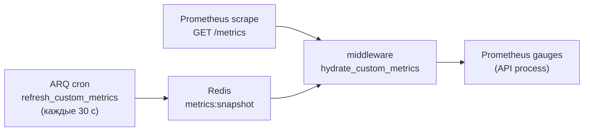

# Мониторинг и наблюдаемость

> **Когда читать:** Нужно понять health/readiness-пробы, как устроен `/metrics` для Prometheus (включая токен-защиту и кастомные гейджи), heartbeat воркера, а также runtime-настройки наблюдаемости из Admin UI (вкладка «Мониторинг»: метрики, уровень логирования, Sentry, лимит ARQ).
> **Ключевой код:** `./backend/app/api/health.py`, `./backend/app/middleware/metrics.py`, `./backend/app/core/metrics.py`, `./backend/app/worker/tasks/metrics.py`, `./backend/app/core/sentry.py`, `./backend/app/api/system_settings/_settings.py`, `./frontend/src/pages/admin/tabs/MonitoringTab.vue`.
> **ADR:** 037 (bootstrap env vs runtime JSON). См. также `./deploy.md`, `./audit.md`.

---

## 1. Обзор

Наблюдаемость портала состоит из четырёх слоёв:

| Слой | Что даёт | Точка входа |
|---|---|---|
| **Health-пробы** | Liveness/readiness для оркестратора и nginx | `GET /health`, `GET /ready` |
| **Метрики** | Prometheus-экспорт (RED-метрики + кастомные гейджи) | `GET /metrics` |
| **Логи** | Структурные логи (structlog), уровень и формат — runtime | `system.json` |
| **Ошибки** | Трейсинг исключений с PII-скрабингом | Sentry (`sentry_dsn`) |

Все runtime-параметры (вкл/выкл метрик, токен, уровень логов, ARQ max jobs,
Sentry DSN) меняются **без рестарта** через Admin UI и хранятся в
`/data/settings/system.json` (`SystemSettings`, ADR-037). Бутстрап-параметры
(`DATABASE_URL`, `REDIS_URL` и т.п.) остаются в env.

---

## 2. Health-пробы

Роутер `./backend/app/api/health.py` подключается **без префикса** `/api/v1`
(`app.include_router(health_router)`), чтобы оркестратор и nginx дёргали
короткие пути. Аутентификация не требуется; пути исключены из продления сессии и
из инструментирования метрик.

### `GET /health` — liveness

Всегда `200 {"status": "ok"}`. Не ходит в зависимости — проверяет только то, что
процесс жив и отвечает.

### `GET /ready` — readiness

Проверяет зависимости и возвращает `200` либо `503` (`status: "ok"|"error"`) с
картой `checks`:

| Проверка | Условие |
|---|---|
| `postgres` | `SELECT 1` через `AsyncSessionLocal` |
| `redis` | `PING` |
| `nextcloud` | только если модуль включён: `unconfigured` (нет URL) или `health_check()` |
| `audit_partitions` | флаг `app.state.audit_partitions_ok` (партиции аудита созданы) |
| `mime_detection` | `magic` при наличии libmagic, иначе `fallback` (не влияет на код ответа) |

`503` отдаётся, если упала любая из проверок postgres/redis/nextcloud/audit_partitions.
`mime_detection=fallback` — информационный, не фейлит readiness.

> Использование: docker/k8s — `health` как liveness, `ready` как readiness;
> nginx upstream-проверки; staging-чеклист в `./deploy.md` (`/api/v1/ready` за
> прокси).

---

## 3. Метрики Prometheus (`/metrics`)

Инструментирование — `setup_metrics()` в `./backend/app/middleware/metrics.py`
на базе `prometheus_fastapi_instrumentator`. Эндпоинт `/metrics`:

- **не** в OpenAPI (`include_in_schema=False`);
- исключает из RED-метрик служебные хендлеры `/health`, `/ready`, `/metrics`;
- защищён зависимостью `_require_metrics_token`.

### Токен-защита

Заголовок `X-Metrics-Token` сверяется с `system.json::metrics_token` через
`secrets.compare_digest` (constant-time). Если токен **не задан** — эндпоинт
открыт (удобно для закрытого периметра/VPN); если задан — без верного заголовка
`403`. Prometheus настраивается слать токен в scrape-конфиге.

### Кастомные метрики (cross-process snapshot)

Кастомные гейджи объявлены в `./backend/app/core/metrics.py`
(`portal_sse_connections`, `portal_audit_queue_depth`,
`portal_audit_processing_depth`, `portal_active_users_last_1h`,
`portal_photo_storage_bytes`, `portal_kb_articles_total{status}`,
`portal_news_published_total{status}`, `portal_users_total{auth_source}` и
счётчики вроде `portal_arq_jobs_enqueued_total`).

Загвоздка: значения этих гейджей знает **воркер**, а scrape приходит в **API**.
Поэтому:

1. ARQ-cron `refresh_custom_metrics` (`./backend/app/worker/tasks/metrics.py`,
   `second={0,30}`, т.е. каждые 30 с, `run_at_startup=True`) считает значения и
   пишет JSON в Redis-ключ `metrics:snapshot` (`METRICS_SNAPSHOT_KEY`).
2. Middleware `hydrate_custom_metrics` на каждый запрос `/metrics` подтягивает
   снапшот из Redis в гейджи **перед** отдачей. Ошибка гидрации логируется
   (`metrics.hydrate_failed`), но никогда не ломает `/metrics`.

### Heartbeat воркера

`worker_heartbeat` (cron `second={0,30}`) обновляет Redis-ключ `arq:heartbeat`
(`WORKER_HEARTBEAT_KEY`) c TTL **90 с** (`WORKER_HEARTBEAT_TTL`). Если ключ
протух — воркер считается мёртвым (основа для алерта «worker down»).

---

## 4. Логирование

structlog (`./backend/app/core/logging.py`, обязательно
`stdlib.LoggerFactory()` — см. `../AGENTS.md`). Runtime-параметры из
`system.json`:

| Поле | Назначение |
|---|---|
| `log_level` | `DEBUG…CRITICAL` |
| `log_force_json` | `null` = авто (JSON в проде, текст в dev), `true`/`false` = принудительно |
| `log_slow_request_ms` | Порог, выше которого запрос логируется как «медленный» |

Токены/пароли/PII в логи не пишутся (политика безопасности `../AGENTS.md`).

---

## 5. Sentry

Инициализация — `./backend/app/core/sentry.py`. DSN берётся из
`system.json::sentry_dsn` (runtime). PII вычищается перед отправкой хуком
`scrub_sensitive(event, hint)` (`before_send`) — токены/куки/пароли не уходят во
внешний сервис. Пустой DSN = Sentry выключен.

---

## 6. Admin-вкладка «Мониторинг»

`./frontend/src/pages/admin/tabs/MonitoringTab.vue` (`AdminPage` → группа
«логи»/«система»). Тонкий редактор подмножества `SystemSettings`; сохранение —
`PATCH /admin/system/settings` (`./backend/app/api/system_settings/_settings.py`),
инвалидация `queryKeys.admin.systemSettings()`.

Секции и поля:

| Секция | Поля |
|---|---|
| **Prometheus** | `prometheus_metrics_enabled`, `metrics_token` |
| **Логирование** | `log_level`, `log_slow_request_ms`, `log_force_json` |
| **Воркер** | `arq_max_jobs` |
| **Sentry** | `sentry_dsn` |

**Семантика секрет-полей** (`metrics_token`, `sentry_dsn`): на `GET` возвращается
только флаг `*_set` (значение не отдаётся); при `PATCH` `null`/пусто → оставить
как есть, новое значение → задать. i18n-ключи — `admin.monitoring.*`
(`ru.json` мастер + `en.json`).

---

## 7. Грабли / контекст

- **Кастомные гейджи без воркера «замерзают».** Если ARQ-воркер не запущен,
  `metrics:snapshot` не обновляется и кастомные метрики на `/metrics` показывают
  устаревшие/нулевые значения. RED-метрики самого API при этом живые.
- **Токен сравнивается constant-time.** Не «оптимизируйте» `_require_metrics_token`
  на обычное `==` — это таймин-атака на токен.
- **`mime_detection=fallback` не фейлит readiness** — это сигнал «libmagic
  недоступен, используется запасной детектор», а не отказ.
- **Не логируйте секреты.** Любое новое поле с токеном/паролем должно
  отдаваться наружу только флагом `*_set`, как `metrics_token`/`sentry_dsn`.
- **`/health` и `/ready` без префикса** `/api/v1` и без auth — учитывайте при
  настройке allowlist/nginx.
