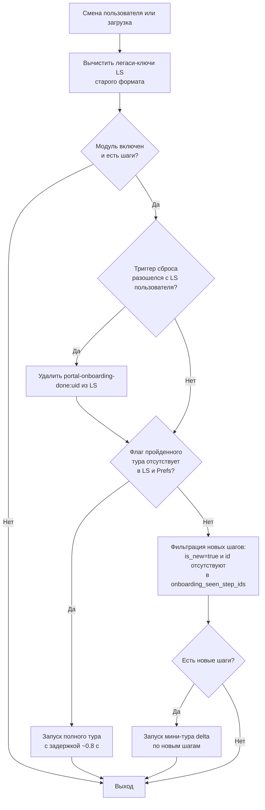

# Модуль «Экскурс по порталу» (Onboarding Tour)

> **Когда читать:** тур по порталу, шаги, флаг `is_new`, сброс прохождения.
> **Ключевой код:** `./backend/app/core/system_config/`, `./backend/app/api/system_settings/`, `./frontend/src/stores/onboarding.ts`, `./frontend/src/components/OnboardingTour.vue`, `./frontend/src/components/AppLayout.vue`.
> **ADR:** —. **См. также:** `./docs/dev-onboarding.md`.

> Краткий пошаговый тур по основным разделам портала. Запускается автоматически при первом входе пользователя; администратор может включать/выключать модуль, редактировать шаги, помечать новые пункты как «новинку» и сбрасывать прохождение у всех сотрудников.

---

## 1. Обзор

| Аспект | Значение |
|---|---|
| Backend | FastAPI (`./backend/app/api/system_settings/`), SQLAlchemy, PostgreSQL |
| Frontend | Vue 3 + Pinia + Naive UI (`./frontend/src/components/OnboardingTour.vue`, `./frontend/src/components/admin/onboarding/OnboardingModuleSettings.vue`) |
| Воркер | — |
| Хранилище | Локальная ФС `/data/settings/system.json` (модели в `./backend/app/core/system_config/_schemas.py`), БД (таблица `users`, колонка `preferences`) |
| Префикс API | `/api/v1/portal/onboarding`, `/api/v1/admin/system/settings` |
| ACL-кэш | Redis, ключ `system_settings` (TTL 60 с) |

---

## 2. Структура кода

| Слой | Путь | Назначение |
|---|---|---|
| Router / API | `./backend/app/api/system_settings/_onboarding.py` | Публичный эндпоинт (`GET /portal/onboarding`) и административные роуты сброса просмотров/шагов |
| Router / API | `./backend/app/api/system_settings/_settings.py` | Администрирование системных настроек (`SystemSettings`) и шагов онбординга |
| Router / API | `./backend/app/api/system_settings/_tls.py` | Управление TLS-сертификатом/ключом (загрузка, тест, применение) — `system_settings`-пакет разбит на 4 файла, см. `__init__.py` |
| Router / API | `./backend/app/api/system_settings/_public.py` | Публичные read-only настройки: gallery-links, staff-settings, status Nextcloud |
| Service | `./backend/app/api/users/users_me_service.py` | Логика обновления предпочтений пользователя (лимиты и сохранение) |
| Model | `./backend/app/models/user.py` | SQLAlchemy-модель пользователя (поле `preferences` типа `JSONB`) |
| Schema | `./backend/app/core/system_config/_schemas.py` | Pydantic-схемы настроек системы и шага онбординга |
| Schema | `./backend/app/schemas/user.py` | Pydantic-схемы обновления профиля и предпочтений |
| Store (Pinia) | `./frontend/src/stores/onboarding.ts` | Управление состоянием экскурса и дефолтными шагами |
| Component (Player) | `./frontend/src/components/OnboardingTour.vue` | Плеер тура (backdrop, подсветка шагов, автозапуск, delta-режим) |
| Component (Admin) | `./frontend/src/components/admin/onboarding/OnboardingModuleSettings.vue` | Панель администрирования шагов экскурса и глобальных настроек |
| Component (Admin) | `./frontend/src/components/admin/onboarding/OnboardingStepsList.vue` | Компонент для списка шагов онбординга в админ-панели |
| Component (Admin) | `./frontend/src/components/admin/onboarding/OnboardingStepEditor.vue` | Редактор конкретного шага экскурса |
| Composable (Admin) | `./frontend/src/components/admin/onboarding/composables/useOnboardingDraft.ts` | Управление черновиком шагов в панели администрирования |
| Layout | `./frontend/src/components/AppLayout.vue` | Интеграция плеера экскурса в общий интерфейс портала |
| Menu User | `./frontend/src/components/layout/HeaderUserMenu.vue` | Пункт меню для ручного перезапуска тура |
| Targets | `./frontend/src/utils/tourTargets.ts` | Справочник готовых CSS-селекторов для шагов |

---

## 3. Модель данных

### 3.1. Глобальные настройки модуля

Конфигурационный файл `/data/settings/system.json` (модель `SystemSettings` в `./backend/app/core/system_config/_schemas.py`):

| Поле | Тип | Назначение |
|---|---|---|
| `onboarding_enabled` | `bool` (default `true`) | Глобальный переключатель работы модуля. |
| `onboarding_reset_trigger` | `str` (ISO-8601, default `""`) | Водяной знак последнего сброса. Клиент сравнивает его с локальным кэшем. |
| `onboarding_steps` | `list[OnboardingStep] \| null` | Переопределённый список шагов экскурса. `null` ⇒ используются дефолтные шаги из i18n. |

### 3.2. Схема шага `OnboardingStep`

```python
class OnboardingStep(BaseModel):
    id: str = Field(default="", max_length=64)
    selector: str = Field(min_length=1, max_length=500)
    title: str = Field(min_length=1, max_length=200)
    body: str = Field(default="", max_length=2000)
    is_new: bool = Field(default=False)
```

- **`id`**: Стабильный идентификатор шага. Если значение пустое или дублируется, бэкенд автозаполняет его 12-символьным случайным hex (`uuid4().hex[:12]`).
- **`selector`**: CSS-селектор элемента. UI предлагает список готовых таргетов из `./frontend/src/utils/tourTargets.ts` или ввод любого селектора.
- **`is_new`**: Пометка новинки. Шаги c `is_new=true` показываются как мини-тур пользователям, уже прошедшим основной экскурс, но не видевшим данный шаг.

### 3.3. Пользовательские предпочтения

Поле `preferences` в таблице `users` (модель `User` в `./backend/app/models/user.py`), тип `JSONB`:

| Ключ | Тип | Назначение |
|---|---|---|
| `onboarding_completed` | `bool` | Флаг завершения основного тура пользователем (дошёл **или** пропустил). |
| `onboarding_completed_via` | `'finished' \| 'skipped'` | Как закрыт основной тур: дошёл до конца или пропустил. Пишется плеером вместе с `onboarding_completed`; у завершений до внедрения метрики ключ отсутствует (в статистике попадает в «раньше»). |
| `onboarding_seen_step_ids` | `list[str]` | Список идентификаторов шагов, которые пользователь уже видел (cap 500 на запись/хранение). |

### 3.4. Локальное хранилище (localStorage) клиента

Ключи привязаны к `user.id` — на общем компьютере метка «пройдено» одного сотрудника не блокирует тур для другого. Ключи старого формата (без суффикса) вычищаются при входе.

| Ключ | Назначение |
|---|---|
| `portal-onboarding-done:{user_id}` | Быстрый локальный кэш "тур пройден" для немедленной проверки до получения ответа от `/users/me`. |
| `portal-onboarding-reset-trigger:{user_id}` | Локальная копия водяного знака сброса. При несовпадении с серверным — локальный флаг сбрасывается. |

---

## 4. Модель прав (ACL)

Доступ к онбордингу разграничен на основе ролей пользователей:

- **Обычные пользователи (User/Reader/Editor)**:
  - Имеют доступ к публичным настройкам экскурса (`GET /api/v1/portal/onboarding`) — **требуется авторизация** (анонимный запрос → 401).
  - Могут сохранять свой личный прогресс прохождения экскурса (`PATCH /api/v1/users/me/preferences`).
- **Администраторы (Admin)**:
  - Имеют полный доступ к просмотру и редактированию настроек системы (`GET` / `PUT` / `PATCH` на `/api/v1/admin/system/settings`).
  - Имеют исключительное право на полный сброс прохождения для всех пользователей (`POST /api/v1/admin/system/settings/onboarding/reset`).
  - Имеют право на сброс просмотров для конкретного шага экскурса (`POST /api/v1/admin/system/settings/onboarding/steps/reset-views`).

---

## 5. REST API

| Метод | Путь | Роль | Описание |
|---|---|---|---|
| `GET` | `/api/v1/admin/system/settings` | Admin | Получить полные системные настройки (включая шаги и статус онбординга). |
| `PUT` | `/api/v1/admin/system/settings` | Admin | Полное обновление системных настроек. |
| `PATCH` | `/api/v1/admin/system/settings` | Admin | Частичное обновление настроек. Поле `onboarding_steps`: омитим ⇒ оставить без изменений, `null` ⇒ сбросить на дефолтные, список ⇒ обновить шаги. Поле `onboarding_reset_trigger` через PATCH/PUT не принимается. |
| `GET` | `/api/v1/admin/system/settings/onboarding/stats` | Admin | Агрегаты прохождения: всего/прошли/пропустили/не проходили + счётчики просмотров по id шагов (`seen_step_counts`). Без персональных данных. |
| `POST` | `/api/v1/admin/system/settings/onboarding/reset` | Admin | Полный сброс прохождения для всех пользователей (удаляет флаг `onboarding_completed` из `preferences`, обновляет watermark `onboarding_reset_trigger`). |
| `POST` | `/api/v1/admin/system/settings/onboarding/steps/reset-views` | Admin | Сброс просмотров конкретного шага. Body: `{step_id: str}`. Удаляет `step_id` из `onboarding_seen_step_ids` у всех пользователей. |
| `GET` | `/api/v1/portal/onboarding` | Auth (любой вошедший) | Публичные настройки модуля онбординга для клиента (анонимно — 401). |
| `PATCH` | `/api/v1/users/me/preferences` | User | Обновление предпочтений пользователя: завершение тура (`onboarding_completed`) и список увиденных шагов (`onboarding_seen_step_ids`). |

### 5.1. SQL-запросы администрирования в СУБД

- **Сброс прохождения для всех**:
  ```sql
  UPDATE users
     SET preferences = preferences - 'onboarding_completed'
   WHERE preferences ? 'onboarding_completed';
  ```

- **Сброс просмотров шага**:
  ```sql
  UPDATE users
     SET preferences = jsonb_set(
           preferences,
           '{onboarding_seen_step_ids}',
           (preferences->'onboarding_seen_step_ids') - :sid
         )
   WHERE jsonb_typeof(preferences->'onboarding_seen_step_ids') = 'array'
     AND preferences->'onboarding_seen_step_ids' ? :sid;
  ```

---

## 6. Специфика модуля и алгоритмы

### 6.1. Автозапуск экскурса (`maybeAutoStart`)

Алгоритм выполняется на фронтенде в `./frontend/src/components/OnboardingTour.vue` при монтировании или смене пользователя:



### 6.2. Плеер экскурса (`./frontend/src/components/OnboardingTour.vue`)

- Монтируется один раз в `./frontend/src/components/AppLayout.vue`.
- Экспонирует методы `startTour()` (полный тур) и `startDeltaTour(ids: string[])` (мини-тур по указанным `id`). `startTour()` уважает выключенный модуль (`onboarding_enabled=false` — no-op).
- Перед запуском (полный и delta) шаги **фильтруются по наличию цели в DOM**: шаг, чей селектор ничего не находит (выключенный модуль, пункт меню недоступен роли, устаревший селектор), не показывается. Непоказанные delta-шаги не помечаются просмотренными и будут предложены снова, когда их цель появится.
- При завершении/пропуске тура (`finish()`):
  1. Формируется список показанных шагов: `steps[0..currentIndex]` — «Пропустить» в середине тура засчитывает только реально показанные шаги.
  2. Новый список виденных шагов: объединение предыдущих виденных и показанных, отфильтрованных по актуальному списку шагов (удаление сиротских ID) и обрезанных до жесткого лимита 500 элементов.
  3. Выполняется `PATCH /api/v1/users/me/preferences` со списком `onboarding_seen_step_ids` и, если это полный тур, `onboarding_completed: true`.
  4. В случае полного тура записывается локальный кэш в `localStorage` **привязанный к пользователю**: `portal-onboarding-done:{user_id}` = "1" и `portal-onboarding-reset-trigger:{user_id}` = актуальный водяной знак с бэкенда.
- Клик по backdrop **не** закрывает тур — закрытие по кнопкам `Skip` / `Next` / `Finish` или клавише **Esc**.
- **«Напомнить позже»** (только delta-режим, кнопка `snooze`): закрывает мини-тур **без** записи просмотров — все его новинки предложатся снова при следующем входе. «Пропустить», в отличие от этого, засчитывает показанные шаги («не интересно»).
- Резолвинг цели шага не вычисляет CSS `:has()`: селекторы вида `.n-menu-item:has([data-tour-id="x"])` разбираются регэкспом и резолвятся через `[data-tour-id="x"]` + `closest('.n-menu-item')` — работает в браузерах без поддержки `:has()`. Прочие селекторы — обычный `querySelector`.
- Перед позиционированием цель прокручивается в центр видимости (`scrollIntoView({block:'center'})`) — иначе подсветка уходит за край на низких окнах/длинном меню.
- **Мобильная раскладка** (<768px, тот же порог что `useBreakpoints`): карточка-«шторка» у нижнего края экрана на всю ширину минус отступы; десктоп — поповер 300px сбоку от цели.
- Доступность (a11y): при показе шага фокус переводится на основную кнопку поповера, после завершения возвращается на элемент, сфокусированный до старта тура; **фокус-трап** — Tab/Shift+Tab циклят фокус внутри карточки, под затемнение он не уходит.
- Позиционирование поповера — в координатах viewport (оверлей `position:fixed`), пересчёт по событиям `resize`/`scroll` (включая внутренние скролл-контейнеры, capture) с пассивными слушателями и очисткой перед уничтожением компонента.

### 6.3. Шаги по умолчанию и локализация (i18n)

Если на бэкенде отсутствуют кастомные шаги (`onboarding_steps` равен `null`), клиент автоматически использует дефолтные шаги из функции `defaultOnboardingSteps()` в `./frontend/src/stores/onboarding.ts` (порядок как в меню):
1. `default-news` (селектор `.n-menu-item:has([data-tour-id="news"])`)
2. `default-kb` (селектор `.n-menu-item:has([data-tour-id="kb"])`)
3. `default-files` (селектор `.n-menu-item:has([data-tour-id="files"])`)
4. `default-links` (селектор `.n-menu-item:has([data-tour-id="links"])`)
5. `default-staff` (селектор `.n-menu-item:has([data-tour-id="staff"])`)
6. `default-meetings` (селектор `.n-menu-item:has([data-tour-id="meetings"])`)
7. `default-photo-gallery` (селектор `.n-menu-item:has([data-tour-id="photo-gallery"])`)
8. `default-helpdesk` (селектор `.n-menu-item:has([data-tour-id="helpdesk-my"])`)
9. `default-profile` (селектор `.app-header .user-pill`)

Шаги `default-files` / `default-staff` / `default-meetings` / `default-photo-gallery` / `default-helpdesk` помечены `is_new=true`: сотрудники, прошедшие экскурс до их добавления, увидят их как мини-тур новинок (однократно). Если соответствующий пункт меню отсутствует (модуль выключен), шаг молча пропускается (см. §6.2).

Локализация всех текстов находится в `./frontend/src/i18n/ru.json` и `./frontend/src/i18n/en.json` под ключом `admin.modules.onboarding.*`, а шаги по умолчанию используют пути `onboarding.steps.{news,kb,files,links,staff,meetings,photoGallery,helpdesk,profile}.{title,body}`.

### 6.4. Панель администрирования

Интерфейс настройки расположен в `./frontend/src/components/admin/onboarding/OnboardingModuleSettings.vue` и открывается как drawer в `/api/v1/admin` или на вкладке модулей при параметре URL `?manage=onboarding`. Содержит три основные секции:
1. **Общие** — переключатель `onboarding_enabled`.
2. **Шаги экскурса** — редактор шагов со следующими возможностями:
   - Изменение порядка (кнопки ↑/↓) и удаление (✕).
   - Выбор селектора из выпадающего списка (`n-select` с группами из `./frontend/src/utils/tourTargets.ts`) или ручной ввод селектора.
   - Чекбокс «Показать как новинку» (`is_new`) и подтверждение сброса просмотров.
   - Под каждым шагом — счётчик «Просмотрели: N из M» (для новинок дополнительно «не видели K»; из `/onboarding/stats`).
   - Восстановление шагов по умолчанию (PATCH с `onboarding_steps: null`).
3. **Статистика прохождения** — агрегаты из `GET /admin/system/settings/onboarding/stats`: всего сотрудников, прошли/пропустили (разбивка «дошли до конца»/«пропустили»/«раньше внедрения метрики»), ещё не проходили. Обновляется автоматически после сбросов.
4. **Сброс прохождения** — кнопка полного сброса для всех пользователей с отображением даты последнего сброса.

---

## Безопасность

- **Защита от DoS-атак на БД**: Поле `onboarding_seen_step_ids` имеет ограничение размера (Pydantic-схема разрешает до 1000 элементов, однако сервис `./backend/app/api/users/users_me_service.py` принудительно обрезает массив до последних 500 элементов перед сохранением в JSONB).
- **Маскирование секретов**: Бэкенд маскирует конфиденциальные данные (такие как пароли и токены) при выводе настроек, а также поддерживает специальную маску сохранения (`_SECRET_MASK` в `./backend/app/core/system_config/`), предотвращая случайную перезапись секретов пустыми или замаскированными значениями.
- **Ограничение прав доступа**: Все административные методы защищены зависимостью `AdminDep` (`./backend/app/api/deps.py`), требующей роль администратора.

---

## События аудита

При выполнении административных действий генерируются следующие события аудита (через функцию `push_audit_event`):

| Имя события (event_type) | Источник | Метаданные | Описание |
|---|---|---|---|
| `system_settings.onboarding_reset` | `./backend/app/api/system_settings/_onboarding.py` | `{"updated_users": int, "reset_trigger": str}` | Полный сброс прохождения тура у всех пользователей |
| `system_settings.onboarding_step_reset_views` | `./backend/app/api/system_settings/_onboarding.py` | `{"step_id": str, "updated_users": int}` | Сброс статуса просмотра для конкретного шага |
| `system_settings.updated` | `./backend/app/api/system_settings/_settings.py` | `{"sections": list[str]}` | Частичное или полное обновление системных настроек (включая флаг онбординга или его шаги) |

---

## Тесты

| Тип | Путь | Покрывает |
|---|---|---|
| Unit (Backend) | `./backend/tests/unit/test_system_settings.py` | Тестирование значений по умолчанию, валидации схем шагов, автозаполнения ID, эндпоинтов сброса прохождения и сброса просмотров шагов, 401 анонима на `GET /portal/onboarding` |
| Unit (Frontend) | `./frontend/tests/unit/onboarding-module-settings.spec.ts` | Смоук-тесты монтирования OnboardingModuleSettings.vue при различных входных данных (отсутствие настроек, дефолтные шаги, переопределенные шаги) |
| Unit (Frontend) | `./frontend/tests/unit/onboarding-tour.spec.ts` | Плеер тура: автозапуск, delta-режим, «Пропустить» засчитывает только показанные шаги, «Напомнить позже», per-user LS-ключи (общий компьютер), Esc, фокус-трап, мобильная раскладка, резолвинг целей без `:has()`, scrollIntoView, гейт выключенного модуля, фильтр шагов без цели; видимость пункта перезапуска в HeaderUserMenu |
| Integration (Backend) | `./backend/tests/integration/test_onboarding_stats_db.py` | Агрегаты статистики на реальном Postgres: разбивка finished/skipped/легаси, счётчики просмотров шагов |
| Unit (Frontend) | `./frontend/tests/unit/onboarding-defaults-targets.spec.ts` | Дефолтные шаги (состав, порядок, is_new, i18n-тексты ru/en) и справочник TOUR_TARGETS (новые цели, формат селекторов, локализация подписей) |

Запуск бэкенд тестов:
```bash
cd backend && pytest ./tests/unit/test_system_settings.py -k Onboarding -q
```

Запуск фронтенд тестов:
```bash
cd frontend && npx vitest run ./tests/unit/onboarding-module-settings.spec.ts
```

---

## Связанные документы

- `./docs/dev-onboarding.md` — руководство по локальному запуску и разработке экскурса
- `./docs/_TEMPLATE.md` — эталон оформления технической документации модулей
