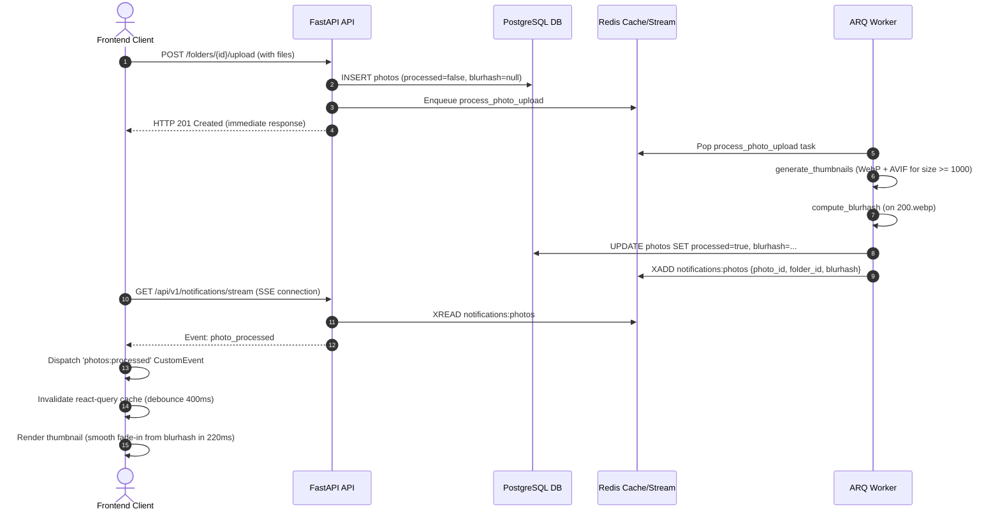

# Модуль «Фотогалерея»

> **Когда читать:** работа с фото и папками, per-folder ACL, миниатюры WebP/AVIF, ZIP-выгрузка, корзина, SSE.
> **Ключевой код:** `./backend/app/api/photos/`, `./backend/app/services/photos_storage/`, `./backend/app/models/photos.py`, `./frontend/src/pages/photos/`.
> **ADR:** ADR-030, ADR-031. **См. также:** `./docs/adr.md`, `./docs/api-contracts.md`, `./docs/db-schema.md`, `./docs/roles-matrix.md`.

> Собственный модуль портала. Иерархия папок с per-folder ACL (viewer / uploader / manager), хранение оригиналов на локальной ФС, метаданные в PostgreSQL, миниатюры (WebP + AVIF) и blurhash-плейсхолдеры генерируются в фоне через ARQ-воркер. Готовность фото пушится клиенту по SSE; в гриде показываются только обработанные снимки.

---

## 1. Обзор

| Аспект | Значение |
|---|---|
| Backend | FastAPI (`./backend/app/api/photos/`), SQLAlchemy, PostgreSQL |
| Frontend | Vue 3 + Pinia + Naive UI (`./frontend/src/pages/photos/`, `./frontend/src/components/photos/`) |
| Воркер | ARQ (`./backend/app/worker/tasks/photos/`) |
| Хранилище | Локальная ФС под `/data/photos/{originals,thumbs,zips,import}` |
| Префикс API | `/api/v1/photos` |
| Раздача файлов | nginx `X-Accel-Redirect` (внутренние локации `/internal/photos-*`) |
| ACL-кэш | Redis, версионированные ключи `photo_acl:{user_id}:{folder_id}:v{N}` + счётчик `photo_acl_ver:{folder_id}` |
| Связанные ADR | ADR-030 (модель данных), ADR-031 (воркер и thumbnails) |

### Возможности

- Дерево папок неограниченной вложенности с soft-delete и корзиной.
- Гранулярные права на папку (viewer / uploader / manager) с наследованием от родителя; subject = `user` или `group` (Keycloak).
- Загрузка одиночная и пакетная, drag-and-drop, очередь загрузки, EXIF-парсинг, опциональный strip GPS.
- Bulk-операции (move / delete / restore / tag).
- Теги (управляются глобально, привязка many-to-many).
- Публичные ссылки на отдельное фото и на папку (с TTL).
- ZIP-выгрузка папки через фоновую задачу.
- Сканирование импорт-директории `/data/photos/import` для массового импорта без upload.
- Thumbnails 5 размеров (200/400/600/1000/1600), формат WebP всегда + AVIF только для размеров `≥ PHOTOS_AVIF_MIN_SIZE` (по умолчанию 1000).
- Blurhash-плейсхолдер (4×3 components) считается на 200.webp; UI рисует его на `<canvas>` и плавно сменяет реальной картинкой через 220 ms fade-in.
- Реалтайм-уведомление о готовности фото по SSE (`event: photo_processed`) через общий поток `/api/v1/notifications/stream`. Грид и виджет автоматически обновляются (debounce 400 ms).
- Авто-исцеление рассинхрона БД↔диск: cron каждые 5 минут перевыкладывает в очередь фото с отсутствующими thumbnails или зависшие в `processed=false`.

---

## 2. Структура кода

| Слой | Путь | Назначение |
|---|---|---|
| Router | `./backend/app/api/photos/folders.py` | CRUD дерева папок, tree-эндпойнт, soft-delete/restore. |
| Router | `./backend/app/api/photos/photos.py` | CRUD фото, upload, корзина, восстановление, purge, bulk-операции. |
| Router | `./backend/app/api/photos/thumbnails.py` | Раздача thumbnails (WebP/AVIF) и оригиналов через `X-Accel-Redirect`. |
| Router | `./backend/app/api/photos/sharing.py` | Создание/отзыв токенов на фото и папки (private endpoints). |
| Router | `./backend/app/api/photos/public_views.py` | Публичные эндпойнты просмотра/скачивания по токену (фото и папки). |
| Router | `./backend/app/api/photos/permissions.py` | Управление ACL папки + поиск subjects (users/groups) через Keycloak. |
| Router | `./backend/app/api/photos/tags.py` | CRUD тегов + назначение тегов на фото. |
| Router | `./backend/app/api/photos/zip_jobs.py` | Постановка ZIP-задач и выдача готовых архивов. |
| Router | `./backend/app/api/photos/import_scan.py` | Постановка задач сканирования импорт-директории. |
| Router | `./backend/app/api/photos/__init__.py` | Сборка `photos_router` из подроутеров. |
| Router | `./backend/app/api/photos/_common.py` | Общие хелперы (`_would_create_cycle`, `_enqueue_processing`, `_module_settings`, логгер). |
| Service | `./backend/app/api/photos/folder_service.py` | Сервисный слой папок (валидация, права, инвалидация ACL-кэша). |
| Service | `./backend/app/api/photos/photo_service/` | Сервисный слой фото: `_queries.py` (листинги, статистика), `_move.py` (перемещение фото), `_bulk.py` (bulk delete/move), `_upload.py` (pipeline загрузки). |
| Service | `./backend/app/services/photos_storage/` | Работа с ФС: пути (`./backend/app/services/photos_storage/paths.py`), оригиналы (`./backend/app/services/photos_storage/originals.py`), миниатюры (`./backend/app/services/photos_storage/thumbnails.py`), EXIF и blurhash (`./backend/app/services/photos_storage/metadata.py`). |
| Service | `./backend/app/services/photos_acl.py` | Резолв прав по папке/фото с рекурсивным CTE, кэширование в Redis, инвалидация. |
| Service | `./backend/app/services/photos_realtime.py` | Публикация `photo_processed` в общий Redis-стрим `notifications:photos`. |
| Service | `./backend/app/services/photos_folder_repo.py` | DB-репозиторий для папок: выборки, рекурсивные CTE, soft-delete. |
| Service | `./backend/app/services/photos_photo_repo.py` | DB-репозиторий для фото (выборки с пагинацией, deleted, recent, storage stats). |
| Service | `./backend/app/services/photos_serializers.py` | Чистые сериализаторы ORM→Pydantic (`folder_to_public`, `photo_to_public`). |
| Service | `./backend/app/services/photos_trash.py` | Оркестратор корзины (ACL + транзакции + аудит). |
| Service | `./backend/app/services/photos_trash_repo.py` | DB-репозиторий для trash-сценариев. |
| Service | `./backend/app/services/photos_trash_files.py` | FS-операции корзины (удаление оригиналов, thumbnails, папок). |
| Model | `./backend/app/models/photos.py` | SQLAlchemy ORM модели (`PhotoFolder`, `PhotoFolderPermission`, `Photo`, `PhotoZipJob`, `PhotoShareToken`, `PhotoTag`, `PhotoTagAssignment`, `PhotoFolderShareToken`). |
| Schema | `./backend/app/schemas/photos.py` | Pydantic-схемы запросов/ответов. |
| Worker | `./backend/app/worker/tasks/photos/` | ARQ-задачи воркера (`processing.py`, `zip_jobs.py`, `import_scan.py`, `cleanup.py`). |
| Frontend | `./frontend/src/pages/photos/` | Vue 3 страницы: главная (`PhotosIndexPage.vue`), свои ссылки (`MySharesPage.vue`), публичный просмотр (`PublicPhotoPage.vue`, `PublicFolderPage.vue`). |
| Frontend | `./frontend/src/components/photos/` | Компоненты Vue 3: дерево папок (`PhotosSidebar.vue`, `FolderNode.vue`), заголовок (`PhotosFolderHeader.vue`), сетка (`PhotosGridBase.vue`, `PhotosGrid.vue`), плитка (`PhotoThumb.vue`), модалки (`SharePhotoModal.vue`, `ShareFolderModal.vue`, `PhotoPermissionsModal.vue`, `PhotoTrashView.vue`), lightbox (`LightboxBase.vue`, `LightboxModal.vue`, `PhotoLightboxViewer.vue`, `LightboxToolbar.vue`, `LightboxTagsEditor.vue`). |
| Frontend | `./frontend/src/api/photos.ts` | Клиент REST API. |
| Frontend | `./frontend/src/stores/` | Pinia-сторы: `photos.ts`, `notifications.ts`. |
| Frontend | `./frontend/src/composables/` | Сборники логики: `usePhotoListing.ts`, `usePhotoUpload.ts`, `usePhotoSelection.ts`, `usePhotoFolderActions.ts`, `usePhotoFolderSelection.ts`, `useLightboxPhotoTags.ts`, `useLightboxShare.ts`, `useLightboxSlideshow.ts`, `useLightboxView.ts`. |

---

## 3. Модель данных

### Схема таблиц БД (SQLAlchemy)

```
photo_folders
  id (UUID, PK)              -- Уникальный идентификатор папки
  parent_id (UUID, FK)       -- Ссылка на родительскую папку (photo_folders.id, ON DELETE CASCADE, nullable)
  name (String(255))         -- Отображаемое название папки
  slug (String(255))         -- URL-safe слаг
  path (String(2000))        -- Символический путь папки (напр. "folder/subfolder")
  fs_path (String(2000))     -- Физический путь на файловой системе
  storage_kind (String(20))  -- Вид хранилища ('originals' | 'import', по умолчанию 'originals')
  storage_root (String(500)) -- Переопределённый корень импорта (nullable)
  description (Text)         -- Описание папки (nullable)
  cover_photo_id (UUID, FK)  -- Ссылка на обложку папки (photos.id, ON DELETE SET NULL, nullable)
  created_by (UUID, FK)      -- Создатель папки (users.id, ON DELETE SET NULL, nullable)
  created_at (DateTime)      -- Дата создания (NOW())
  updated_at (DateTime)      -- Дата обновления (NOW())
  deleted_at (DateTime)      -- Мягкое удаление (nullable)
  -- Ограничения и индексы:
  -- UNIQUE (parent_id, slug)
  -- INDEX (path)
  -- INDEX active (parent_id) WHERE deleted_at IS NULL
  -- CHECK (storage_kind IN ('originals','import'))

photo_folder_permissions
  id (UUID, PK)              -- Уникальный идентификатор права
  folder_id (UUID, FK)       -- Ссылка на папку (photo_folders.id, ON DELETE CASCADE)
  subject_type (String(10))  -- Тип субъекта ('user' | 'group')
  subject_id (String(255))   -- ID субъекта в Keycloak
  subject_name (String(255)) -- Отображаемое имя субъекта
  permission (String(20))    -- Уровень прав ('viewer' | 'uploader' | 'manager')
  granted_by (UUID, FK)      -- Ссылка на предоставившего права (users.id, ON DELETE SET NULL, nullable)
  created_at (DateTime)      -- Дата выдачи прав (NOW())
  -- Ограничения и индексы:
  -- UNIQUE (folder_id, subject_type, subject_id)
  -- CHECK (subject_type IN ('user', 'group'))
  -- CHECK (permission IN ('viewer', 'uploader', 'manager'))

photos
  id (UUID, PK)              -- Уникальный идентификатор фото
  folder_id (UUID, FK)       -- Ссылка на папку размещения (photo_folders.id, ON DELETE CASCADE)
  filename (String(500))     -- Имя файла на ФС
  original_name (String(500))-- Исходное имя загруженного файла
  size_bytes (BigInteger)    -- Размер в байтах
  mime_type (String(100))    -- MIME-тип файла (nullable)
  width (Integer)            -- Ширина в пикселях (nullable)
  height (Integer)           -- Высота в пикселях (nullable)
  taken_at (DateTime)        -- Дата съёмки по EXIF (nullable)
  exif (JSONB)               -- EXIF-метаданные фотографии (nullable)
  description (Text)         -- Описание фото (nullable)
  inherit_permissions (Bool) -- Наследовать ли права папки (по умолчанию true)
  processed (Bool)           -- Флаг готовности миниатюр (по умолчанию false)
  blurhash (String(64))      -- Хэш Blurhash для плейсхолдера (nullable)
  uploaded_by (UUID, FK)     -- Ссылка на загрузившего пользователя (users.id, ON DELETE SET NULL, nullable)
  created_at (DateTime)      -- Дата загрузки (NOW())
  deleted_at (DateTime)      -- Мягкое удаление (nullable)
  -- Индексы:
  -- INDEX (folder_id, created_at DESC)
  -- INDEX (taken_at DESC NULLS LAST)
  -- INDEX active (folder_id) WHERE deleted_at IS NULL

photo_zip_jobs
  id (UUID, PK)
  folder_id (UUID, FK)       -- Ссылка на папку (photo_folders.id, ON DELETE CASCADE)
  user_id (UUID, FK)         -- Ссылка на пользователя (users.id, ON DELETE SET NULL)
  status (String(20))        -- 'pending' | 'processing' | 'completed' | 'failed'
  file_path (String(500))
  error (Text)
  created_at (DateTime)
  expires_at (DateTime)

photo_share_tokens
  id (UUID, PK)
  photo_id (UUID, FK)        -- Ссылка на фото (photos.id, ON DELETE CASCADE)
  token (String(64), UNIQUE)
  created_by (UUID, FK)      -- Ссылка на пользователя (users.id, ON DELETE SET NULL)
  created_at (DateTime)
  expires_at (DateTime)
  revoked_at (DateTime)

photo_folder_share_tokens
  id (UUID, PK)
  folder_id (UUID, FK)       -- Ссылка на папку (photo_folders.id, ON DELETE CASCADE)
  token (Text, UNIQUE)
  created_by (UUID, FK)      -- Ссылка на пользователя (users.id, ON DELETE SET NULL)
  created_at (DateTime)
  expires_at (DateTime)
  revoked_at (DateTime)

photo_tags
  id (UUID, PK)
  name (String(100), UNIQUE)
  slug (String(100), UNIQUE)
  created_at (DateTime)

photo_tag_assignments (Таблица связи M2M)
  photo_id (UUID, PK, FK)    -- Ссылка на фото (photos.id, ON DELETE CASCADE)
  tag_id (UUID, PK, FK)      -- Ссылка на тег (photo_tags.id, ON DELETE CASCADE)
```

### Soft-delete и Корзина

- `photo_folders.deleted_at` и `photos.deleted_at` используются для мягкого удаления.
- **Окно хранения:** Удалённые файлы доступны в корзине в течение **30 дней** (см. метод `list_deleted_photos` репозитория `./backend/app/services/photos_photo_repo.py`).
- **Окончательное удаление:** Вызов `POST /photos/trash/empty` ставит задачу воркера `empty_photo_trash`, которая физически удаляет файлы миниатюр, оригиналов и соответствующие строки из БД.

### storage_kind

- `storage_kind = 'originals'` (по умолчанию) — обычная папка под `/data/photos/originals/{fs_path}`.
- `storage_kind = 'import'` — папка-«окно» в drop-зону `/data/photos/import` (или альтернативный `storage_root`). Используется для массового импорта без копирования через `POST /photos/import/scan`. Поведение перемещения файлов и thumbnails для импортированных папок отличается — см. `./backend/app/services/photos_storage/`.

---

## 4. Модель прав (ACL)

### Уровни доступа

Проверки выполняются по иерархическому принципу: `viewer < uploader < manager`

- **viewer** — просмотр папок/фото, скачивание миниатюр и оригиналов.
- **uploader** — просмотр, скачивание, загрузка новых фото в папку, удаление и восстановление своих собственных загруженных фотографий.
- **manager** — полный контроль над папкой: переименование, перемещение, удаление, окончательное уничтожение, создание публичных ссылок и управление правами ACL.

### Алгоритм резолва прав (`./backend/app/services/photos_acl.py`)

Для папки:
1. `user.role == 'admin'` → автоматически назначается уровень `manager`.
2. `folder.created_by == user.id` → уровень `manager`.
3. Читается версия прав для папки `photo_acl_ver:{folder_id}` (если ключа нет, по умолчанию `0`).
4. Выполняется попытка получить права из Redis по ключу `photo_acl:{user_id}:{folder_id}:v{N}`.
5. При промахе кэша выполняется рекурсивный SQL-запрос (CTE): поднимаемся по родительским папкам до самого корня и ищем явные правила доступа для субъектов пользователя (личный `user_id` и UUID групп из Keycloak). Из всех найденных уровней прав выбирается максимальный.

Для фотографии:
1. Администратор → уровень `manager`.
2. Загрузивший её пользователь (`uploaded_by == user.id`) → уровень `manager`.
3. В противном случае проверяются права на родительскую папку.

### Инвалидация ACL-кэша

- **При изменении прав папки / перемещении / удалении:** вызывается `invalidate_folder_cache(redis, folder_id, db)`, которая инкрементирует счётчики `photo_acl_ver:{folder_id}` для самой папки и всех её потомков (с помощью рекурсивного CTE). Старые ключи прав пользователей в Redis автоматически становятся невалидными из-за несовпадения версии в имени ключа.
- **При изменении групп пользователя в Keycloak:** вызывается `invalidate_user_cache(redis, user_id)`, которая очищает все Redis-ключи по шаблону `photo_acl:{user_id}:*` (вызывается в процессе Keycloak-sync).

---

## 5. REST API

Все эндпоинты требуют авторизации текущего пользователя (`CurrentUser`), за исключением публичных роутов (`/public/*` и `/public-folder/*`).

### Папки (`PhotoFolder`)

| Метод | Путь | Описание | Права |
|---|---|---|---|
| GET | `/api/v1/photos/folders/tree` | Получить всё дерево доступных папок с правами пользователя. | Авторизован |
| GET | `/api/v1/photos/folders/deleted` | Список мягко удалённых папок. | `manager`+ |
| GET | `/api/v1/photos/folders/{folder_id}` | Детали конкретной папки. | `viewer` |
| POST | `/api/v1/photos/folders` | Создать новую папку. | `uploader` на родителя / admin |
| PATCH | `/api/v1/photos/folders/{folder_id}` | Обновить папку (имя, описание, обложка, перемещение). | `manager` |
| DELETE | `/api/v1/photos/folders/{folder_id}` | Мягкое удаление папки (soft-delete). | `manager` |
| POST | `/api/v1/photos/folders/{folder_id}/restore` | Восстановить папку из корзины. | `manager` |
| DELETE | `/api/v1/photos/folders/{folder_id}/purge` | Физически стереть папку и всех потомков из корзины. | `manager` |

### Фотографии (`Photo`)

| Метод | Путь | Описание | Права |
|---|---|---|---|
| GET | `/api/v1/photos/folders/{folder_id}/photos` | Пагинированный список фото в папке (`page`, `per_page` ≤ 200). | `viewer` |
| GET | `/api/v1/photos/deleted` | Список удалённых фотографий из корзины. | С учётом прав |
| GET | `/api/v1/photos/recent` | Лента последних обработанных фотографий для виджета. | Авторизован |
| GET | `/api/v1/photos/storage-stats` | Топ папок по занимаемому объёму на диске. | admin |
| GET | `/api/v1/photos/{photo_id}` | Метаданные фотографии. | `viewer` |
| PATCH | `/api/v1/photos/{photo_id}` | Обновить описание или переместить в другую папку. | `manager` / автор |
| DELETE | `/api/v1/photos/{photo_id}` | Мягкое удаление фотографии в корзину. | `manager` / автор |
| POST | `/api/v1/photos/{photo_id}/restore` | Восстановить фотографию из корзины. | `manager` / автор |
| DELETE | `/api/v1/photos/{photo_id}/purge` | Физически удалить фотографию и её файлы. | admin / автор |
| POST | `/api/v1/photos/trash/empty` | Очистить корзину. Возвращает 202 и статус `{"status": "queued"}`. | admin (all) / `manager` (own) |
| POST | `/api/v1/photos/bulk` | Пакетная операция (перемещение, удаление, восстановление, тегирование). | `manager` / автор |
| POST | `/api/v1/photos/folders/{folder_id}/upload` | Загрузка файлов (multipart, лимит 60 запр/мин). | `uploader` |

### Миниатюры и оригиналы

| Метод | Путь | Описание | Права |
|---|---|---|---|
| GET | `/api/v1/photos/thumbnail/{photo_id}/{size}` | Получить миниатюру WebP/AVIF. Размеры: `200`, `400`, `600`, `1000`, `1600`. Если миниатюра не сгенерирована, возвращает `503 Retry-After: 3` (автоввод в очередь ARQ). Если AVIF отсутствует, а WebP есть — отдаёт `404 X-Thumb-Status: no-avif`. | `viewer` |
| GET | `/api/v1/photos/original/{photo_id}` | Скачать или открыть оригинал файла через `X-Accel-Redirect` nginx. Параметр `download=1` форсирует скачивание. | `viewer` |

### Публичный доступ и шеринг (Public & Sharing)

| Метод | Путь | Описание | Права |
|---|---|---|---|
| POST | `/api/v1/photos/{photo_id}/share` | Создать публичную ссылку на фотографию (с указанием TTL в днях). | `manager` / автор |
| POST | `/api/v1/photos/folders/{folder_id}/share` | Создать публичную ссылку на всю папку. | `manager` |
| GET | `/api/v1/photos/folders/{folder_id}/shares` | Список активных ссылок папки. | `manager` |
| GET | `/api/v1/photos/my-shares` | Список созданных текущим пользователем токенов. | Авторизован |
| DELETE | `/api/v1/photos/my-shares/photo/{token_id}` | Отозвать ссылку на фото. | `manager` / автор |
| DELETE | `/api/v1/photos/my-shares/folder/{token_id}` | Отозвать ссылку на папку. | `manager` |
| GET | `/api/v1/photos/public/{token}/info` | Публичная информация о фотографии. | Публичный |
| GET | `/api/v1/photos/public/{token}/thumbnail/{size}` | Публичное получение миниатюры. | Публичный |
| GET | `/api/v1/photos/public/{token}/file` | Публичное получение оригинала. | Публичный |
| GET | `/api/v1/photos/public-folder/{token}/info` | Метаданные публичной папки по токену. | Публичный |
| GET | `/api/v1/photos/public-folder/{token}/photos` | Пагинированный список фото в публичной папке. | Публичный |
| GET | `/api/v1/photos/public-folder/{token}/thumbnail/{photo_id}/{size}` | Публичная миниатюра фотографии внутри папки. | Публичный |

### Управление правами папок

| Метод | Путь | Описание | Права |
|---|---|---|---|
| GET | `/api/v1/photos/users/search` | Поиск пользователей и групп в Keycloak. | Авторизован |
| GET | `/api/v1/photos/folders/{folder_id}/permissions` | Показать список назначенных прав (ACL). | `manager` |
| POST | `/api/v1/photos/folders/{folder_id}/permissions` | Назначить права пользователю/группе. | `manager` |
| DELETE | `/api/v1/photos/folders/{folder_id}/permissions/{subject_id}` | Отозвать права. | `manager` |

### Теги

| Метод | Путь | Описание | Права |
|---|---|---|---|
| GET | `/api/v1/photos/tags` | Получить список всех глобальных тегов. | Авторизован |
| POST | `/api/v1/photos/tags` | Создать глобальный тег. | Авторизован |
| DELETE | `/api/v1/photos/tags/{tag_id}` | Удалить глобальный тег. | admin |
| GET | `/api/v1/photos/{photo_id}/tags` | Теги конкретного фото. | `viewer` |
| PATCH | `/api/v1/photos/{photo_id}/tags` | Обновить/заменить теги на фото. | `manager` / автор |

### ZIP и Импорт

| Метод | Путь | Описание | Права |
|---|---|---|---|
| POST | `/api/v1/photos/folders/{folder_id}/zip` | Создать задачу на упаковку папки в ZIP-архив. | `viewer` |
| GET | `/api/v1/photos/zip-jobs/{job_id}` | Узнать статус сборки архива. | `viewer` |
| GET | `/api/v1/photos/zip-jobs/{job_id}/download` | Скачать готовый ZIP-архив через nginx. | `viewer` |
| POST | `/api/v1/photos/import/scan` | Запустить фоновое сканирование папки импорта `/data/photos/import`. | admin |
| GET | `/api/v1/photos/import/scan/status/{job_id}`| Статус задачи массового импорта. | admin |

> **Примечание:** Все списки и счетчики фотографий (за исключением ленты «Недавние» `/api/v1/photos/recent`) возвращают снимки вне зависимости от флага `processed=false` (активные, но ещё обрабатывающиеся фото). На фронтенде для таких фото временно отображается плейсхолдер Blurhash или мерцающий шиммер, а по SSE-событию `photo_processed` миниатюра подменяется "на лету" без перезагрузки интерфейса.

---

## 6. Хранилище ФС

Физические файлы фотогалереи хранятся локально на диске в директории `/data/photos/` (класс `./backend/app/services/photos_storage/paths.py`):

```
/data/photos/
  originals/{fs_path}/{filename}      -- Исходные оригиналы фотографий
  thumbs/{photo_id}/{size}.webp       -- Сгенерированные миниатюры WebP (размеры 200, 400, 600, 1000, 1600)
  thumbs/{photo_id}/{size}.avif       -- Опциональные миниатюры AVIF (для размеров >= 1000)
  import/                             -- Корневая папка импорта для массового импорта файлов
  zips/{job_id}.zip                   -- Временные ZIP-архивы, сгенерированные для скачивания папок
```

### Настройка генерации миниатюр

- **Единый источник правды:** Размеры миниатюр жестко заданы константой `THUMB_SIZES = (200, 400, 600, 1000, 1600)` в файле `./backend/app/services/photos_storage/thumbnails.py`.
- **Качество сжатия:** `THUMB_QUALITY = 85`.
- **Метод сжатия WebP:** `WEBP_METHOD = 4` (сбалансированное соотношение скорость/качество).
- **Опциональный AVIF:** Формат AVIF генерируется только для больших миниатюр с разрешением `≥ PHOTOS_AVIF_MIN_SIZE` (по умолчанию 1000 пикселей). Его можно полностью отключить с помощью переменной среды `PHOTOS_GENERATE_AVIF=0`.

---

## 7. Воркер и фоновые задачи

Фоновые задачи выполняются ARQ-воркером (`./backend/app/worker/tasks/photos/`):

| Задача | Триггер | Описание |
|---|---|---|
| `process_photo_upload` | После успешной загрузки фото; при запросе отсутствующего файла; из cron-задачи авто-исцеления. | Генерирует WebP всех размеров и AVIF для ≥1000. Рассчитывает хэш Blurhash по миниатюре 200.webp. Извлекает EXIF, вырезает GPS (если включено). Сохраняет флаг `processed=true` и шлёт SSE-уведомление `photo_processed`. |
| `detect_missing_thumbnails` | Каждые 5 минут (cron-задача) | Сверяет БД и диск. Если у фото со статусом `processed=true` пропал файл `200.webp` на диске, статус сбрасывается в `false` и запускается пересчёт. Зависшие в статусе `false` более 2 минут фотографии переотправляются в очередь. |
| `generate_folder_zip` | Вызов `POST /folders/{id}/zip` | Рекурсивно собирает все файлы из папки на диске и упаковывает в `/data/photos/zips/{job_id}.zip`. |
| `import_scan_run` | Вызов `POST /import/scan` | Сканирует локальную директорию `/data/photos/import`. Задачи `process_photo_upload` для импортированных фотографий ставятся в очередь только после коммита транзакции БД. |
| `cleanup_deleted_photos` | Каждые сутки в 04:00 (cron-задача) | Окончательно удаляет из ФС и БД фотографии, находящиеся в корзине более 30 дней. |
| `cleanup_zip_jobs` | Каждые сутки в 05:00 (cron-задача) | Удаляет временные ZIP-архивы, у которых истек срок жизни `expires_at`. |
| `empty_photo_trash` | Вызов `POST /trash/empty` администратором | Полная физическая очистка файлов и записей всей корзины. |

### Параметры регистрации задач в `./backend/app/worker/main.py`

- `process_photo_upload` — `timeout=300s`, `max_tries=5`.
- `generate_folder_zip` — `timeout=600s`, `max_tries=2`.
- `import_scan_run` — `timeout=600s`, `max_tries=2`.
- `cleanup_deleted_photos` — `timeout=300s`, `max_tries=2`.
- `cleanup_zip_jobs` — `timeout=120s`, `max_tries=2`.
- `detect_missing_thumbnails` — `timeout=300s`, `max_tries=2`.
- `empty_photo_trash` — `timeout=300s`, `max_tries=2`.

### График выполнения регулярных cron-задач

- `cleanup_deleted_photos` — Ежедневно в `04:00:00` UTC (`hour=4, minute=0, second=0`).
- `cleanup_zip_jobs` — Ежедневно в `05:00:00` UTC (`hour=5, minute=0, second=0`).
- `detect_missing_thumbnails` — Каждые 5 минут (`minute=set(range(0, 60, 5)), second=0`).

---

## 8. Архитектура показа миниатюр и Realtime

### Решаемая проблема

При загрузке больших пакетов фотографий (40+) фронтенд генерировал десятки параллельных HTTP-запросов к миниатюрам. В старой архитектуре PIL-сжатие (5 размеров WebP + AVIF) выполнялось **синхронно в uvicorn-процессе**. Это вызывало OOM-kill API-сервера, прерывания HTTP-соединений (`ERR_INCOMPLETE_CHUNKED_ENCODING`) и вешало приложение. Кроме того, возникал рассинхрон: запись в БД получала статус готовности, а файлы на диске не успевали записаться.

### Принципы новой архитектуры

1. **Разгрузка HTTP-процессов:** Любые операции с изображениями (PIL) запрещены внутри API-контроллеров. Если миниатюры нет на диске, API немедленно отдаёт `503 Retry-After` и ставит задачу в ARQ.
2. **Мгновенный плейсхолдер (Blurhash):** При обработке генерируется компактная строка Blurhash (4×3 компонента, ~28 символов). Фронтенд отрисовывает её на `<canvas>` за <1ms с CSS blur-эффектом, избегая пустого пространства.
3. **Push готовности по SSE:** О готовности миниатюры воркер сообщает в поток `notifications:photos` в Redis. API транслирует событие `photo_processed` клиенту через единое SSE-соединение `/api/v1/notifications/stream`.
4. **Ленивый рендер в гриде:** Фронтенд выводит фотографии в грид до окончания обработки. По готовности фото (SSE-событие) картинка плавно проявляется поверх Blurhash за 220 ms (`usePhotoListing.ts` инвалидирует react-query кэш с дебаунсом 400ms).
5. **Семафор на конкурентность:** Одновременная PIL-обработка в воркере ограничена внутренним семафором `_THUMB_GEN_SEMAPHORE=2`. Это предотвращает перегрузку GIL и процессора при одновременном сжатии нескольких 4K JPEG-изображений.
6. **Дедупликация задач авто-исцеления:** Каждые 5 минут cron запускает `detect_missing_thumbnails`. `_job_id` формируется с привязкой к 5-минутному окну, гарантируя не более 1 дублирующей задачи на фото в окно.

### Схема обработки и показа миниатюр (upload → render)



### Архитектурные компромиссы

- **AVIF только для размеров ≥ 1000:** На малых плитках грида выигрыш в размере файла не окупает процессорное время на сжатие AVIF.
- **Быстрый WebP:** Используется `WEBP_METHOD = 4` вместо `6`. Время сжатия сокращается в 2-3 раза при увеличении итогового файла менее чем на 5%.
- **Cutoff авто-исцеления (2 минуты):** Позволяет воркеру гарантированно успеть обработать свежие фотографии перед тем, как cron сочтет их "зависшими" и отправит на перепроверку.

### Изменения по файлам (краткий список)

Backend:
- `./backend/migrations/versions/060_photos_blurhash.py` — миграция поля `blurhash`.
- `./backend/app/models/photos.py:131` — добавление поля `blurhash`.
- `./backend/app/schemas/photos.py` — схемы `PhotoPublic` и `PhotoPublicAnon`.
- `./backend/app/api/photos/_common.py` — сериализация `blurhash`.
- `./backend/app/services/photos_storage/` — реализация `compute_blurhash()`.
- `./backend/app/services/photos_realtime.py` — публикация событий по `notifications:photos`.
- `./backend/app/worker/tasks/photos/processing.py` — пайплайн обработки миниатюр и авто-исцеление.
- `./backend/app/worker/main.py` — интервалы для крона и воркер-таски.
- `./backend/app/services/photos_photo_repo.py` — фильтрация недавних фото.
- `./backend/app/api/photos/public_views.py` — публичные списки фото.
- `./backend/app/api/photos/thumbnails.py` — возврат статуса `503` вместо "на лету" PIL генерации.
- `./backend/app/api/notifications.py` — подмешивание `notifications:photos` в SSE поток.
- `./backend/pyproject.toml` — библиотека `blurhash`.

Frontend:
- `./frontend/src/components/photos/PhotoThumb.vue` — рендер плейсхолдера и fade-in.
- `./frontend/src/components/photos/PhotosGrid.vue` — интеграция нового плейсхолдера.
- `./frontend/src/stores/notifications.ts` — слушатель SSE-событий.
- `./frontend/src/stores/photos.ts` — реалтайм обновление недавних.
- `./frontend/src/composables/usePhotoListing.ts` — инвалидация react-query кэша.
- `./frontend/src/api/photos.ts` — удаление устаревших методов.
- `./frontend/package.json` — библиотека `blurhash` фронтенда.

### Развёртывание

```bash
docker compose run --rm migrations alembic upgrade head   # миграция 060
docker compose build backend worker frontend
docker compose up -d backend worker frontend
```

---

## 9. Конфигурация модуля

Настройки хранятся в `PhotosModuleSettings` (`./backend/app/core/modules_config.py`):

| Поле | По умолчанию | Описание |
|---|---|---|
| `enabled` | `True` | Глобальный статус модуля (влияет на API и видимость в UI). |
| `widget_limit` | `8` | Лимит количества фотографий в ленте недавних для дашборда. |
| `max_size_mb` | `50` | Ограничение на максимальный размер загружаемой фотографии. |
| `allowed_mime` | `image/jpeg,png,webp,heic,heif,gif` | Разрешенные MIME-типы при загрузке. |
| `strip_gps` | `True` | Признак вырезания GPS-тегов из EXIF при обработке. |

### Окружение и системные параметры

- `PHOTOS_GENERATE_AVIF` (по умолчанию `1`) — `0` или `false` полностью выключает кодирование в AVIF.
- `PHOTOS_AVIF_MIN_SIZE` (по умолчанию `1000`) — порог размера, начиная с которого создается AVIF миниатюра.

Управление модулем осуществляется через интерфейс: `Администрирование → Система → Модули → Фотогалерея`. Статус тумблера сохраняется в `./data/modules.json`.

### Видимость пункта меню в сайдбаре

Определяется в файле `./frontend/src/composables/useAppMenu.ts` на основании следующих условий:
1. Модуль включен в настройках системы (`modulesStore.isEnabled('photos')`).
2. Либо включен legacy-режим `photoGalleryMode === 'internal'`.
3. Либо настроена интеграция со сторонней галереей `photoGalleryMode === 'external'` и задан URL `photoGalleryUrl`.

---

## Безопасность

- **Валидация путей (Path Traversal Prevention):** Все операции с файлами на диске жестко валидируются через функцию проверки разрешённых директорий `_ALLOWED_ROOTS` (под `./backend/app/services/photos_storage/paths.py`). Попытки передать относительные пути с выходом из песочницы блокируются.
- **Санитизация имен файлов:** Функция `sanitize_filename` преобразует исходные имена файлов к безопасному виду (ASCII-only, спецсимволы заменяются дефисами, обрезается длина до 180 символов с добавлением SHA256-суффикса для избежания коллизий). Названия папок санитизируются функцией `sanitize_folder_name` с сохранением Cyrillic Unicode, удаляя reserved OS символы.
- **Лимиты запросов (Rate Limiting):** На загрузку фотографий (`POST /folders/{folder_id}/upload`) и публичные просмотры картинок по токенам установлена заглушка-лимитер 60 запросов в минуту (`Depends(RateLimiter(times=60, minutes=1))`).
- **Скрытие GPS координат:** При включенном `strip_gps=True` из EXIF-метаданных фотографии полностью удаляются все геолокационные теги (`GPSInfo` и т.д.) перед сохранением метаданных в базу данных и записью файла на диск.

---

## События аудита

События отправляются асинхронно через Redis-очередь в БД. Название событий строится по шаблону `photos.<resource>_<action>`:

| Событие | Описание | Инициатор (Эмиттер) |
|---|---|---|
| `photos.photo_uploaded` | Успешно загружен оригинал фото. | `photo_service.perform_upload` |
| `photos.photo_deleted` | Фотография мягко удалена в корзину. | `DELETE /photos/{id}` |
| `photos.photo_restored` | Фотография восстановлена из корзины. | `POST /photos/{id}/restore` |
| `photos.photo_purged` | Фотография навсегда удалена физически. | `DELETE /photos/{id}/purge` |
| `photos.trash_empty_requested` | Запущена очистка корзины (полная или личная). | `POST /photos/trash/empty` |
| `photos.trash_emptied` | Корзина физически очищена от файлов и записей. | воркер `empty_photo_trash` / `empty_trash_for_user` |
| `photos.folder_created` | Создана новая папка. | `POST /photos/folders` |
| `photos.folder_deleted` | Папка мягко удалена в корзину. | `DELETE /photos/folders/{id}` |
| `photos.folder_restored` | Папка восстановлена из корзины. | `POST /photos/folders/{id}/restore` |
| `photos.folder_purged` | Папка и все потомки уничтожены навсегда. | `DELETE /photos/folders/{id}/purge` |
| `photos.share_created` | Создан публичный токен доступа к фотографии. | `POST /photos/{id}/share` |
| `photos.share_revoked` | Отозван токен доступа к фотографии. | `DELETE /my-shares/photo/{token_id}` |
| `photos.folder_share_created` | Создан публичный токен доступа к папке. | `POST /photos/folders/{id}/share` |
| `photos.folder_share_revoked` | Отозван токен доступа к папке. | `DELETE /my-shares/folder/{token_id}` |
| `photos.permission_granted` | Выданы ACL-права пользователю или группе на папку. | `POST /photos/folders/{id}/permissions` |
| `photos.permission_revoked` | Отозваны ACL-права на папку. | `DELETE /photos/folders/{id}/permissions/{subject_id}` |

---

## Тесты

Тестовое покрытие модуля включает модульные, интеграционные, фронтенд и сквозные тесты:

| Тип тестов | Расположение | Описание / Покрываемые сценарии |
|---|---|---|
| Unit (Backend) | `./backend/tests/unit/test_photos_acl.py` | Проверка иерархического резолва прав, CTE, Redis-кэша и инвалидации. |
| Unit (Backend) | `./backend/tests/unit/test_photos_permissions.py` | Проверка API управления ACL-правами на папки, в т.ч. уникальности правил. |
| Unit (Backend) | `./backend/tests/unit/test_photos_sharing.py` | Проверка логики создания, валидации срока жизни и отзыва токенов шеринга. |
| Unit (Backend) | `./backend/tests/unit/test_photos_storage.py` | Проверка санитизации имен, ограничений на расширения и удаления GPS. |
| Unit (Backend) | `./backend/tests/unit/test_worker_photos_tasks.py` | Тестирование воркер-функций `process_photo_upload`, `generate_folder_zip`, `empty_photo_trash`. |
| Unit (Backend) | `./backend/tests/unit/test_photos_folders_api.py` | Проверка CRUD-эндпоинтов папок. |
| Unit (Backend) | `./backend/tests/unit/test_photos_zip_jobs.py` | Проверка логики создания и скачивания ZIP-архивов. |
| Unit (Backend) | `./backend/tests/unit/test_photos_photo_repo.py` | Покрытие SQL-запросов выборки фотографий. |
| Unit (Backend) | `./backend/tests/unit/test_photos_folder_repo.py` | Покрытие SQL-запросов репозитория папок. |
| Unit (Backend) | `./backend/tests/unit/test_photos_trash.py` | Тестирование Trash orchestrator, soft-delete, restore и purge. |
| Unit (Backend) | `./backend/tests/unit/test_photos_trash_files.py` | Проверка низкоуровневых файловых операций корзины. |
| Unit (Backend) | `./backend/tests/unit/test_photo_service.py` | Покрытие бизнес-сценариев загрузки и пакетных действий над фото. |
| Unit (Backend) | `./backend/tests/unit/test_photos_processing.py` | Покрытие пайплайна генерации миниатюр и Blurhash. |
| Integration (Backend) | `./backend/tests/integration/test_photos_api.py` | Сквозное API тестирование от загрузки до раздачи оригиналов. |
| Unit (Frontend) | `./frontend/tests/unit/photos-store.spec.ts` | Логика Pinia-стора галереи. |
| Unit (Frontend) | `./frontend/tests/unit/photos-api.spec.ts` | Проверка интеграции с API-клиентом. |
| Unit (Frontend) | `./frontend/tests/unit/photos-components-smoke.spec.ts`| Тестирование компонентов сетки грида, лайтбокса, боковой панели. |
| Unit (Frontend) | `./frontend/tests/unit/photo-decomposition.spec.ts` | smoke-тесты декомпозированных модулей плиток и загрузок. |
| Unit (Frontend) | `./frontend/tests/unit/queries-photos.spec.ts` | Покрытие TanStack Query хуков. |
| Unit (Frontend) | `./frontend/tests/unit/queries-photos-extra.spec.ts` | Дополнительное покрытие хуков пагинации и ленты недавних. |
| E2E (Frontend) | `./frontend/tests/e2e/photos.spec.ts` | Сценарии пользователя: создание папки, D&D загрузка, share, удаление. |

---

## Связанные документы

- **Схема БД:** `./docs/db-schema.md`
- **API-контракты:** `./docs/api-contracts.md` (раздел `/photos`)
- **Матрица ролей и допусков:** `./docs/roles-matrix.md`
- **Решения проектирования:** `./docs/adr.md` (ADR-030, ADR-031)
