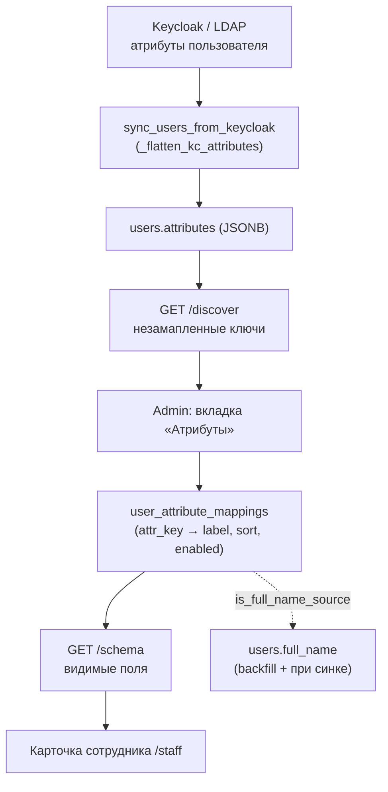

# Модуль «Маппинг атрибутов пользователя»

> **Когда читать:** Нужно понять, как произвольные атрибуты пользователя из Keycloak (`users.attributes`, JSONB) превращаются в человекочитаемые поля карточки сотрудника, как админ управляет этим маппингом и как один из атрибутов назначается источником ФИО (`users.full_name`).
> **Ключевой код:** `./backend/app/api/user_attribute_mappings.py`, `./backend/app/models/user_attribute_mapping.py`, `./backend/app/schemas/user_attribute_mapping.py`, `./backend/app/services/full_name_source.py`, `./backend/app/worker/tasks/news.py` (`sync_users_from_keycloak`, `_flatten_kc_attributes`), `./frontend/src/pages/admin/tabs/UserAttributesTab.vue`, `./frontend/src/api/userAttributeMappings.ts`, `./frontend/src/queries/admin.ts`.
> **ADR:** — (см. также `./roles-matrix.md`, `./db-schema.md`, `./integration-keycloak-nextcloud.md`)

---

## 1. Обзор

Keycloak (и стоящий за ним LDAP/AD) хранит на пользователе произвольный набор
атрибутов: город, табельный номер, внутренний телефон, кабинет и т.п. При
синхронизации пользователей воркер складывает **весь** этот набор как есть в
JSONB-колонку `users.attributes`. Сами по себе ключи (`city`, `office_room`,
`personnel_no`) не имеют ни человекочитаемой подписи, ни порядка, ни признака
«показывать ли это в карточке».

**Маппинг атрибутов** — это admin-управляемый словарь, который связывает
технический ключ атрибута (`attr_key`) с подписью (`label_ru`/`label_en`),
порядком сортировки и флагом видимости. На основе него карточка сотрудника
в `/staff` рисует дополнительные поля сверх нативных колонок профиля.

Отдельно один из маппингов можно пометить как **источник ФИО**
(`is_full_name_source`) — тогда значение этого атрибута становится каноническим
`users.full_name` (полезно, когда «правильное» ФИО лежит в кастомном атрибуте, а
не в `firstName`/`lastName`).

| Аспект | Значение |
|---|---|
| **Backend** | FastAPI (`./backend/app/api/user_attribute_mappings.py`), SQLAlchemy async |
| **Frontend** | Vue 3 + TanStack Query + Naive UI (`./frontend/src/pages/admin/tabs/UserAttributesTab.vue`) |
| **Хранилище маппингов** | PostgreSQL, таблица `user_attribute_mappings` (миграции `026`, `047`) |
| **Источник данных** | `users.attributes` (JSONB), наполняется `sync_users_from_keycloak` |
| **Доступ** | CRUD маппингов — только `admin`; публичная схема `/schema` — любой авторизованный |
| **Аудит** | `resource_type=user_attribute_mapping`, события `created/updated/deleted` |

---

## 2. Поток данных

1. **Синхронизация.** `sync_users_from_keycloak` (`./backend/app/worker/tasks/news.py`)
   получает из Keycloak Admin API атрибуты в формате `dict[str, list[str]]`,
   уплощает их (`_flatten_kc_attributes`) в `dict[str, str | list[str]]` и
   `UPSERT`-ом пишет в `users.attributes`.
2. **Discover.** Админ открывает вкладку и видит все ключи, которые реально
   встречаются в `users.attributes`, но ещё не имеют маппинга и не входят в
   список «нативных» (см. ниже).
3. **Маппинг.** Админ заводит запись `attr_key → label_ru/label_en/sort_order/enabled`.
4. **Отдача.** Эндпоинт `/schema` возвращает видимые (`enabled=true`) маппинги,
   карточка сотрудника рисует по ним дополнительные строки.

---

## 3. Модель данных

Таблица `user_attribute_mappings` (`./backend/app/models/user_attribute_mapping.py`):

| Колонка | Тип | Назначение |
|---|---|---|
| `id` | UUID PK | `gen_random_uuid()` |
| `attr_key` | `VARCHAR(255)` UNIQUE | Ключ в `users.attributes` (например `city`). Уникален — `uq_user_attribute_mappings_attr_key` |
| `label_ru` | `VARCHAR(255)` NOT NULL | Подпись поля (рус., мастер) |
| `label_en` | `VARCHAR(255)` NULL | Подпись (англ.) |
| `sort_order` | `INTEGER` NOT NULL, default `0` | Порядок в карточке. Индекс `idx_user_attribute_mappings_sort` |
| `enabled` | `BOOLEAN` NOT NULL, default `TRUE` | Видимость в карточке/схеме |
| `is_full_name_source` | `BOOLEAN` NOT NULL, default `FALSE` | Атрибут — источник `users.full_name` (см. §5) |
| `created_at` / `updated_at` | `TIMESTAMPTZ` | Аудит-таймстемпы |

> Миграции: `026_user_attribute_mappings` (базовая таблица),
> `047_user_attribute_mapping_full_name_source` (флаг `is_full_name_source`).
> Подробности — `./db-schema.md`.

### Зарезервированные «нативные» ключи

Часть атрибутов Keycloak воркер уже мапит в **отдельные колонки** `users.*`
(email, ФИО, отдел, должность, телефон). Их нет смысла дублировать через JSONB —
они и так показаны в блоке «Личные данные» карточки. Эти ключи (`email`,
`firstName`, `lastName`, `name`, `department`, `job_title`, `post`, `title`,
`phone`) собраны в `_RESERVED_NATIVE_ATTR_KEYS` и:

- **не** попадают в выдачу `GET /discover`;
- отклоняются с `400` при попытке создать для них маппинг через `POST`.

> **Примечание (миграция 087):** `birth_date` и `gender` — тоже нативные колонки
> `users.*`, но их источником является не Keycloak, а ERP-выгрузка (1С). Они не
> входят в `_RESERVED_NATIVE_ATTR_KEYS`, потому что не приходят из KC-атрибутов и
> физически не могут оказаться в `users.attributes` JSONB. В карточке `/staff`
> рендерятся как отдельные слоты (как `position`/`phone`), а не через
> attribute-schema. Ручное редактирование — через `PATCH /users/admin/{id}/profile`.

---

## 4. REST API

Префикс — `/api/v1/user-attribute-mappings` (роутер регистрируется в
`./backend/app/api/__init__.py`). Если не указано иное — доступ только `admin`.

| Метод | Путь | Доступ | Назначение |
|---|---|---|---|
| `GET` | `/schema` | любой авторизованный | Видимые маппинги для карточки сотрудника (без атрибута-источника ФИО — он уже показан как `full_name`) |
| `GET` | `` (корень) | admin | Полный список маппингов `{ items, total }` |
| `GET` | `/discover` | admin | Незамапленные ключи из `users.attributes` с примером значения и счётчиком вхождений |
| `POST` | `` (корень) | admin | Создать маппинг → `201`. `409` если `attr_key` занят, `400` если ключ нативный |
| `PUT` | `/{mapping_id}` | admin | Частичное обновление (`exclude_unset`) |
| `DELETE` | `/{mapping_id}` | admin | Удалить маппинг → `204` |

**Особенности:**

- `GET /schema` намеренно **исключает** маппинг с `is_full_name_source=true`:
  его значение уже отображается как канонический `full_name` в шапке профиля,
  иначе в карточке появилось бы дублирующее поле.
- `GET /discover` для каждого ключа делает выборку одного непустого `sample`
  (обрезается до 200 символов) и считает `occurrences` — сколько пользователей
  имеют этот ключ. Уже замапленные и нативные ключи отфильтрованы.
- При установке `is_full_name_source=true` (на create или update) флаг
  **снимается со всех остальных** маппингов в той же транзакции — источник ФИО
  всегда единственный.
- Каждая мутация после `commit` пишет событие в аудит через
  `make_audit_emitter("user_attribute_mapping")`.

Полный список прав — `./roles-matrix.md` (раздел «Атрибуты пользователя»).

---

## 5. Источник ФИО (`is_full_name_source`)

Единая точка правды по политике «каким атрибутом перезаписывать
`users.full_name`» — сервис `./backend/app/services/full_name_source.py`. Он
нужен, потому что правило применяется в **трёх** независимых путях, и его нельзя
размазывать:

| Путь | Функция-помощник |
|---|---|
| Воркер-синк (asyncpg) | `get_full_name_attr_key_asyncpg(conn)` |
| OIDC-callback (SQLAlchemy async) | `get_full_name_attr_key_sa(db)` |
| Admin-эндпоинты | `get_full_name_attr_key_sa(db)` |

Разрешение значения — `resolve_full_name(default, kc_attrs, attr_key)`:
возвращает `kc_attrs[attr_key]` (со `strip`, поддерживает и скаляр, и
одноэлементный список из уплощённого KC-словаря), иначе — `default` (текущее ФИО
из `firstName + lastName`). Пустое/отсутствующее значение атрибута ФИО **не
затирает**.

**Backfill.** Чтобы не ждать ближайшего цикла синка, при пометке атрибута
источником ФИО (на create или при изменении `is_full_name_source`/`enabled` на
update) эндпоинт сразу выполняет `_backfill_full_name_from_attribute` — массовый
`UPDATE users SET full_name = btrim(attributes->>:k)` по всем живым
пользователям, у которых значение непусто и отличается от текущего. Количество
обновлённых строк логируется (`user_attribute_mapping.full_name_backfilled`).

---

## 6. Frontend

- **API-клиент:** `./frontend/src/api/userAttributeMappings.ts` —
  `fetchAttributeSchema`, `fetchAttributeMappings`, `discoverAttributes`,
  `createAttributeMapping`, `updateAttributeMapping`, `deleteAttributeMapping`.
- **Queries:** `useUserAttributeMappingsQuery`, `useDiscoverAttributesQuery`
  (`./frontend/src/queries/admin.ts`); ключи — `queryKeys.admin.userAttributes()`
  и `queryKeys.admin.discoverAttributes()` (`./frontend/src/queries/keys.ts`).
- **Admin-вкладка:** `./frontend/src/pages/admin/tabs/UserAttributesTab.vue`
  (открывается из `AdminPage`, группа «доступ»). Таблица маппингов
  (редактирование/удаление), отдельная секция «Найдено в данных» из `/discover` с
  кнопкой «добавить» (префилл `attr_key`/`label_ru`), модалка создания/правки.
  `attr_key` нельзя менять при редактировании (только при создании). Конфликт
  `409` показывается отдельным сообщением.
- **i18n:** ключи `admin.userAttributes.*` (`ru.json` мастер + `en.json`).
- **Потребитель схемы:** карточка/грид сотрудника в `/staff`
  (`./frontend/src/components/staff/StaffGrid.vue`,
  `./frontend/src/pages/StaffDirectoryPage.vue`) рисует дополнительные поля по
  ответу `GET /schema`.

---

## 7. Грабли / контекст

- **Нативные ключи не маппятся.** Список `_RESERVED_NATIVE_ATTR_KEYS` должен
  идти в ногу с тем, что реально раскладывает по колонкам `users.*` синк
  (`./backend/app/worker/tasks/news.py`). Добавили новую нативную колонку —
  добавьте ключ и в резерв, иначе в карточке будет визуальный дубль.
- **Источник ФИО единственный.** Не полагайтесь на ручную чистку — установка
  флага снимает его с остальных атомарно в одной транзакции.
- **`/schema` ≠ `/` (список).** Схема скрывает выключенные маппинги и атрибут-
  источник ФИО; админ-список отдаёт всё как есть. Не путать при отладке «почему
  поле не видно в карточке».
- **Три пути ФИО.** Любую правку политики ФИО вносите только через
  `full_name_source.py`, иначе воркер/OIDC/admin разъедутся.
