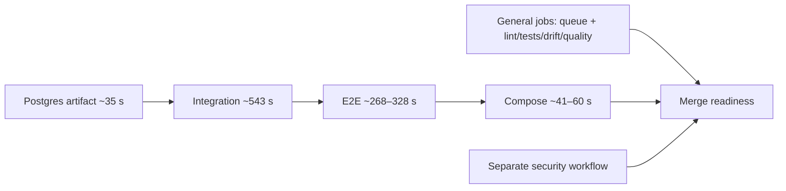

# Аудит CI Portal — 5 сентября 2026

> Когда читать: недостатки CI, причины задержек, приоритеты исправлений.
> Baseline: `main`, `fe49d9345f503f0b635c2baa7b1db36f2125bc7a`, совпадение с Forgejo проверено.
> Статус: аудит завершён; PR #220 и #222 смёржены. Push-пайплайны их merge SHA и required security contexts завершились успешно; ручной nightly 5/5 подтверждён, семь scheduled ночей ещё ожидаются.
> План: [ci-improvement-plan.md](ci-improvement-plan.md).
> Проверяемые данные: [ci-audit-evidence-20260905.json](ci-audit-evidence-20260905.json).

## Вывод

CI содержит серьёзный набор проверок, но его зелёный статус имеет более узкий смысл, чем предполагают некоторые названия заданий и документация. Основные проблемы: неработающий последний nightly-контур, нестабильное окружение раннеров, неполный анализ dead code, неполная граница публикации и невоспроизводимый комплект релиза. Скорость страдает одновременно от очередей, длинной последовательной цепочки и отдельных пауз примерно по 1000 секунд.

«Идеал» здесь — воспроизводимые результаты для одного SHA, понятное покрытие проверок, отсутствие скрытых ошибок инструментов, проверенный комплект образов, ограниченные очереди и измеримая скорость. Это достижимые критерии; обещание отсутствия любых будущих ошибок было бы некорректно.

## Охват и ограничения

- Прочитаны CI/security/nightly workflows, связанные конфигурации тестов, публикации, Compose, документация тестирования и раннеров. Два независимых исследовательских разбора сверены с конфигурацией и логами.
- Сняты реальные настройки main: **22 required contexts**, `apply_to_admins=true`, прямой push запрещён, устаревшая ветка блокируется. Required approvals = 0 — факт политики, сам по себе не дефект для единственного сопровождающего.
- API подтвердил два активных постоянных runner v13.0.0: general (`ci-general`) и services (`ci-services`). Логи general показывают `network="host"`, хотя документация рекомендует bridge. Точные live capacity, лимиты CPU/RAM, диски, mounts credentials и физическая топология не получены; записанный конфиг не принят за доказательство live capacity.
- Список API содержал 1383 записи несмотря на `limit=50`. Основная выборка ограничена **первыми 60** записями: 3–5 сентября, 29 CI workflows. Дополнительно взяты шесть предыдущих nightly-записей. Изучены **158 job logs**, включая все failures основной выборки и десять упавших nightly jobs.
- В JSON сохранены только отобранные поля и хэши логов. Сырые API payload/логи с потенциально чувствительными данными в репозиторий не добавлены.
- **API run ID не равен номеру UI.** Например API 1453 открывается по `html_url` с номером 1451. Ниже числовые ID — API ID; ссылки взяты из API.
- Job duration оценена по первой/последней timestamp-строке лога, включает setup/cleanup. `start_offset` — время от создания workflow до получения job раннером; это сумма ожидания зависимостей и очереди, а не чистая очередь. Для независимого стартового job отражает задержку старта.
- Исторические прогоны проверяют свои SHA. У последнего main CI 1455 на момент снимка ещё был статус running; он не объявлен зелёным. Последний nightly исполнял `4aaf71a7`; текущий main заново в nightly не запускался. Сохранение открытых диапазонов зависимостей проверено на baseline, но воспроизведение ошибки nightly на baseline ещё требуется.
- Первую контролируемую реализацию подготовили после аудита (commit `73e0abea`, PR #220): ограничен AnyIO до `<4.15`, nightly migration tests получили свой `PORTAL_POSTGRES_IMAGE`, а Knip получил явную конфигурацию и fail-closed запуск. Локально воспроизведён прежний collection failure на AnyIO 4.15.0, затем collection прошёл с 5889 тестами. После merge ручной nightly API 1493 (UI 1491) прошёл 5/5 jobs; это ещё не заменяет наблюдение 7 ночей.
- Не выполнялись нагрузочные тесты, изменения runner host, merge/release. Аудит не доказывает отсутствие уязвимостей в продукте или исправность production.

## Что уже работает правильно

Обязательные проверки реально защищают merge, включая новый db-schema drift. Actions закреплены SHA, основные scanner images — digest. Gitleaks блокирует публикацию. Trivy сканирует образы до push и проверяет наличие/структуру JSON. Backend имеет исполняемые skip-бюджеты, включая collection и xdist; E2E требует credentials, проверяет skips и допускает не более двух flaky/retried тестов. Потерянное integration coverage приводит к ошибке после попытки download — этот `continue-on-error` не является дырой. Nightly сохраняет pytest exit code через pipefail. Эти свойства нельзя терять ради скорости.

## Фактическая скорость и надёжность

В 29 CI workflows основной выборки: **20 success, 5 failure, 3 cancelled, 1 running**. Это смешанные PR/main/tag, поэтому число не называется процентом flaky CI. Среди **13 завершённых успешных PR**:

| Метрика от created до stopped API | Значение |
|---|---:|
| Минимум | 15:02 |
| Медиана | 30:35 |
| p95, nearest-rank | 42:04 |
| Максимум | 42:04 |

Выборка небольшая, с разными коммитами и конкурентной нагрузкой; p95 — характеристика этой выборки, не долгосрочный SLO. Неуспешные/отменённые прогоны не включены в длительности. API timestamps могут иметь особенности для matrix: для точного resource accounting нужны timestamps каждого задания, а не только `run.duration`.

| Прогон | Результат | Время | Что видно в логах |
|---|---|---:|---|
| [API 1423](https://forgejo.mage.ru/mage/portal/actions/runs/1421) | 22 success / 9 skipped | 15:02 | integration 543 s, E2E 268 s, smoke 41 s |
| [API 1437](https://forgejo.mage.ru/mage/portal/actions/runs/1435) | 22 success / 9 skipped | 15:27 | quality 45 s, сервисная цепочка определяет завершение |
| [API 1417](https://forgejo.mage.ru/mage/portal/actions/runs/1415) | 22 success / 9 skipped | 31:31 | E2E install-пауза 996 s; types job 1014 s |
| [API 1448](https://forgejo.mage.ru/mage/portal/actions/runs/1446) | 22 success / 9 skipped | 37:32 | quality 1044 s; coverage стартует на 2187-й секунде |
| [API 1453](https://forgejo.mage.ru/mage/portal/actions/runs/1451) | 22 success / 9 skipped | 42:04 | Gitleaks ждёт старта 606 s; quality 1057 s |

9 skipped в успешном PR — условные jobs (публикация и другие не-PR задачи); это не 31 успешно выполненная проверка. Ещё два required security contexts приходят из отдельного security workflow.

У API 1453 логи подтверждают: backend unit/security **5175 passed, 12 skipped** (nightly system-settings); integration **695 passed, 2 skipped**; Vitest **2792 passed / 283 файла**; screenshot **36 passed**; merged backend coverage **85%**. E2E: **79 passed + 1 flaky**, 0 skipped; flake в `files-bulk.spec.ts:43`, бюджет 2. Это успешный CI с восстановившимся тестом, а не безусловно стабильный прогон.

Нормальная наблюдаемая цепочка:

Нельзя просто убрать dependencies: сначала проверить live capacity и устранить общие теги образов. Иначе очередь останется либо появятся гонки.

## Реестр проблем

P1 — восстановить достоверность/надёжность в первую очередь. P2 — существенный пробел или потеря эффективности. P3 — сопровождение. «Риск» означает, что механизм виден статически, но инцидент не воспроизведён.

### CI-01 · P1 · Последние два nightly-flakes не выполняют свою задачу

**Подтверждено логами:** API 1337 и 1403, все 5/5 jobs каждого run падают на collection четырёх файлов. `starlette.testclient` обращается к deprecated `anyio.abc.BlockingPortal`, а warnings policy превращает предупреждение в ошибку. API 1403/job 23792 установил anyio 4.15.0 и starlette 1.6.0. Это детерминированная несовместимость окружения, не найденный flake приложения.

**Последствие:** nightly-проверки, включая проверки с `NIGHTLY=true`, не дают обещанной гарантии. **Основа:** `backend/pyproject.toml:22,220`, `.forgejo/workflows/nightly-flakes.yml:46,155`. **Действие:** воспроизвести и согласовать версии; закрепить разрешение зависимостей, отделить infrastructure/collection failures от test failures. Не выключать глобально предупреждения. **Закрытие:** 5/5 прогонов собирают и выполняют полный набор, 0 неожиданных skips, фиксируются seed и версии.

### CI-02 · P1 · Сбои Docker API раннера вызывают красный CI

**Подтверждено:** API 1419/job 24055 и API 1445/job 24534 — `context deadline exceeded` при копировании `SUMMARY.md/pathcmd.txt` через docker.sock, в том числе cleanup. **Последствие:** повторные прогоны и потеря времени не связаны напрямую с дефектом проверяемого кода. **Не установлено:** CPU, I/O, RAM, версия daemon, переполнение диска либо конкретная ошибка runner. **Действие:** собрать host telemetry и daemon/runner logs для тех же timestamps, проверить ресурсные лимиты и shared cache. Автоматический бесконечный retry не исправление.

**Статус CI-01 (2026-09-05):** PR #220 merged; прежняя ошибка воспроизведена локально на 4.15.0 и отсутствует при collection с ограничением. Ручной nightly API 1493 (UI 1491) завершился 5/5 success. Остаётся семь последовательных расписаний.

### CI-03 · P1 · Quality зелёный при ошибке конфигурации анализатора

**Подтверждено:** jobs 24678/24642 сообщают `ERROR: Error loading playwright.config.ts` из-за отсутствия E2E credentials. Knip затем печатает отчёт, но ошибочно считает `tests/e2e/auth.setup.ts` unused, хотя файл зарегистрирован в setup project. `continue-on-error` не различает ожидаемые findings и неисправный анализатор.

**Статус реализации (2026-09-05):** PR #220 добавляет `frontend/knip.json`, закреплённый Knip и убирает `continue-on-error`. Корректный конфиг локально завершился с кодом 0 и информационными findings; намеренно повреждённый JSON вернул код 2. Требуется подтверждение required quality job на Forgejo.

**Основа:** `.forgejo/workflows/ci.yml:949–954`, `frontend/playwright.config.ts:6–12,68`. **Действие:** явно описать entrypoints portal/learn/E2E, сохранить fail-closed credentials настоящего E2E, отделить ошибку инструмента от информационных findings. **Закрытие:** валидный граф входов; намеренно сломанная конфигурация делает job красным.

### CI-04 · P1 · Публикация не ждёт всех проверок

PR #222 добавил `db-schema-drift` в `publish-images.needs`; publication inventory теперь проверяется fail-closed against exact same-workflow allowlist. Publication всё ещё не связан с dependency audit / filesystem Trivy отдельного `security.yml`. Branch protection защищает предшествующий PR, но не создаёт барьер для результатов нового push/tag, новой vulnerability DB или иного разрешения зависимостей. Отсутствие связи подтверждено; гонка с красным gate в живом release не воспроизводилась.

**Основа:** `.forgejo/workflows/ci.yml:1418,1606–1627`, `.forgejo/workflows/security.yml:13–18`. **Действие:** единый барьер того же SHA перед promotion, структурный тест полноты gate inventory. **Закрытие:** ошибки каждого gate, missing result и cancellation блокируют публикацию проверяемого комплекта.

### CI-05 · P1 · PostgreSQL вне версии релизного комплекта

Compose использует `portal-postgres:16`, публикация создаёт `:16` и `sha-*`, без semver. Повторный pull старого релиза может получить изменённый Postgres-образ, включая init.sql/hunspell. **Основа:** `docker-compose.yml:14`, `ci.yml:1673–1681`. **Действие:** manifest с digest всех шести образов либо согласованная версия каждого компонента. **Закрытие:** старый комплект разрешается в те же digest после нового релиза; новый и повторный bootstrap проверены. Не утверждается, что сама БД автоматически откатится при rollback приложения.

### CI-06 · P2 · Старый релиз/RC меняет latest; публикация не атомарна

`latest` добавляется и на tag, validator допускает коммит из истории main. Следовательно, старый/RC tag может передвинуть latest. Production semver-lock снижает воздействие, но политика latest нарушена. **Основа:** `ci.yml:1559–1575,1683–1699`.

**Статический риск:** concurrent main/tag имеют разные concurrency groups; build и push используют mutable имена, postgres также scan по `:16`. Возможна подмена имени между scan и push. Matrix публикует компоненты независимо; cancellation оставляет частичный набор. **Основа:** `ci.yml:31–33,1748–1752,1795,1872–1875`. **Закрытие:** scan по immutable identity, отдельная promotion только полного manifest; latest только для принятого main; проверка конкурирующих runs и прерывания. Инцидент подмены не заявлен.

### CI-07 · P1 · Smoke не доказывает работоспособность релиза

Compose smoke поднимает postgres/redis/migrations/backend с CI override и обращается прямо к backend. Нет полного прохода через Nginx/frontend/learn routing, TLS/allowlist, worker и готовый публикуемый комплект. E2E идёт через Vite preview. **Основа:** `ci.yml:1305–1363`, `frontend/playwright.config.ts:118–140`. **Действие:** smoke точного комплекта по digest через реальный ingress, minimal auth и worker job. Проверка бизнес-сценариев не заменяет проверку упаковки.

### CI-08 · P2 · Длинные нерегулярные задержки npm/npx

Quality 24678/24642: 1014.6/1015.9 s между завершением jscpd и результатом Knip. Quality 24601: около 1002 s перед выводом jscpd. E2E 24032: install-пауза 996.2 s и сообщение `added 550 packages in 17m`; затем сами 80 E2E проходят за 2.2 min. Knip/jscpd запускаются через `npx --yes`, отсутствуют в project lock. **Основа:** `ci.yml:945–954`, jobs в JSON.

**Не доказано:** что все паузы вызваны audit endpoint, registry либо CPU. Рядом с одной паузой есть notice об устаревающем audit endpoint — это гипотеза, не RCA. **Действие:** npm timings/debug, сетевые таймауты, закреплённые tools в lock; пилот `npm ci --no-audit --fund=false` для несекьюрити jobs с сохранением отдельного required audit. Принимать по серии одинаковых прогонов.

### CI-09 · P2 · Очередь и последовательная цепочка ограничивают скорость

Integration стабильно около 540–546 s; далее E2E и smoke. General стартовый Gitleaks в 1453 ждал 606 s, в 1448 — 513 s; в тихих runs — 1–3 s. Это измеренная нагрузочная вариативность. **Основа:** `ci.yml:353,992,1262`, timestamps JSON. **Действие:** измерить ready-to-start queue, CPU/RAM/I/O; затем обоснованно выделить capacity. Убрать зависимости между независимыми тестами только после изоляции. Не считать весь start_offset чистой очередью.

### CI-10 · P2 · Общие image tags ограничивают безопасный параллелизм

Nightly пишет `portal-postgres:16`, не экспортирует `PORTAL_POSTGRES_IMAGE`, который читают migration tests. Smoke использует `IMAGE_TAG=ci`, а postgres — общий `:16`. Project scope не изолирует Docker image names. **Основа:** `nightly-flakes.yml:64–71`, `backend/tests/integration/test_migrations.py:25`, `ci.yml:1299`, `docker-compose.yml:14`. **Закрытие:** уникальные names/digest для всех consumers и два перекрывающихся прогона без смешивания и чужого cleanup.

### CI-11 · P2 · Python окружение не воспроизводится; Node/npm расходятся

Многие зависимости Python задаются нижней границей, каждый job разрешает их самостоятельно. pip-cache не lock. В nightly реально установлены новые версии; unit general содержит ранее установленные версии. Node 20.20.2 с npm 10.8.2 виден в job 24032, с npm 11.19.1 — в 24390. `rollup-plugin-visualizer@7.0.1` требует Node >=22, лог содержит EBADENGINE. Причинность к задержкам не доказана.

**Основа:** `backend/pyproject.toml:19–75`, `ci.yml:915`, `frontend/package.json:97`. **Действие:** единый согласованный поддерживаемый toolchain, lock/constraints для CI и Docker, versions manifest. Выбор версии Node — отдельное проверенное изменение, не механическая замена.

### CI-12 · P2 · Повторные установки и подготовка расходуют ресурсы

Полный backend dev install повторяется в lint/unit/integration/coverage/drift/quality/E2E; frontend npm ci — в нескольких jobs. Frontend строится для lint, E2E и образа. E2E каждый раз готовит системные browser dependencies через apt; postgres artifact сохраняется/загружается несколькими jobs. Nightly повторяет setup пять раз. **Основа:** `ci.yml:1156–1179,334–345,370,1015`, `nightly-flakes.yml:33–71`.

**Действие:** измерить setup отдельно; versioned runner/wheelhouse, корректные cache keys, reuse только артефактов того же SHA и build inputs. Не обещать выигрыш заранее: в наблюдаемой норме postgres job уже ~35 s. Не объявлять Docker cache отсутствующим — shared daemon может иметь native layer cache.

### CI-13 · P2 · Full-history Gitleaks занимает около четырёх минут каждого run

В 1453 — 868 commits, 230 s непосредственно scan, 238 s job; в других выборочных PR 236–242 s. **Основа:** `ci.yml:53–70`, job 24662. **Действие:** range scan с надёжным base, полный history по расписанию/manual; неизвестный/нулевой/unreachable base переключает на полный scan. Контрпример должен ловить секрет, добавленный и удалённый в пределах диапазона. Только финальное дерево сканировать нельзя.

### CI-14 · P2 · Восстановившиеся тесты недостаточно наблюдаемы

Integration разрешает два rerun по exception regex, без аналогичного E2E машинного бюджета/истории. E2E честно допускает бюджет 2; 1453 использовал 1. В API 1431 Vitest упал по 15 s timeout `kb-article-page.spec.ts:262`; связь с ресурсами ещё не доказана. **Основа:** `ci.yml:480–484`, job 24271. **Действие:** JUnit/JSON attempts, seed, причины, тренд и SLA исправления. Различать инфраструктуру, test flake и продуктовую ошибку.

### CI-15 · P2 · Остаточный security-риск виден неполностью

Image Trivy сохраняет только fixable HIGH/CRITICAL (`--ignore-unfixed`), блокирует только fixable CRITICAL; unfixed отсутствуют в JSON. Это текущая осознанная политика, не отсутствие scan. ZAP работает без auth против uvicorn, coverage gate — число URL >=100; не доказывает доступ к защищённым операциям. CodeQL условный, активный выделенный SAST не подтверждён; это пробел охвата, не найденная уязвимость.

**Основа:** `ci.yml:1807,1837`, `nightly-security.yml:169–177,203–216`, `security.yml:203–227`. **Действие:** полный inventory отдельно от blocking policy; согласовать severity/сроки исключений; auth ZAP с operation/status/role coverage; применимый SAST пилотировать на релевантных правилах.

### CI-16 · P2 · Trust boundary раннеров требует отдельного завершения аудита

Конфиг предоставляет docker.sock; логи general подтверждают host networking. Оба runner постоянные. Docker socket не изолирует PR-job от остальных ресурсов того же daemon. **Основа:** `scripts/forgejo-runner-config.yaml:66–70`, log 24662 и [официальная документация Forgejo](https://forgejo.org/docs/v15.0/admin/actions/docker-access/).

**Не установлено:** совмещены ли daemon/host с Forgejo или prod, какие credentials доступны job, можно ли запускать недоверенные PR без approval. **Действие:** read-only live inventory, отдельный trusted publish boundary и минимальные credentials; подтвердить фактическое enforcement. Severity повысить, если обнаружен доступ недоверенного PR к секретам/production. Из одного документа это не заключать.

### CI-17 · P3 · Документация и эксплуатационные метрики отстают

`docs/testing.md:733–737` говорит, что integration/E2E вынесены из PR, тогда как workflows и required contexts говорят обратное. Числа тестов также устарели. Не найден единый сохраняемый отчёт queue/step/runtime/rerun/infra-fail trends. **Действие:** генерируемый inventory jobs/contexts + ручное описание их гарантий; dashboard и регламент red nightly. Новый отчёт должен различать API ID и UI number.

## Приоритет действий

Сначала восстановить nightly, выяснить Docker timeouts и сделать ошибки Knip явными. Параллельно спроектировать полноценный publication barrier и воспроизводимый комплект. Затем закрепить окружение и убрать непредсказуемые установки инструментов. После стабилизации измерить эффект caches/артефактов, и только затем увеличивать параллелизм. Расширение smoke/security coverage и поддержание SLO — постоянные части готового CI.

## Журнал реализации

| Дата | Изменение | Связанные находки | Статус доказательств |
|---|---|---|---|
| 2026-09-05 | PR #220 `fix(ci): restore nightly collection and Knip gate` | CI-01, CI-03, часть CI-10 | Merged; ручной nightly API 1493 (UI 1491) — 5/5 success. Семь scheduled nightlies ещё ожидаются. |
| 2026-09-05 | PR #222 `fix(ci): gate publication on DB schema drift` | часть CI-04 | `db-schema-drift` стал same-workflow dependency publication; exact inventory gate покрыт Bats counterexamples. External security barrier, atomic promotion и manifest остаются открыты. |

## Внешние основания рекомендаций

[npm ci documentation](https://docs.npmjs.com/cli/v8/commands/npm-ci/?v=true) описывает audit как отдельную настройку установки; это основание для контролируемого пилота, а не доказательство причины пауз в наших логах. [Forgejo Docker access](https://forgejo.org/docs/v15.0/admin/actions/docker-access/) объясняет отсутствие изоляции при доступе к общему daemon. Применимость к конкретному серверу проверяется live inventory; найденная версия сервера — 16.0.2, runner — 13.0.0.
